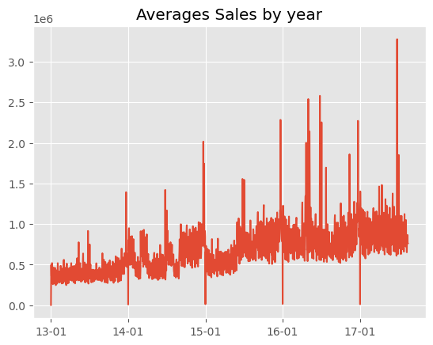
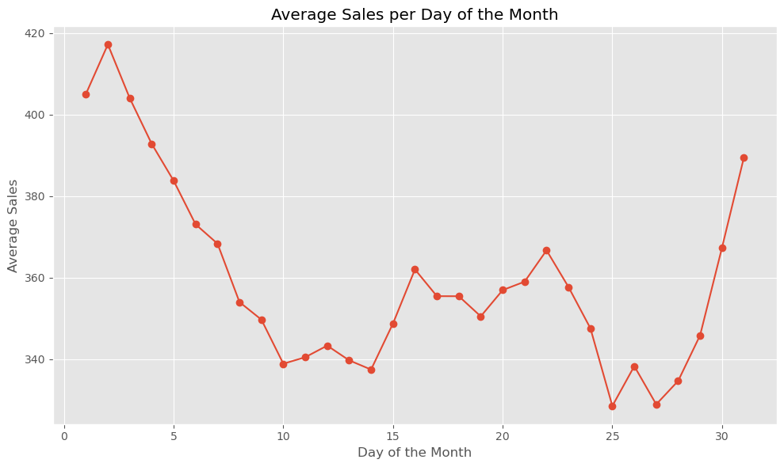
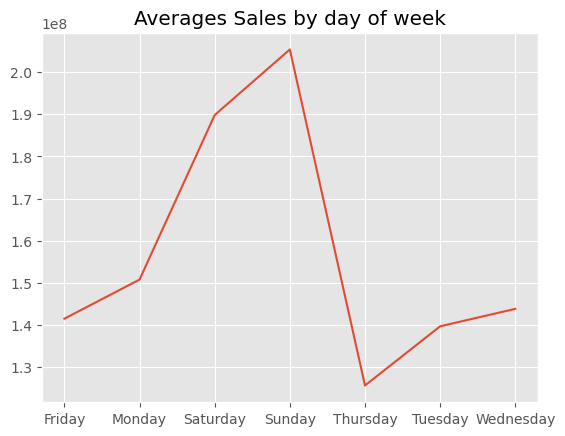

___

<!-- Author: https://www.kaggle.com/lasm1984 -->

This notebook analyzes store sales time series data to make predictions for a Kaggle competition [Alexis Cook, DanB, inversion, Ryan Holbrook. (2021). Store Sales - Time Series Forecasting](https://www.kaggle.com/competitions/store-sales-time-series-forecasting). It loads and prepares the data, conducts exploratory analysis, trains Prophet forecasting models on sliced datasets and makes predictions.

Author: [Ale uy](https://www.kaggle.com/lasm1984) 

___

<h1 style="background-color:red;font-family:newtimeroman;color:black;font-size:380%;text-align:center;border-radius: 50px 50px;">Store Sales - Time Series Forecasting</h1>

<a id='goto0'></a>
<h1 style="background-color:orange;font-family:newtimeroman;color:black;font-size:300%;text-align:center;border-radius: 15px 50px;">Table of Contents</h1>

0. [Table of Contents](#goto0)

1. [Notebook Description](#goto1)

2. [Loading Libraries](#goto2)

3. [Reading and Join Data Files](#goto3)

4. [Data Exploration](#goto4)

5. [Data Modeling](#goto5)

    5a. [Preprocessing](#goto5a)

    5b. [Prophet Model](#goto5b)

    5c. [Final Touches](#goto5c)

6. [Conclusions](#goto6)

<a id='goto1'></a>
# <h1 style="background-color:orange;font-family:newtimeroman;color:black;font-size:300%;text-align:center;border-radius: 15px 50px;">Notebook Description</h1>

[Back](#goto0)

## Description

### Goal of the Competition

In this “getting started” competition, you’ll use time-series forecasting to forecast store sales on data from Corporación Favorita, a large Ecuadorian-based grocery retailer.

Specifically, you'll build a model that more accurately predicts the unit sales for thousands of items sold at different Favorita stores. You'll practice your machine learning skills with an approachable training dataset of dates, store, and item information, promotions, and unit sales.

### Context

Forecasts aren’t just for meteorologists. Governments forecast economic growth. Scientists attempt to predict the future population. And businesses forecast product demand—a common task of professional data scientists. Forecasts are especially relevant to brick-and-mortar grocery stores, which must dance delicately with how much inventory to buy. Predict a little over, and grocers are stuck with overstocked, perishable goods. Guess a little under, and popular items quickly sell out, leading to lost revenue and upset customers. More accurate forecasting, thanks to machine learning, could help ensure retailers please customers by having just enough of the right products at the right time.

Current subjective forecasting methods for retail have little data to back them up and are unlikely to be automated. The problem becomes even more complex as retailers add new locations with unique needs, new products, ever-transitioning seasonal tastes, and unpredictable product marketing.

### Potential Impact

If successful, you'll have flexed some new skills in a real world example. For grocery stores, more accurate forecasting can decrease food waste related to overstocking and improve customer satisfaction. The results of this ongoing competition, over time, might even ensure your local store has exactly what you need the next time you shop.

**Author: [Ale uy](https://www.kaggle.com/lasm1984)**

<a id='goto2'></a>
# <h1 style="background-color:orange;font-family:newtimeroman;color:black;font-size:300%;text-align:center;border-radius: 15px 50px;">Loading Libraries</h1>

[Back](#goto0)


```python
import pandas as pd; pd.set_option('display.max_columns', 30)
import numpy as np

import matplotlib.pyplot as plt; plt.style.use('ggplot')
import seaborn as sns
import plotly.express as px

import warnings; warnings.filterwarnings("ignore")
```

<a id='goto3'></a>
# <h1 style="background-color:orange;font-family:newtimeroman;color:black;font-size:300%;text-align:center;border-radius: 15px 50px;">Reading and Join Data Files</h1> 

[Back](#goto0)

### Import the main analysis datasets

We check the shape of the training and test dataframes.


```python
train = pd.read_csv('train.csv')
test = pd.read_csv('test.csv')

print('The dimension of the train dataset is:', train.shape)
print('The dimension of the test dataset is:', test.shape)
```

    The dimension of the train dataset is: (3000888, 6)
    The dimension of the test dataset is: (28512, 5)
    


```python
train.describe()
```


<div>
<style scoped>
    .dataframe tbody tr th:only-of-type {
        vertical-align: middle;
    }

    .dataframe tbody tr th {
        vertical-align: top;
    }

    .dataframe thead th {
        text-align: right;
    }
</style>
<table border="1" class="dataframe">
  <thead>
    <tr style="text-align: right;">
      <th></th>
      <th>id</th>
      <th>store_nbr</th>
      <th>sales</th>
      <th>onpromotion</th>
    </tr>
  </thead>
  <tbody>
    <tr>
      <th>count</th>
      <td>3.000888e+06</td>
      <td>3.000888e+06</td>
      <td>3.000888e+06</td>
      <td>3.000888e+06</td>
    </tr>
    <tr>
      <th>mean</th>
      <td>1.500444e+06</td>
      <td>2.750000e+01</td>
      <td>3.577757e+02</td>
      <td>2.602770e+00</td>
    </tr>
    <tr>
      <th>std</th>
      <td>8.662819e+05</td>
      <td>1.558579e+01</td>
      <td>1.101998e+03</td>
      <td>1.221888e+01</td>
    </tr>
    <tr>
      <th>min</th>
      <td>0.000000e+00</td>
      <td>1.000000e+00</td>
      <td>0.000000e+00</td>
      <td>0.000000e+00</td>
    </tr>
    <tr>
      <th>25%</th>
      <td>7.502218e+05</td>
      <td>1.400000e+01</td>
      <td>0.000000e+00</td>
      <td>0.000000e+00</td>
    </tr>
    <tr>
      <th>50%</th>
      <td>1.500444e+06</td>
      <td>2.750000e+01</td>
      <td>1.100000e+01</td>
      <td>0.000000e+00</td>
    </tr>
    <tr>
      <th>75%</th>
      <td>2.250665e+06</td>
      <td>4.100000e+01</td>
      <td>1.958473e+02</td>
      <td>0.000000e+00</td>
    </tr>
    <tr>
      <th>max</th>
      <td>3.000887e+06</td>
      <td>5.400000e+01</td>
      <td>1.247170e+05</td>
      <td>7.410000e+02</td>
    </tr>
  </tbody>
</table>
</div>


```python
train.info()
```

    <class 'pandas.core.frame.DataFrame'>
    RangeIndex: 3000888 entries, 0 to 3000887
    Data columns (total 6 columns):
     #   Column       Dtype  
    ---  ------       -----  
     0   id           int64  
     1   date         object 
     2   store_nbr    int64  
     3   family       object 
     4   sales        float64
     5   onpromotion  int64  
    dtypes: float64(1), int64(3), object(2)
    memory usage: 137.4+ MB
    


```python
test.describe()
```


<div>
<style scoped>
    .dataframe tbody tr th:only-of-type {
        vertical-align: middle;
    }

    .dataframe tbody tr th {
        vertical-align: top;
    }

    .dataframe thead th {
        text-align: right;
    }
</style>
<table border="1" class="dataframe">
  <thead>
    <tr style="text-align: right;">
      <th></th>
      <th>id</th>
      <th>store_nbr</th>
      <th>onpromotion</th>
    </tr>
  </thead>
  <tbody>
    <tr>
      <th>count</th>
      <td>2.851200e+04</td>
      <td>28512.000000</td>
      <td>28512.000000</td>
    </tr>
    <tr>
      <th>mean</th>
      <td>3.015144e+06</td>
      <td>27.500000</td>
      <td>6.965383</td>
    </tr>
    <tr>
      <th>std</th>
      <td>8.230850e+03</td>
      <td>15.586057</td>
      <td>20.683952</td>
    </tr>
    <tr>
      <th>min</th>
      <td>3.000888e+06</td>
      <td>1.000000</td>
      <td>0.000000</td>
    </tr>
    <tr>
      <th>25%</th>
      <td>3.008016e+06</td>
      <td>14.000000</td>
      <td>0.000000</td>
    </tr>
    <tr>
      <th>50%</th>
      <td>3.015144e+06</td>
      <td>27.500000</td>
      <td>0.000000</td>
    </tr>
    <tr>
      <th>75%</th>
      <td>3.022271e+06</td>
      <td>41.000000</td>
      <td>6.000000</td>
    </tr>
    <tr>
      <th>max</th>
      <td>3.029399e+06</td>
      <td>54.000000</td>
      <td>646.000000</td>
    </tr>
  </tbody>
</table>
</div>


```python
test.info()
```

    <class 'pandas.core.frame.DataFrame'>
    RangeIndex: 28512 entries, 0 to 28511
    Data columns (total 5 columns):
     #   Column       Non-Null Count  Dtype 
    ---  ------       --------------  ----- 
     0   id           28512 non-null  int64 
     1   date         28512 non-null  object
     2   store_nbr    28512 non-null  int64 
     3   family       28512 non-null  object
     4   onpromotion  28512 non-null  int64 
    dtypes: int64(3), object(2)
    memory usage: 1.1+ MB
    

### Import other supporting datasets


```python
holidays =  pd.read_csv('holidays_events.csv')
stores =  pd.read_csv('stores.csv')
transactions = pd.read_csv('transactions.csv')
oil = pd.read_csv('oil.csv')
```


```python
holidays.describe()
```


<div>
<style scoped>
    .dataframe tbody tr th:only-of-type {
        vertical-align: middle;
    }

    .dataframe tbody tr th {
        vertical-align: top;
    }

    .dataframe thead th {
        text-align: right;
    }
</style>
<table border="1" class="dataframe">
  <thead>
    <tr style="text-align: right;">
      <th></th>
      <th>date</th>
      <th>type</th>
      <th>locale</th>
      <th>locale_name</th>
      <th>description</th>
      <th>transferred</th>
    </tr>
  </thead>
  <tbody>
    <tr>
      <th>count</th>
      <td>350</td>
      <td>350</td>
      <td>350</td>
      <td>350</td>
      <td>350</td>
      <td>350</td>
    </tr>
    <tr>
      <th>unique</th>
      <td>312</td>
      <td>6</td>
      <td>3</td>
      <td>24</td>
      <td>103</td>
      <td>2</td>
    </tr>
    <tr>
      <th>top</th>
      <td>2014-06-25</td>
      <td>Holiday</td>
      <td>National</td>
      <td>Ecuador</td>
      <td>Carnaval</td>
      <td>False</td>
    </tr>
    <tr>
      <th>freq</th>
      <td>4</td>
      <td>221</td>
      <td>174</td>
      <td>174</td>
      <td>10</td>
      <td>338</td>
    </tr>
  </tbody>
</table>
</div>


```python
stores.describe()
```


<div>
<style scoped>
    .dataframe tbody tr th:only-of-type {
        vertical-align: middle;
    }

    .dataframe tbody tr th {
        vertical-align: top;
    }

    .dataframe thead th {
        text-align: right;
    }
</style>
<table border="1" class="dataframe">
  <thead>
    <tr style="text-align: right;">
      <th></th>
      <th>store_nbr</th>
      <th>cluster</th>
    </tr>
  </thead>
  <tbody>
    <tr>
      <th>count</th>
      <td>54.000000</td>
      <td>54.000000</td>
    </tr>
    <tr>
      <th>mean</th>
      <td>27.500000</td>
      <td>8.481481</td>
    </tr>
    <tr>
      <th>std</th>
      <td>15.732133</td>
      <td>4.693395</td>
    </tr>
    <tr>
      <th>min</th>
      <td>1.000000</td>
      <td>1.000000</td>
    </tr>
    <tr>
      <th>25%</th>
      <td>14.250000</td>
      <td>4.000000</td>
    </tr>
    <tr>
      <th>50%</th>
      <td>27.500000</td>
      <td>8.500000</td>
    </tr>
    <tr>
      <th>75%</th>
      <td>40.750000</td>
      <td>13.000000</td>
    </tr>
    <tr>
      <th>max</th>
      <td>54.000000</td>
      <td>17.000000</td>
    </tr>
  </tbody>
</table>
</div>


```python
transactions.describe()
```


<div>
<style scoped>
    .dataframe tbody tr th:only-of-type {
        vertical-align: middle;
    }

    .dataframe tbody tr th {
        vertical-align: top;
    }

    .dataframe thead th {
        text-align: right;
    }
</style>
<table border="1" class="dataframe">
  <thead>
    <tr style="text-align: right;">
      <th></th>
      <th>store_nbr</th>
      <th>transactions</th>
    </tr>
  </thead>
  <tbody>
    <tr>
      <th>count</th>
      <td>83488.000000</td>
      <td>83488.000000</td>
    </tr>
    <tr>
      <th>mean</th>
      <td>26.939237</td>
      <td>1694.602158</td>
    </tr>
    <tr>
      <th>std</th>
      <td>15.608204</td>
      <td>963.286644</td>
    </tr>
    <tr>
      <th>min</th>
      <td>1.000000</td>
      <td>5.000000</td>
    </tr>
    <tr>
      <th>25%</th>
      <td>13.000000</td>
      <td>1046.000000</td>
    </tr>
    <tr>
      <th>50%</th>
      <td>27.000000</td>
      <td>1393.000000</td>
    </tr>
    <tr>
      <th>75%</th>
      <td>40.000000</td>
      <td>2079.000000</td>
    </tr>
    <tr>
      <th>max</th>
      <td>54.000000</td>
      <td>8359.000000</td>
    </tr>
  </tbody>
</table>
</div>


```python
oil.describe()
```


<div>
<style scoped>
    .dataframe tbody tr th:only-of-type {
        vertical-align: middle;
    }

    .dataframe tbody tr th {
        vertical-align: top;
    }

    .dataframe thead th {
        text-align: right;
    }
</style>
<table border="1" class="dataframe">
  <thead>
    <tr style="text-align: right;">
      <th></th>
      <th>dcoilwtico</th>
    </tr>
  </thead>
  <tbody>
    <tr>
      <th>count</th>
      <td>1175.000000</td>
    </tr>
    <tr>
      <th>mean</th>
      <td>67.714366</td>
    </tr>
    <tr>
      <th>std</th>
      <td>25.630476</td>
    </tr>
    <tr>
      <th>min</th>
      <td>26.190000</td>
    </tr>
    <tr>
      <th>25%</th>
      <td>46.405000</td>
    </tr>
    <tr>
      <th>50%</th>
      <td>53.190000</td>
    </tr>
    <tr>
      <th>75%</th>
      <td>95.660000</td>
    </tr>
    <tr>
      <th>max</th>
      <td>110.620000</td>
    </tr>
  </tbody>
</table>
</div>


### Join the different datasets that have a common feature


```python
# Add oil price
train = train.merge(oil, on='date', how='left')
test = test.merge(oil, on='date', how='left')

# Add transactions
train = train.merge(transactions, on=['date', 'store_nbr'], how='left')
test = test.merge(transactions, on=['date', 'store_nbr'], how='left')

# Add stores description
train = train.merge(stores, on='store_nbr', how='left')
test = test.merge(stores, on='store_nbr', how='left')
```

### Before adding holidays, apply transformations


```python
# Delete transferred holidays
holidays = holidays.loc[holidays.iloc[:, -1] != "True"]
```


```python
# Add holidays
train = train.merge(holidays, on='date', how='left')
test = test.merge(holidays, on='date', how='left')
```

<a id='goto4'></a>
# <h1 style="background-color:orange;font-family:newtimeroman;color:black;font-size:300%;text-align:center;border-radius: 15px 50px;">Data Exploration</h1>

[Back](#goto0)

### Adapt holiday depending on whether it is local, regional, national or not a holiday

We do some transformations on the holiday data to create columns indicating local, regional, and national holidays.


```python
def nat_holiday(row):
    if row['locale'] == 'National':
        return 1
    else:
        return 0
def reg_holiday(row):
    if row['locale'] == 'Regional' and row['locale_name'] == row['state']:
        return 1
    else:
        return 0
def loc_holiday(row):
    if row['locale'] == 'Local' and row['locale_name'] == row['city']:
        return 1
    else:
        return 0

train['holiday_national'] = train.apply(nat_holiday, axis=1)
train['holiday_regional'] = train.apply(reg_holiday, axis=1)
train['holiday_local'] = train.apply(loc_holiday, axis=1)

test['holiday_national'] = test.apply(nat_holiday, axis=1)
test['holiday_regional'] = test.apply(reg_holiday, axis=1)
test['holiday_local'] = test.apply(loc_holiday, axis=1)
```

### Study the characteristics of the datasets


```python
print(f'Number of observations: {test.shape[0]}\n Number of features: {train.shape[1]}')
```

    Number of observations: 28512
     Number of features: 20
    


```python
print(f'Time period covered by the data: {train.date.nunique()} days\n First day: {train.date[0]} || Last day: {train.date.iloc[-1]}')
```

    Time period covered by the data: 1684 days
     First day: 2013-01-01 || Last day: 2017-08-15
    


```python
print(f'Numbers of stores: {train.store_nbr.nunique()}')
```

    Numbers of stores: 54
    

### Convert 'date' to pd.datetime


```python
train['date'] = pd.to_datetime(train['date'], format='%Y-%m-%d')
test['date'] = pd.to_datetime(test['date'], format='%Y-%m-%d')
```

### Add day of the week


```python
train['day_of_week'] = train['date'].dt.day_name()
test['day_of_week'] = test['date'].dt.day_name()
```

### Eliminate features that do not provide important data

* **locale, locale_name, description**: information within holidays
* **transferred**: not relevant
* **city, state**: information within clusters and type_x
* **transactions**: general information that does not separate into products


```python
train = train.drop(columns=['city', 'state', 'transactions', 'type_y', 'locale', 'locale_name', 'description', 'transferred'])
test = test.drop(columns=['city', 'state', 'transactions', 'type_y', 'locale', 'locale_name', 'description', 'transferred'])
```

### Study behavior of the target series


```python
plt.plot(train.groupby('date')['sales'].sum())
plt.title('Averages Sales by year')
plt.gca().xaxis.set_major_formatter(plt.matplotlib.dates.DateFormatter('%y-%m'))
plt.show()
```


    

    


```python
# Group the data by the day of the month and calculate the average sales for each day.
average_sales_per_day = train.groupby(train['date'].dt.day)['sales'].mean()

# Create a line or bar plot to represent the average sales per day of the month.
plt.figure(figsize=(10, 6))
plt.plot(average_sales_per_day.index, average_sales_per_day.values, marker='o', linestyle='-')
plt.xlabel('Day of the Month')
plt.ylabel('Average Sales')
plt.title('Average Sales per Day of the Month')
plt.grid(True)

# Show the plot
plt.tight_layout()
plt.show()
```


    

    


```python
plt.plot(train.groupby('day_of_week')['sales'].sum())
plt.title('Averages Sales by day of week')
plt.show()
```


    

    


### First Conclusions:
* On the first day of the years there are many no sales
* The trend is increasing
* Half of each month and year sales increase a lot
* Saturdays and Sundays are when sales increase the most

*Much more data can be obtained by doing more preliminary analysis on the data, but our premise in this study is prediction.*

<a id='goto5'></a>
# <h1 style="background-color:orange;font-family:newtimeroman;color:black;font-size:300%;text-align:center;border-radius: 15px 50px;">Data Modeling</h1>

[Back](#goto0)

<a id='goto5a'></a>
# <h2 style="background-color:gold;font-family:newtimeroman;color:black;font-size:200%;text-align:center;border-radius: 50px 15px;">Preprocessing</h2>

[Back to models](#goto5)

### Clean NaN observations


```python
print(train.isna().sum().sort_values(ascending=False) / train.shape[0] * 100)
```

    dcoilwtico          31.271879
    id                   0.000000
    date                 0.000000
    store_nbr            0.000000
    family               0.000000
    sales                0.000000
    onpromotion          0.000000
    type_x               0.000000
    cluster              0.000000
    holiday_national     0.000000
    holiday_regional     0.000000
    holiday_local        0.000000
    day_of_week          0.000000
    dtype: float64
    


```python
# Use the next lowest value first and then the next highest value
train['dcoilwtico'] = train['dcoilwtico'].fillna(method='bfill')
train['dcoilwtico'] = train['dcoilwtico'].fillna(method='ffill')
```


```python
train.dcoilwtico.isna().sum()
```


    0


```python
print(test.isna().sum().sort_values(ascending=False) / test.shape[0] * 100)
```

    dcoilwtico          25.0
    id                   0.0
    date                 0.0
    store_nbr            0.0
    family               0.0
    onpromotion          0.0
    type_x               0.0
    cluster              0.0
    holiday_national     0.0
    holiday_regional     0.0
    holiday_local        0.0
    day_of_week          0.0
    dtype: float64
    


```python
# Use the next lowest value first and then the next highest value
test['dcoilwtico'] = test['dcoilwtico'].fillna(method='bfill')
test['dcoilwtico'] = test['dcoilwtico'].fillna(method='ffill')
```


```python
test.dcoilwtico.isna().sum()
```


    0


### Create Dataset for each store and product


```python
%%time

train_dict = {}

for store in train['store_nbr'].unique():
    for product in train['family'].unique():

        subset_df = train[(train['store_nbr'] == store) & (train['family'] == product)]

        key = f'train_{store}_{product}'.replace('/', '_').replace(' ', '_')

        train_dict[key] = subset_df

test_dict = {}

for store in test['store_nbr'].unique():
    for product in test['family'].unique():

        subset_df = test[(test['store_nbr'] == store) & (test['family'] == product)]

        key = f'test_{store}_{product}'.replace('/', '_').replace(' ', '_')

        test_dict[key] = subset_df
```

    CPU times: total: 4min 21s
    Wall time: 4min 36s
    


```python
## Save Dataframe splits in small sets
# import os


# if not os.path.exists('keys'):
#     os.makedirs('keys')

# for key in train_dict.keys():
#     train_dict[key].to_csv(f'keys/{key}.csv', index=False)
# for key in test_dict.keys():
#     test_dict[key].to_csv(f'keys/{key}.csv', index=False)
```

<a id='goto5b'></a>
# <h2 style="background-color:gold;font-family:newtimeroman;color:black;font-size:200%;text-align:center;border-radius: 50px 15px;">Prophet Model</h2>

[Back to models](#goto5)

### Use prophet to train the temporal model and make prediction


```python
from prophet import Prophet
from prophet.serialize import model_to_json, model_from_json
```

### Prophet model


```python
def train_prophet_model(
            df: pd.DataFrame, 
            target: str, 
            dates: str, 
            ):
        """
        Train and fit a Prophet model for time series forecasting.

        Parameters:
            df (pd.DataFrame): The DataFrame containing the time series data.
            target (str): The name of the column containing the target values.
            dates (str): The name of the column containing the corresponding dates.

        Returns:
            Prophet: The fitted Prophet model.
        """
        
        # Prepare the data in the format required by Prophet
        df_prophet = df.rename(columns={target: 'y', dates: 'ds'})

        best_model = Prophet(changepoint_prior_scale = 3.2).fit(df_prophet)

        return best_model
```

### Train splits little models.


```python
%%time

for key in train_dict.keys():
    train_dict[key] = pd.get_dummies(train_dict[key], drop_first=True)
    model = train_prophet_model(train_dict[key], 'sales', 'date')
    with open(f'models/{key}.json', 'w') as fout:
        fout.write(model_to_json(model))
```

    00:59:09 - cmdstanpy - INFO - Chain [1] start processing
    00:59:09 - cmdstanpy - INFO - Chain [1] done processing
    00:59:10 - cmdstanpy - INFO - Chain [1] start processing
    00:59:10 - cmdstanpy - INFO - Chain [1] done processing
    00:59:10 - cmdstanpy - INFO - Chain [1] start processing
    00:59:11 - cmdstanpy - INFO - Chain [1] done processing
    00:59:11 - cmdstanpy - INFO - Chain [1] start processing
    00:59:12 - cmdstanpy - INFO - Chain [1] done processing
    00:59:12 - cmdstanpy - INFO - Chain [1] start processing
    00:59:12 - cmdstanpy - INFO - Chain [1] done processing
    00:59:12 - cmdstanpy - INFO - Chain [1] start processing
    00:59:13 - cmdstanpy - INFO - Chain [1] done processing
    00:59:13 - cmdstanpy - INFO - Chain [1] start processing
    00:59:13 - cmdstanpy - INFO - Chain [1] done processing
    00:59:13 - cmdstanpy - INFO - Chain [1] start processing
    00:59:14 - cmdstanpy - INFO - Chain [1] done processing
    00:59:14 - cmdstanpy - INFO - Chain [1] start processing
    00:59:14 - cmdstanpy - INFO - Chain [1] done processing
    00:59:14 - cmdstanpy - INFO - Chain [1] start processing
    00:59:15 - cmdstanpy - INFO - Chain [1] done processing
    00:59:15 - cmdstanpy - INFO - Chain [1] start processing
    00:59:15 - cmdstanpy - INFO - Chain [1] done processing
    00:59:16 - cmdstanpy - INFO - Chain [1] start processing
    00:59:16 - cmdstanpy - INFO - Chain [1] done processing
    00:59:16 - cmdstanpy - INFO - Chain [1] start processing
    00:59:17 - cmdstanpy - INFO - Chain [1] done processing
    00:59:17 - cmdstanpy - INFO - Chain [1] start processing
    00:59:17 - cmdstanpy - INFO - Chain [1] done processing
    00:59:18 - cmdstanpy - INFO - Chain [1] start processing
    00:59:18 - cmdstanpy - INFO - Chain [1] done processing
    00:59:18 - cmdstanpy - INFO - Chain [1] start processing
    00:59:19 - cmdstanpy - INFO - Chain [1] done processing
    00:59:19 - cmdstanpy - INFO - Chain [1] start processing
    00:59:19 - cmdstanpy - INFO - Chain [1] done processing
    00:59:20 - cmdstanpy - INFO - Chain [1] start processing
    00:59:20 - cmdstanpy - INFO - Chain [1] done processing
    00:59:20 - cmdstanpy - INFO - Chain [1] start processing
    00:59:21 - cmdstanpy - INFO - Chain [1] done processing
    00:59:21 - cmdstanpy - INFO - Chain [1] start processing
    00:59:22 - cmdstanpy - INFO - Chain [1] done processing
    00:59:22 - cmdstanpy - INFO - Chain [1] start processing
    00:59:22 - cmdstanpy - INFO - Chain [1] done processing
    00:59:23 - cmdstanpy - INFO - Chain [1] start processing
    00:59:23 - cmdstanpy - INFO - Chain [1] done processing
    00:59:23 - cmdstanpy - INFO - Chain [1] start processing
    00:59:24 - cmdstanpy - INFO - Chain [1] done processing
    00:59:24 - cmdstanpy - INFO - Chain [1] start processing
    00:59:24 - cmdstanpy - INFO - Chain [1] done processing
    00:59:25 - cmdstanpy - INFO - Chain [1] start processing
    00:59:25 - cmdstanpy - INFO - Chain [1] done processing
    00:59:25 - cmdstanpy - INFO - Chain [1] start processing
    00:59:26 - cmdstanpy - INFO - Chain [1] done processing
    00:59:26 - cmdstanpy - INFO - Chain [1] start processing
    00:59:27 - cmdstanpy - INFO - Chain [1] done processing
    00:59:27 - cmdstanpy - INFO - Chain [1] start processing
    00:59:27 - cmdstanpy - INFO - Chain [1] done processing
    00:59:28 - cmdstanpy - INFO - Chain [1] start processing
    00:59:28 - cmdstanpy - INFO - Chain [1] done processing
    00:59:28 - cmdstanpy - INFO - Chain [1] start processing
    00:59:29 - cmdstanpy - INFO - Chain [1] done processing
    00:59:29 - cmdstanpy - INFO - Chain [1] start processing
    00:59:30 - cmdstanpy - INFO - Chain [1] done processing
    00:59:30 - cmdstanpy - INFO - Chain [1] start processing
    00:59:30 - cmdstanpy - INFO - Chain [1] done processing
    00:59:31 - cmdstanpy - INFO - Chain [1] start processing
    00:59:31 - cmdstanpy - INFO - Chain [1] done processing
    00:59:31 - cmdstanpy - INFO - Chain [1] start processing
    00:59:32 - cmdstanpy - INFO - Chain [1] done processing
    00:59:32 - cmdstanpy - INFO - Chain [1] start processing
    00:59:33 - cmdstanpy - INFO - Chain [1] done processing
    00:59:33 - cmdstanpy - INFO - Chain [1] start processing
    00:59:34 - cmdstanpy - INFO - Chain [1] done processing
    00:59:34 - cmdstanpy - INFO - Chain [1] start processing
    00:59:34 - cmdstanpy - INFO - Chain [1] done processing
    00:59:35 - cmdstanpy - INFO - Chain [1] start processing
    00:59:35 - cmdstanpy - INFO - Chain [1] done processing
    00:59:35 - cmdstanpy - INFO - Chain [1] start processing
    00:59:36 - cmdstanpy - INFO - Chain [1] done processing
    00:59:36 - cmdstanpy - INFO - Chain [1] start processing
    00:59:37 - cmdstanpy - INFO - Chain [1] done processing
    00:59:37 - cmdstanpy - INFO - Chain [1] start processing
    00:59:37 - cmdstanpy - INFO - Chain [1] done processing
    00:59:38 - cmdstanpy - INFO - Chain [1] start processing
    00:59:38 - cmdstanpy - INFO - Chain [1] done processing
    00:59:38 - cmdstanpy - INFO - Chain [1] start processing
    00:59:39 - cmdstanpy - INFO - Chain [1] done processing
    00:59:39 - cmdstanpy - INFO - Chain [1] start processing
    00:59:39 - cmdstanpy - INFO - Chain [1] done processing
    00:59:40 - cmdstanpy - INFO - Chain [1] start processing
    00:59:40 - cmdstanpy - INFO - Chain [1] done processing
    00:59:40 - cmdstanpy - INFO - Chain [1] start processing
    00:59:41 - cmdstanpy - INFO - Chain [1] done processing
    00:59:41 - cmdstanpy - INFO - Chain [1] start processing
    00:59:42 - cmdstanpy - INFO - Chain [1] done processing
    00:59:42 - cmdstanpy - INFO - Chain [1] start processing
    00:59:42 - cmdstanpy - INFO - Chain [1] done processing
    00:59:43 - cmdstanpy - INFO - Chain [1] start processing
    00:59:43 - cmdstanpy - INFO - Chain [1] done processing
    00:59:43 - cmdstanpy - INFO - Chain [1] start processing
    00:59:44 - cmdstanpy - INFO - Chain [1] done processing
    00:59:44 - cmdstanpy - INFO - Chain [1] start processing
    00:59:45 - cmdstanpy - INFO - Chain [1] done processing
    00:59:45 - cmdstanpy - INFO - Chain [1] start processing
    00:59:46 - cmdstanpy - INFO - Chain [1] done processing
    00:59:46 - cmdstanpy - INFO - Chain [1] start processing
    00:59:46 - cmdstanpy - INFO - Chain [1] done processing
    00:59:46 - cmdstanpy - INFO - Chain [1] start processing
    00:59:47 - cmdstanpy - INFO - Chain [1] done processing
    00:59:47 - cmdstanpy - INFO - Chain [1] start processing
    00:59:47 - cmdstanpy - INFO - Chain [1] done processing
    00:59:48 - cmdstanpy - INFO - Chain [1] start processing
    00:59:48 - cmdstanpy - INFO - Chain [1] done processing
    00:59:48 - cmdstanpy - INFO - Chain [1] start processing
    00:59:49 - cmdstanpy - INFO - Chain [1] done processing
    00:59:49 - cmdstanpy - INFO - Chain [1] start processing
    00:59:49 - cmdstanpy - INFO - Chain [1] done processing
    00:59:49 - cmdstanpy - INFO - Chain [1] start processing
    00:59:50 - cmdstanpy - INFO - Chain [1] done processing
    00:59:50 - cmdstanpy - INFO - Chain [1] start processing
    00:59:51 - cmdstanpy - INFO - Chain [1] done processing
    00:59:51 - cmdstanpy - INFO - Chain [1] start processing
    00:59:52 - cmdstanpy - INFO - Chain [1] done processing
    00:59:52 - cmdstanpy - INFO - Chain [1] start processing
    00:59:52 - cmdstanpy - INFO - Chain [1] done processing
    00:59:53 - cmdstanpy - INFO - Chain [1] start processing
    00:59:53 - cmdstanpy - INFO - Chain [1] done processing
    00:59:53 - cmdstanpy - INFO - Chain [1] start processing
    00:59:54 - cmdstanpy - INFO - Chain [1] done processing
    00:59:54 - cmdstanpy - INFO - Chain [1] start processing
    00:59:55 - cmdstanpy - INFO - Chain [1] done processing
    00:59:55 - cmdstanpy - INFO - Chain [1] start processing
    00:59:55 - cmdstanpy - INFO - Chain [1] done processing
    00:59:56 - cmdstanpy - INFO - Chain [1] start processing
    00:59:56 - cmdstanpy - INFO - Chain [1] done processing
    00:59:56 - cmdstanpy - INFO - Chain [1] start processing
    00:59:57 - cmdstanpy - INFO - Chain [1] done processing
    00:59:57 - cmdstanpy - INFO - Chain [1] start processing
    00:59:57 - cmdstanpy - INFO - Chain [1] done processing
    00:59:58 - cmdstanpy - INFO - Chain [1] start processing
    00:59:58 - cmdstanpy - INFO - Chain [1] done processing
    00:59:58 - cmdstanpy - INFO - Chain [1] start processing
    00:59:58 - cmdstanpy - INFO - Chain [1] done processing
    00:59:59 - cmdstanpy - INFO - Chain [1] start processing
    00:59:59 - cmdstanpy - INFO - Chain [1] done processing
    00:59:59 - cmdstanpy - INFO - Chain [1] start processing
    01:00:00 - cmdstanpy - INFO - Chain [1] done processing
    01:00:00 - cmdstanpy - INFO - Chain [1] start processing
    01:00:00 - cmdstanpy - INFO - Chain [1] done processing
    01:00:01 - cmdstanpy - INFO - Chain [1] start processing
    01:00:01 - cmdstanpy - INFO - Chain [1] done processing
    01:00:01 - cmdstanpy - INFO - Chain [1] start processing
    01:00:01 - cmdstanpy - INFO - Chain [1] done processing
    01:00:02 - cmdstanpy - INFO - Chain [1] start processing
    01:00:02 - cmdstanpy - INFO - Chain [1] done processing
    01:00:02 - cmdstanpy - INFO - Chain [1] start processing
    01:00:03 - cmdstanpy - INFO - Chain [1] done processing
    01:00:03 - cmdstanpy - INFO - Chain [1] start processing
    01:00:03 - cmdstanpy - INFO - Chain [1] done processing
    01:00:03 - cmdstanpy - INFO - Chain [1] start processing
    01:00:04 - cmdstanpy - INFO - Chain [1] done processing
    01:00:04 - cmdstanpy - INFO - Chain [1] start processing
    01:00:05 - cmdstanpy - INFO - Chain [1] done processing
    01:00:05 - cmdstanpy - INFO - Chain [1] start processing
    01:00:06 - cmdstanpy - INFO - Chain [1] done processing
    01:00:06 - cmdstanpy - INFO - Chain [1] start processing
    01:00:07 - cmdstanpy - INFO - Chain [1] done processing
    01:00:07 - cmdstanpy - INFO - Chain [1] start processing
    01:00:07 - cmdstanpy - INFO - Chain [1] done processing
    01:00:08 - cmdstanpy - INFO - Chain [1] start processing
    01:00:08 - cmdstanpy - INFO - Chain [1] done processing
    01:00:08 - cmdstanpy - INFO - Chain [1] start processing
    01:00:09 - cmdstanpy - INFO - Chain [1] done processing
    01:00:09 - cmdstanpy - INFO - Chain [1] start processing
    01:00:09 - cmdstanpy - INFO - Chain [1] done processing
    01:00:09 - cmdstanpy - INFO - Chain [1] start processing
    01:00:10 - cmdstanpy - INFO - Chain [1] done processing
    01:00:10 - cmdstanpy - INFO - Chain [1] start processing
    01:00:10 - cmdstanpy - INFO - Chain [1] done processing
    01:00:10 - cmdstanpy - INFO - Chain [1] start processing
    01:00:11 - cmdstanpy - INFO - Chain [1] done processing
    01:00:11 - cmdstanpy - INFO - Chain [1] start processing
    01:00:12 - cmdstanpy - INFO - Chain [1] done processing
    01:00:12 - cmdstanpy - INFO - Chain [1] start processing
    01:00:12 - cmdstanpy - INFO - Chain [1] done processing
    01:00:12 - cmdstanpy - INFO - Chain [1] start processing
    01:00:13 - cmdstanpy - INFO - Chain [1] done processing
    01:00:13 - cmdstanpy - INFO - Chain [1] start processing
    01:00:14 - cmdstanpy - INFO - Chain [1] done processing
    01:00:14 - cmdstanpy - INFO - Chain [1] start processing
    01:00:15 - cmdstanpy - INFO - Chain [1] done processing
    01:00:15 - cmdstanpy - INFO - Chain [1] start processing
    01:00:15 - cmdstanpy - INFO - Chain [1] done processing
    01:00:16 - cmdstanpy - INFO - Chain [1] start processing
    01:00:16 - cmdstanpy - INFO - Chain [1] done processing
    01:00:17 - cmdstanpy - INFO - Chain [1] start processing
    01:00:17 - cmdstanpy - INFO - Chain [1] done processing
    01:00:17 - cmdstanpy - INFO - Chain [1] start processing
    01:00:17 - cmdstanpy - INFO - Chain [1] done processing
    01:00:18 - cmdstanpy - INFO - Chain [1] start processing
    01:00:18 - cmdstanpy - INFO - Chain [1] done processing
    01:00:19 - cmdstanpy - INFO - Chain [1] start processing
    01:00:19 - cmdstanpy - INFO - Chain [1] done processing
    01:00:19 - cmdstanpy - INFO - Chain [1] start processing
    01:00:20 - cmdstanpy - INFO - Chain [1] done processing
    01:00:20 - cmdstanpy - INFO - Chain [1] start processing
    01:00:21 - cmdstanpy - INFO - Chain [1] done processing
    01:00:21 - cmdstanpy - INFO - Chain [1] start processing
    01:00:22 - cmdstanpy - INFO - Chain [1] done processing
    01:00:22 - cmdstanpy - INFO - Chain [1] start processing
    01:00:23 - cmdstanpy - INFO - Chain [1] done processing
    01:00:23 - cmdstanpy - INFO - Chain [1] start processing
    01:00:23 - cmdstanpy - INFO - Chain [1] done processing
    01:00:24 - cmdstanpy - INFO - Chain [1] start processing
    01:00:24 - cmdstanpy - INFO - Chain [1] done processing
    01:00:24 - cmdstanpy - INFO - Chain [1] start processing
    01:00:25 - cmdstanpy - INFO - Chain [1] done processing
    01:00:25 - cmdstanpy - INFO - Chain [1] start processing
    01:00:25 - cmdstanpy - INFO - Chain [1] done processing
    01:00:26 - cmdstanpy - INFO - Chain [1] start processing
    01:00:26 - cmdstanpy - INFO - Chain [1] done processing
    01:00:26 - cmdstanpy - INFO - Chain [1] start processing
    01:00:27 - cmdstanpy - INFO - Chain [1] done processing
    01:00:27 - cmdstanpy - INFO - Chain [1] start processing
    01:00:28 - cmdstanpy - INFO - Chain [1] done processing
    01:00:28 - cmdstanpy - INFO - Chain [1] start processing
    01:00:28 - cmdstanpy - INFO - Chain [1] done processing
    01:00:29 - cmdstanpy - INFO - Chain [1] start processing
    01:00:29 - cmdstanpy - INFO - Chain [1] done processing
    01:00:29 - cmdstanpy - INFO - Chain [1] start processing
    01:00:30 - cmdstanpy - INFO - Chain [1] done processing
    01:00:31 - cmdstanpy - INFO - Chain [1] start processing
    01:00:31 - cmdstanpy - INFO - Chain [1] done processing
    01:00:31 - cmdstanpy - INFO - Chain [1] start processing
    01:00:32 - cmdstanpy - INFO - Chain [1] done processing
    01:00:32 - cmdstanpy - INFO - Chain [1] start processing
    01:00:32 - cmdstanpy - INFO - Chain [1] done processing
    01:00:32 - cmdstanpy - INFO - Chain [1] start processing
    01:00:33 - cmdstanpy - INFO - Chain [1] done processing
    01:00:33 - cmdstanpy - INFO - Chain [1] start processing
    01:00:34 - cmdstanpy - INFO - Chain [1] done processing
    01:00:34 - cmdstanpy - INFO - Chain [1] start processing
    01:00:34 - cmdstanpy - INFO - Chain [1] done processing
    01:00:35 - cmdstanpy - INFO - Chain [1] start processing
    01:00:35 - cmdstanpy - INFO - Chain [1] done processing
    01:00:35 - cmdstanpy - INFO - Chain [1] start processing
    01:00:36 - cmdstanpy - INFO - Chain [1] done processing
    01:00:36 - cmdstanpy - INFO - Chain [1] start processing
    01:00:37 - cmdstanpy - INFO - Chain [1] done processing
    01:00:37 - cmdstanpy - INFO - Chain [1] start processing
    01:00:37 - cmdstanpy - INFO - Chain [1] done processing
    01:00:38 - cmdstanpy - INFO - Chain [1] start processing
    01:00:39 - cmdstanpy - INFO - Chain [1] done processing
    01:00:39 - cmdstanpy - INFO - Chain [1] start processing
    01:00:39 - cmdstanpy - INFO - Chain [1] done processing
    01:00:39 - cmdstanpy - INFO - Chain [1] start processing
    01:00:40 - cmdstanpy - INFO - Chain [1] done processing
    01:00:40 - cmdstanpy - INFO - Chain [1] start processing
    01:00:41 - cmdstanpy - INFO - Chain [1] done processing
    01:00:41 - cmdstanpy - INFO - Chain [1] start processing
    01:00:42 - cmdstanpy - INFO - Chain [1] done processing
    01:00:42 - cmdstanpy - INFO - Chain [1] start processing
    01:00:43 - cmdstanpy - INFO - Chain [1] done processing
    01:00:43 - cmdstanpy - INFO - Chain [1] start processing
    01:00:43 - cmdstanpy - INFO - Chain [1] done processing
    01:00:43 - cmdstanpy - INFO - Chain [1] start processing
    01:00:44 - cmdstanpy - INFO - Chain [1] done processing
    01:00:44 - cmdstanpy - INFO - Chain [1] start processing
    01:00:44 - cmdstanpy - INFO - Chain [1] done processing
    01:00:45 - cmdstanpy - INFO - Chain [1] start processing
    01:00:45 - cmdstanpy - INFO - Chain [1] done processing
    01:00:45 - cmdstanpy - INFO - Chain [1] start processing
    01:00:46 - cmdstanpy - INFO - Chain [1] done processing
    01:00:46 - cmdstanpy - INFO - Chain [1] start processing
    01:00:47 - cmdstanpy - INFO - Chain [1] done processing
    01:00:47 - cmdstanpy - INFO - Chain [1] start processing
    01:00:48 - cmdstanpy - INFO - Chain [1] done processing
    01:00:48 - cmdstanpy - INFO - Chain [1] start processing
    01:00:48 - cmdstanpy - INFO - Chain [1] done processing
    01:00:48 - cmdstanpy - INFO - Chain [1] start processing
    01:00:49 - cmdstanpy - INFO - Chain [1] done processing
    01:00:49 - cmdstanpy - INFO - Chain [1] start processing
    01:00:49 - cmdstanpy - INFO - Chain [1] done processing
    01:00:50 - cmdstanpy - INFO - Chain [1] start processing
    01:00:50 - cmdstanpy - INFO - Chain [1] done processing
    01:00:50 - cmdstanpy - INFO - Chain [1] start processing
    01:00:51 - cmdstanpy - INFO - Chain [1] done processing
    01:00:51 - cmdstanpy - INFO - Chain [1] start processing
    01:00:51 - cmdstanpy - INFO - Chain [1] done processing
    01:00:51 - cmdstanpy - INFO - Chain [1] start processing
    01:00:52 - cmdstanpy - INFO - Chain [1] done processing
    01:00:52 - cmdstanpy - INFO - Chain [1] start processing
    01:00:53 - cmdstanpy - INFO - Chain [1] done processing
    01:00:53 - cmdstanpy - INFO - Chain [1] start processing
    01:00:54 - cmdstanpy - INFO - Chain [1] done processing
    01:00:54 - cmdstanpy - INFO - Chain [1] start processing
    01:00:54 - cmdstanpy - INFO - Chain [1] done processing
    01:00:54 - cmdstanpy - INFO - Chain [1] start processing
    01:00:55 - cmdstanpy - INFO - Chain [1] done processing
    01:00:55 - cmdstanpy - INFO - Chain [1] start processing
    01:00:55 - cmdstanpy - INFO - Chain [1] done processing
    01:00:55 - cmdstanpy - INFO - Chain [1] start processing
    01:00:56 - cmdstanpy - INFO - Chain [1] done processing
    01:00:56 - cmdstanpy - INFO - Chain [1] start processing
    01:00:57 - cmdstanpy - INFO - Chain [1] done processing
    01:00:57 - cmdstanpy - INFO - Chain [1] start processing
    01:00:57 - cmdstanpy - INFO - Chain [1] done processing
    01:00:58 - cmdstanpy - INFO - Chain [1] start processing
    01:00:58 - cmdstanpy - INFO - Chain [1] done processing
    01:00:58 - cmdstanpy - INFO - Chain [1] start processing
    01:00:59 - cmdstanpy - INFO - Chain [1] done processing
    01:00:59 - cmdstanpy - INFO - Chain [1] start processing
    01:01:00 - cmdstanpy - INFO - Chain [1] done processing
    01:01:00 - cmdstanpy - INFO - Chain [1] start processing
    01:01:01 - cmdstanpy - INFO - Chain [1] done processing
    01:01:01 - cmdstanpy - INFO - Chain [1] start processing
    01:01:01 - cmdstanpy - INFO - Chain [1] done processing
    01:01:02 - cmdstanpy - INFO - Chain [1] start processing
    01:01:02 - cmdstanpy - INFO - Chain [1] done processing
    01:01:03 - cmdstanpy - INFO - Chain [1] start processing
    01:01:03 - cmdstanpy - INFO - Chain [1] done processing
    01:01:03 - cmdstanpy - INFO - Chain [1] start processing
    01:01:04 - cmdstanpy - INFO - Chain [1] done processing
    01:01:04 - cmdstanpy - INFO - Chain [1] start processing
    01:01:05 - cmdstanpy - INFO - Chain [1] done processing
    01:01:05 - cmdstanpy - INFO - Chain [1] start processing
    01:01:06 - cmdstanpy - INFO - Chain [1] done processing
    01:01:06 - cmdstanpy - INFO - Chain [1] start processing
    01:01:07 - cmdstanpy - INFO - Chain [1] done processing
    01:01:07 - cmdstanpy - INFO - Chain [1] start processing
    01:01:08 - cmdstanpy - INFO - Chain [1] done processing
    01:01:08 - cmdstanpy - INFO - Chain [1] start processing
    01:01:09 - cmdstanpy - INFO - Chain [1] done processing
    01:01:09 - cmdstanpy - INFO - Chain [1] start processing
    01:01:09 - cmdstanpy - INFO - Chain [1] done processing
    01:01:10 - cmdstanpy - INFO - Chain [1] start processing
    01:01:11 - cmdstanpy - INFO - Chain [1] done processing
    01:01:11 - cmdstanpy - INFO - Chain [1] start processing
    01:01:12 - cmdstanpy - INFO - Chain [1] done processing
    01:01:12 - cmdstanpy - INFO - Chain [1] start processing
    01:01:12 - cmdstanpy - INFO - Chain [1] done processing
    01:01:12 - cmdstanpy - INFO - Chain [1] start processing
    01:01:13 - cmdstanpy - INFO - Chain [1] done processing
    01:01:13 - cmdstanpy - INFO - Chain [1] start processing
    01:01:14 - cmdstanpy - INFO - Chain [1] done processing
    01:01:14 - cmdstanpy - INFO - Chain [1] start processing
    01:01:15 - cmdstanpy - INFO - Chain [1] done processing
    01:01:15 - cmdstanpy - INFO - Chain [1] start processing
    01:01:15 - cmdstanpy - INFO - Chain [1] done processing
    01:01:15 - cmdstanpy - INFO - Chain [1] start processing
    01:01:16 - cmdstanpy - INFO - Chain [1] done processing
    01:01:16 - cmdstanpy - INFO - Chain [1] start processing
    01:01:17 - cmdstanpy - INFO - Chain [1] done processing
    01:01:17 - cmdstanpy - INFO - Chain [1] start processing
    01:01:17 - cmdstanpy - INFO - Chain [1] done processing
    01:01:18 - cmdstanpy - INFO - Chain [1] start processing
    01:01:18 - cmdstanpy - INFO - Chain [1] done processing
    01:01:19 - cmdstanpy - INFO - Chain [1] start processing
    01:01:19 - cmdstanpy - INFO - Chain [1] done processing
    01:01:19 - cmdstanpy - INFO - Chain [1] start processing
    01:01:20 - cmdstanpy - INFO - Chain [1] done processing
    01:01:20 - cmdstanpy - INFO - Chain [1] start processing
    01:01:21 - cmdstanpy - INFO - Chain [1] done processing
    01:01:21 - cmdstanpy - INFO - Chain [1] start processing
    01:01:22 - cmdstanpy - INFO - Chain [1] done processing
    01:01:22 - cmdstanpy - INFO - Chain [1] start processing
    01:01:22 - cmdstanpy - INFO - Chain [1] done processing
    01:01:23 - cmdstanpy - INFO - Chain [1] start processing
    01:01:23 - cmdstanpy - INFO - Chain [1] done processing
    01:01:23 - cmdstanpy - INFO - Chain [1] start processing
    01:01:24 - cmdstanpy - INFO - Chain [1] done processing
    01:01:24 - cmdstanpy - INFO - Chain [1] start processing
    01:01:25 - cmdstanpy - INFO - Chain [1] done processing
    01:01:25 - cmdstanpy - INFO - Chain [1] start processing
    01:01:26 - cmdstanpy - INFO - Chain [1] done processing
    01:01:26 - cmdstanpy - INFO - Chain [1] start processing
    01:01:27 - cmdstanpy - INFO - Chain [1] done processing
    01:01:27 - cmdstanpy - INFO - Chain [1] start processing
    01:01:28 - cmdstanpy - INFO - Chain [1] done processing
    01:01:28 - cmdstanpy - INFO - Chain [1] start processing
    01:01:28 - cmdstanpy - INFO - Chain [1] done processing
    01:01:28 - cmdstanpy - INFO - Chain [1] start processing
    01:01:29 - cmdstanpy - INFO - Chain [1] done processing
    01:01:29 - cmdstanpy - INFO - Chain [1] start processing
    01:01:30 - cmdstanpy - INFO - Chain [1] done processing
    01:01:30 - cmdstanpy - INFO - Chain [1] start processing
    01:01:30 - cmdstanpy - INFO - Chain [1] done processing
    01:01:31 - cmdstanpy - INFO - Chain [1] start processing
    01:01:31 - cmdstanpy - INFO - Chain [1] done processing
    01:01:31 - cmdstanpy - INFO - Chain [1] start processing
    01:01:32 - cmdstanpy - INFO - Chain [1] done processing
    01:01:32 - cmdstanpy - INFO - Chain [1] start processing
    01:01:33 - cmdstanpy - INFO - Chain [1] done processing
    01:01:33 - cmdstanpy - INFO - Chain [1] start processing
    01:01:33 - cmdstanpy - INFO - Chain [1] done processing
    01:01:34 - cmdstanpy - INFO - Chain [1] start processing
    01:01:34 - cmdstanpy - INFO - Chain [1] done processing
    01:01:34 - cmdstanpy - INFO - Chain [1] start processing
    01:01:35 - cmdstanpy - INFO - Chain [1] done processing
    01:01:35 - cmdstanpy - INFO - Chain [1] start processing
    01:01:36 - cmdstanpy - INFO - Chain [1] done processing
    01:01:36 - cmdstanpy - INFO - Chain [1] start processing
    01:01:36 - cmdstanpy - INFO - Chain [1] done processing
    01:01:36 - cmdstanpy - INFO - Chain [1] start processing
    01:01:37 - cmdstanpy - INFO - Chain [1] done processing
    01:01:37 - cmdstanpy - INFO - Chain [1] start processing
    01:01:38 - cmdstanpy - INFO - Chain [1] done processing
    01:01:38 - cmdstanpy - INFO - Chain [1] start processing
    01:01:38 - cmdstanpy - INFO - Chain [1] done processing
    01:01:38 - cmdstanpy - INFO - Chain [1] start processing
    01:01:39 - cmdstanpy - INFO - Chain [1] done processing
    01:01:39 - cmdstanpy - INFO - Chain [1] start processing
    01:01:40 - cmdstanpy - INFO - Chain [1] done processing
    01:01:40 - cmdstanpy - INFO - Chain [1] start processing
    01:01:40 - cmdstanpy - INFO - Chain [1] done processing
    01:01:40 - cmdstanpy - INFO - Chain [1] start processing
    01:01:41 - cmdstanpy - INFO - Chain [1] done processing
    01:01:41 - cmdstanpy - INFO - Chain [1] start processing
    01:01:42 - cmdstanpy - INFO - Chain [1] done processing
    01:01:42 - cmdstanpy - INFO - Chain [1] start processing
    01:01:43 - cmdstanpy - INFO - Chain [1] done processing
    01:01:43 - cmdstanpy - INFO - Chain [1] start processing
    01:01:44 - cmdstanpy - INFO - Chain [1] done processing
    01:01:44 - cmdstanpy - INFO - Chain [1] start processing
    01:01:44 - cmdstanpy - INFO - Chain [1] done processing
    01:01:44 - cmdstanpy - INFO - Chain [1] start processing
    01:01:45 - cmdstanpy - INFO - Chain [1] done processing
    01:01:45 - cmdstanpy - INFO - Chain [1] start processing
    01:01:45 - cmdstanpy - INFO - Chain [1] done processing
    01:01:45 - cmdstanpy - INFO - Chain [1] start processing
    01:01:46 - cmdstanpy - INFO - Chain [1] done processing
    01:01:46 - cmdstanpy - INFO - Chain [1] start processing
    01:01:46 - cmdstanpy - INFO - Chain [1] done processing
    01:01:47 - cmdstanpy - INFO - Chain [1] start processing
    01:01:47 - cmdstanpy - INFO - Chain [1] done processing
    01:01:47 - cmdstanpy - INFO - Chain [1] start processing
    01:01:48 - cmdstanpy - INFO - Chain [1] done processing
    01:01:48 - cmdstanpy - INFO - Chain [1] start processing
    01:01:49 - cmdstanpy - INFO - Chain [1] done processing
    01:01:49 - cmdstanpy - INFO - Chain [1] start processing
    01:01:50 - cmdstanpy - INFO - Chain [1] done processing
    01:01:50 - cmdstanpy - INFO - Chain [1] start processing
    01:01:51 - cmdstanpy - INFO - Chain [1] done processing
    01:01:51 - cmdstanpy - INFO - Chain [1] start processing
    01:01:52 - cmdstanpy - INFO - Chain [1] done processing
    01:01:52 - cmdstanpy - INFO - Chain [1] start processing
    01:01:52 - cmdstanpy - INFO - Chain [1] done processing
    01:01:53 - cmdstanpy - INFO - Chain [1] start processing
    01:01:53 - cmdstanpy - INFO - Chain [1] done processing
    01:01:53 - cmdstanpy - INFO - Chain [1] start processing
    01:01:54 - cmdstanpy - INFO - Chain [1] done processing
    01:01:54 - cmdstanpy - INFO - Chain [1] start processing
    01:01:55 - cmdstanpy - INFO - Chain [1] done processing
    01:01:55 - cmdstanpy - INFO - Chain [1] start processing
    01:01:56 - cmdstanpy - INFO - Chain [1] done processing
    01:01:56 - cmdstanpy - INFO - Chain [1] start processing
    01:01:57 - cmdstanpy - INFO - Chain [1] done processing
    01:01:57 - cmdstanpy - INFO - Chain [1] start processing
    01:01:58 - cmdstanpy - INFO - Chain [1] done processing
    01:01:58 - cmdstanpy - INFO - Chain [1] start processing
    01:01:59 - cmdstanpy - INFO - Chain [1] done processing
    01:01:59 - cmdstanpy - INFO - Chain [1] start processing
    01:01:59 - cmdstanpy - INFO - Chain [1] done processing
    01:01:59 - cmdstanpy - INFO - Chain [1] start processing
    01:02:00 - cmdstanpy - INFO - Chain [1] done processing
    01:02:00 - cmdstanpy - INFO - Chain [1] start processing
    01:02:00 - cmdstanpy - INFO - Chain [1] done processing
    01:02:01 - cmdstanpy - INFO - Chain [1] start processing
    01:02:01 - cmdstanpy - INFO - Chain [1] done processing
    01:02:01 - cmdstanpy - INFO - Chain [1] start processing
    01:02:02 - cmdstanpy - INFO - Chain [1] done processing
    01:02:02 - cmdstanpy - INFO - Chain [1] start processing
    01:02:03 - cmdstanpy - INFO - Chain [1] done processing
    01:02:03 - cmdstanpy - INFO - Chain [1] start processing
    01:02:03 - cmdstanpy - INFO - Chain [1] done processing
    01:02:04 - cmdstanpy - INFO - Chain [1] start processing
    01:02:04 - cmdstanpy - INFO - Chain [1] done processing
    01:02:04 - cmdstanpy - INFO - Chain [1] start processing
    01:02:05 - cmdstanpy - INFO - Chain [1] done processing
    01:02:05 - cmdstanpy - INFO - Chain [1] start processing
    01:02:05 - cmdstanpy - INFO - Chain [1] done processing
    01:02:06 - cmdstanpy - INFO - Chain [1] start processing
    01:02:06 - cmdstanpy - INFO - Chain [1] done processing
    01:02:07 - cmdstanpy - INFO - Chain [1] start processing
    01:02:07 - cmdstanpy - INFO - Chain [1] done processing
    01:02:07 - cmdstanpy - INFO - Chain [1] start processing
    01:02:07 - cmdstanpy - INFO - Chain [1] done processing
    01:02:08 - cmdstanpy - INFO - Chain [1] start processing
    01:02:08 - cmdstanpy - INFO - Chain [1] done processing
    01:02:08 - cmdstanpy - INFO - Chain [1] start processing
    01:02:09 - cmdstanpy - INFO - Chain [1] done processing
    01:02:09 - cmdstanpy - INFO - Chain [1] start processing
    01:02:10 - cmdstanpy - INFO - Chain [1] done processing
    01:02:10 - cmdstanpy - INFO - Chain [1] start processing
    01:02:10 - cmdstanpy - INFO - Chain [1] done processing
    01:02:11 - cmdstanpy - INFO - Chain [1] start processing
    01:02:11 - cmdstanpy - INFO - Chain [1] done processing
    01:02:11 - cmdstanpy - INFO - Chain [1] start processing
    01:02:12 - cmdstanpy - INFO - Chain [1] done processing
    01:02:12 - cmdstanpy - INFO - Chain [1] start processing
    01:02:12 - cmdstanpy - INFO - Chain [1] done processing
    01:02:13 - cmdstanpy - INFO - Chain [1] start processing
    01:02:14 - cmdstanpy - INFO - Chain [1] done processing
    01:02:14 - cmdstanpy - INFO - Chain [1] start processing
    01:02:15 - cmdstanpy - INFO - Chain [1] done processing
    01:02:15 - cmdstanpy - INFO - Chain [1] start processing
    01:02:15 - cmdstanpy - INFO - Chain [1] done processing
    01:02:16 - cmdstanpy - INFO - Chain [1] start processing
    01:02:16 - cmdstanpy - INFO - Chain [1] done processing
    01:02:16 - cmdstanpy - INFO - Chain [1] start processing
    01:02:17 - cmdstanpy - INFO - Chain [1] done processing
    01:02:17 - cmdstanpy - INFO - Chain [1] start processing
    01:02:17 - cmdstanpy - INFO - Chain [1] done processing
    01:02:18 - cmdstanpy - INFO - Chain [1] start processing
    01:02:18 - cmdstanpy - INFO - Chain [1] done processing
    01:02:18 - cmdstanpy - INFO - Chain [1] start processing
    01:02:19 - cmdstanpy - INFO - Chain [1] done processing
    01:02:19 - cmdstanpy - INFO - Chain [1] start processing
    01:02:20 - cmdstanpy - INFO - Chain [1] done processing
    01:02:20 - cmdstanpy - INFO - Chain [1] start processing
    01:02:20 - cmdstanpy - INFO - Chain [1] done processing
    01:02:20 - cmdstanpy - INFO - Chain [1] start processing
    01:02:21 - cmdstanpy - INFO - Chain [1] done processing
    01:02:21 - cmdstanpy - INFO - Chain [1] start processing
    01:02:21 - cmdstanpy - INFO - Chain [1] done processing
    01:02:22 - cmdstanpy - INFO - Chain [1] start processing
    01:02:22 - cmdstanpy - INFO - Chain [1] done processing
    01:02:22 - cmdstanpy - INFO - Chain [1] start processing
    01:02:23 - cmdstanpy - INFO - Chain [1] done processing
    01:02:23 - cmdstanpy - INFO - Chain [1] start processing
    01:02:23 - cmdstanpy - INFO - Chain [1] done processing
    01:02:24 - cmdstanpy - INFO - Chain [1] start processing
    01:02:24 - cmdstanpy - INFO - Chain [1] done processing
    01:02:25 - cmdstanpy - INFO - Chain [1] start processing
    01:02:25 - cmdstanpy - INFO - Chain [1] done processing
    01:02:25 - cmdstanpy - INFO - Chain [1] start processing
    01:02:26 - cmdstanpy - INFO - Chain [1] done processing
    01:02:26 - cmdstanpy - INFO - Chain [1] start processing
    01:02:27 - cmdstanpy - INFO - Chain [1] done processing
    01:02:27 - cmdstanpy - INFO - Chain [1] start processing
    01:02:27 - cmdstanpy - INFO - Chain [1] done processing
    01:02:27 - cmdstanpy - INFO - Chain [1] start processing
    01:02:28 - cmdstanpy - INFO - Chain [1] done processing
    01:02:28 - cmdstanpy - INFO - Chain [1] start processing
    01:02:29 - cmdstanpy - INFO - Chain [1] done processing
    01:02:29 - cmdstanpy - INFO - Chain [1] start processing
    01:02:30 - cmdstanpy - INFO - Chain [1] done processing
    01:02:30 - cmdstanpy - INFO - Chain [1] start processing
    01:02:30 - cmdstanpy - INFO - Chain [1] done processing
    01:02:30 - cmdstanpy - INFO - Chain [1] start processing
    01:02:31 - cmdstanpy - INFO - Chain [1] done processing
    01:02:31 - cmdstanpy - INFO - Chain [1] start processing
    01:02:31 - cmdstanpy - INFO - Chain [1] done processing
    01:02:32 - cmdstanpy - INFO - Chain [1] start processing
    01:02:32 - cmdstanpy - INFO - Chain [1] done processing
    01:02:32 - cmdstanpy - INFO - Chain [1] start processing
    01:02:33 - cmdstanpy - INFO - Chain [1] done processing
    01:02:33 - cmdstanpy - INFO - Chain [1] start processing
    01:02:34 - cmdstanpy - INFO - Chain [1] done processing
    01:02:34 - cmdstanpy - INFO - Chain [1] start processing
    01:02:34 - cmdstanpy - INFO - Chain [1] done processing
    01:02:35 - cmdstanpy - INFO - Chain [1] start processing
    01:02:35 - cmdstanpy - INFO - Chain [1] done processing
    01:02:36 - cmdstanpy - INFO - Chain [1] start processing
    01:02:36 - cmdstanpy - INFO - Chain [1] done processing
    01:02:36 - cmdstanpy - INFO - Chain [1] start processing
    01:02:37 - cmdstanpy - INFO - Chain [1] done processing
    01:02:37 - cmdstanpy - INFO - Chain [1] start processing
    01:02:38 - cmdstanpy - INFO - Chain [1] done processing
    01:02:38 - cmdstanpy - INFO - Chain [1] start processing
    01:02:39 - cmdstanpy - INFO - Chain [1] done processing
    01:02:39 - cmdstanpy - INFO - Chain [1] start processing
    01:02:40 - cmdstanpy - INFO - Chain [1] done processing
    01:02:40 - cmdstanpy - INFO - Chain [1] start processing
    01:02:40 - cmdstanpy - INFO - Chain [1] done processing
    01:02:41 - cmdstanpy - INFO - Chain [1] start processing
    01:02:41 - cmdstanpy - INFO - Chain [1] done processing
    01:02:42 - cmdstanpy - INFO - Chain [1] start processing
    01:02:42 - cmdstanpy - INFO - Chain [1] done processing
    01:02:42 - cmdstanpy - INFO - Chain [1] start processing
    01:02:43 - cmdstanpy - INFO - Chain [1] done processing
    01:02:43 - cmdstanpy - INFO - Chain [1] start processing
    01:02:44 - cmdstanpy - INFO - Chain [1] done processing
    01:02:44 - cmdstanpy - INFO - Chain [1] start processing
    01:02:45 - cmdstanpy - INFO - Chain [1] done processing
    01:02:45 - cmdstanpy - INFO - Chain [1] start processing
    01:02:46 - cmdstanpy - INFO - Chain [1] done processing
    01:02:46 - cmdstanpy - INFO - Chain [1] start processing
    01:02:47 - cmdstanpy - INFO - Chain [1] done processing
    01:02:47 - cmdstanpy - INFO - Chain [1] start processing
    01:02:48 - cmdstanpy - INFO - Chain [1] done processing
    01:02:48 - cmdstanpy - INFO - Chain [1] start processing
    01:02:48 - cmdstanpy - INFO - Chain [1] done processing
    01:02:49 - cmdstanpy - INFO - Chain [1] start processing
    01:02:50 - cmdstanpy - INFO - Chain [1] done processing
    01:02:50 - cmdstanpy - INFO - Chain [1] start processing
    01:02:50 - cmdstanpy - INFO - Chain [1] done processing
    01:02:50 - cmdstanpy - INFO - Chain [1] start processing
    01:02:51 - cmdstanpy - INFO - Chain [1] done processing
    01:02:51 - cmdstanpy - INFO - Chain [1] start processing
    01:02:52 - cmdstanpy - INFO - Chain [1] done processing
    01:02:52 - cmdstanpy - INFO - Chain [1] start processing
    01:02:53 - cmdstanpy - INFO - Chain [1] done processing
    01:02:53 - cmdstanpy - INFO - Chain [1] start processing
    01:02:53 - cmdstanpy - INFO - Chain [1] done processing
    01:02:53 - cmdstanpy - INFO - Chain [1] start processing
    01:02:54 - cmdstanpy - INFO - Chain [1] done processing
    01:02:54 - cmdstanpy - INFO - Chain [1] start processing
    01:02:55 - cmdstanpy - INFO - Chain [1] done processing
    01:02:55 - cmdstanpy - INFO - Chain [1] start processing
    01:02:55 - cmdstanpy - INFO - Chain [1] done processing
    01:02:56 - cmdstanpy - INFO - Chain [1] start processing
    01:02:56 - cmdstanpy - INFO - Chain [1] done processing
    01:02:56 - cmdstanpy - INFO - Chain [1] start processing
    01:02:57 - cmdstanpy - INFO - Chain [1] done processing
    01:02:57 - cmdstanpy - INFO - Chain [1] start processing
    01:02:58 - cmdstanpy - INFO - Chain [1] done processing
    01:02:58 - cmdstanpy - INFO - Chain [1] start processing
    01:02:59 - cmdstanpy - INFO - Chain [1] done processing
    01:02:59 - cmdstanpy - INFO - Chain [1] start processing
    01:02:59 - cmdstanpy - INFO - Chain [1] done processing
    01:03:00 - cmdstanpy - INFO - Chain [1] start processing
    01:03:00 - cmdstanpy - INFO - Chain [1] done processing
    01:03:01 - cmdstanpy - INFO - Chain [1] start processing
    01:03:01 - cmdstanpy - INFO - Chain [1] done processing
    01:03:02 - cmdstanpy - INFO - Chain [1] start processing
    01:03:02 - cmdstanpy - INFO - Chain [1] done processing
    01:03:02 - cmdstanpy - INFO - Chain [1] start processing
    01:03:03 - cmdstanpy - INFO - Chain [1] done processing
    01:03:03 - cmdstanpy - INFO - Chain [1] start processing
    01:03:04 - cmdstanpy - INFO - Chain [1] done processing
    01:03:04 - cmdstanpy - INFO - Chain [1] start processing
    01:03:05 - cmdstanpy - INFO - Chain [1] done processing
    01:03:05 - cmdstanpy - INFO - Chain [1] start processing
    01:03:06 - cmdstanpy - INFO - Chain [1] done processing
    01:03:06 - cmdstanpy - INFO - Chain [1] start processing
    01:03:07 - cmdstanpy - INFO - Chain [1] done processing
    01:03:07 - cmdstanpy - INFO - Chain [1] start processing
    01:03:07 - cmdstanpy - INFO - Chain [1] done processing
    01:03:07 - cmdstanpy - INFO - Chain [1] start processing
    01:03:08 - cmdstanpy - INFO - Chain [1] done processing
    01:03:08 - cmdstanpy - INFO - Chain [1] start processing
    01:03:09 - cmdstanpy - INFO - Chain [1] done processing
    01:03:09 - cmdstanpy - INFO - Chain [1] start processing
    01:03:10 - cmdstanpy - INFO - Chain [1] done processing
    01:03:10 - cmdstanpy - INFO - Chain [1] start processing
    01:03:10 - cmdstanpy - INFO - Chain [1] done processing
    01:03:10 - cmdstanpy - INFO - Chain [1] start processing
    01:03:11 - cmdstanpy - INFO - Chain [1] done processing
    01:03:11 - cmdstanpy - INFO - Chain [1] start processing
    01:03:12 - cmdstanpy - INFO - Chain [1] done processing
    01:03:12 - cmdstanpy - INFO - Chain [1] start processing
    01:03:12 - cmdstanpy - INFO - Chain [1] done processing
    01:03:13 - cmdstanpy - INFO - Chain [1] start processing
    01:03:13 - cmdstanpy - INFO - Chain [1] done processing
    01:03:13 - cmdstanpy - INFO - Chain [1] start processing
    01:03:14 - cmdstanpy - INFO - Chain [1] done processing
    01:03:14 - cmdstanpy - INFO - Chain [1] start processing
    01:03:14 - cmdstanpy - INFO - Chain [1] done processing
    01:03:14 - cmdstanpy - INFO - Chain [1] start processing
    01:03:15 - cmdstanpy - INFO - Chain [1] done processing
    01:03:15 - cmdstanpy - INFO - Chain [1] start processing
    01:03:16 - cmdstanpy - INFO - Chain [1] done processing
    01:03:16 - cmdstanpy - INFO - Chain [1] start processing
    01:03:17 - cmdstanpy - INFO - Chain [1] done processing
    01:03:17 - cmdstanpy - INFO - Chain [1] start processing
    01:03:17 - cmdstanpy - INFO - Chain [1] done processing
    01:03:18 - cmdstanpy - INFO - Chain [1] start processing
    01:03:18 - cmdstanpy - INFO - Chain [1] done processing
    01:03:18 - cmdstanpy - INFO - Chain [1] start processing
    01:03:19 - cmdstanpy - INFO - Chain [1] done processing
    01:03:19 - cmdstanpy - INFO - Chain [1] start processing
    01:03:19 - cmdstanpy - INFO - Chain [1] done processing
    01:03:20 - cmdstanpy - INFO - Chain [1] start processing
    01:03:20 - cmdstanpy - INFO - Chain [1] done processing
    01:03:20 - cmdstanpy - INFO - Chain [1] start processing
    01:03:21 - cmdstanpy - INFO - Chain [1] done processing
    01:03:21 - cmdstanpy - INFO - Chain [1] start processing
    01:03:21 - cmdstanpy - INFO - Chain [1] done processing
    01:03:22 - cmdstanpy - INFO - Chain [1] start processing
    01:03:22 - cmdstanpy - INFO - Chain [1] done processing
    01:03:22 - cmdstanpy - INFO - Chain [1] start processing
    01:03:23 - cmdstanpy - INFO - Chain [1] done processing
    01:03:23 - cmdstanpy - INFO - Chain [1] start processing
    01:03:23 - cmdstanpy - INFO - Chain [1] done processing
    01:03:23 - cmdstanpy - INFO - Chain [1] start processing
    01:03:24 - cmdstanpy - INFO - Chain [1] done processing
    01:03:24 - cmdstanpy - INFO - Chain [1] start processing
    01:03:25 - cmdstanpy - INFO - Chain [1] done processing
    01:03:25 - cmdstanpy - INFO - Chain [1] start processing
    01:03:26 - cmdstanpy - INFO - Chain [1] done processing
    01:03:26 - cmdstanpy - INFO - Chain [1] start processing
    01:03:26 - cmdstanpy - INFO - Chain [1] done processing
    01:03:27 - cmdstanpy - INFO - Chain [1] start processing
    01:03:27 - cmdstanpy - INFO - Chain [1] done processing
    01:03:27 - cmdstanpy - INFO - Chain [1] start processing
    01:03:28 - cmdstanpy - INFO - Chain [1] done processing
    01:03:29 - cmdstanpy - INFO - Chain [1] start processing
    01:03:29 - cmdstanpy - INFO - Chain [1] done processing
    01:03:29 - cmdstanpy - INFO - Chain [1] start processing
    01:03:30 - cmdstanpy - INFO - Chain [1] done processing
    01:03:30 - cmdstanpy - INFO - Chain [1] start processing
    01:03:30 - cmdstanpy - INFO - Chain [1] done processing
    01:03:31 - cmdstanpy - INFO - Chain [1] start processing
    01:03:31 - cmdstanpy - INFO - Chain [1] done processing
    01:03:31 - cmdstanpy - INFO - Chain [1] start processing
    01:03:32 - cmdstanpy - INFO - Chain [1] done processing
    01:03:32 - cmdstanpy - INFO - Chain [1] start processing
    01:03:33 - cmdstanpy - INFO - Chain [1] done processing
    01:03:33 - cmdstanpy - INFO - Chain [1] start processing
    01:03:33 - cmdstanpy - INFO - Chain [1] done processing
    01:03:34 - cmdstanpy - INFO - Chain [1] start processing
    01:03:34 - cmdstanpy - INFO - Chain [1] done processing
    01:03:34 - cmdstanpy - INFO - Chain [1] start processing
    01:03:35 - cmdstanpy - INFO - Chain [1] done processing
    01:03:35 - cmdstanpy - INFO - Chain [1] start processing
    01:03:35 - cmdstanpy - INFO - Chain [1] done processing
    01:03:36 - cmdstanpy - INFO - Chain [1] start processing
    01:03:36 - cmdstanpy - INFO - Chain [1] done processing
    01:03:36 - cmdstanpy - INFO - Chain [1] start processing
    01:03:37 - cmdstanpy - INFO - Chain [1] done processing
    01:03:37 - cmdstanpy - INFO - Chain [1] start processing
    01:03:37 - cmdstanpy - INFO - Chain [1] done processing
    01:03:38 - cmdstanpy - INFO - Chain [1] start processing
    01:03:38 - cmdstanpy - INFO - Chain [1] done processing
    01:03:38 - cmdstanpy - INFO - Chain [1] start processing
    01:03:39 - cmdstanpy - INFO - Chain [1] done processing
    01:03:39 - cmdstanpy - INFO - Chain [1] start processing
    01:03:39 - cmdstanpy - INFO - Chain [1] done processing
    01:03:39 - cmdstanpy - INFO - Chain [1] start processing
    01:03:40 - cmdstanpy - INFO - Chain [1] done processing
    01:03:40 - cmdstanpy - INFO - Chain [1] start processing
    01:03:40 - cmdstanpy - INFO - Chain [1] done processing
    01:03:41 - cmdstanpy - INFO - Chain [1] start processing
    01:03:41 - cmdstanpy - INFO - Chain [1] done processing
    01:03:41 - cmdstanpy - INFO - Chain [1] start processing
    01:03:42 - cmdstanpy - INFO - Chain [1] done processing
    01:03:42 - cmdstanpy - INFO - Chain [1] start processing
    01:03:43 - cmdstanpy - INFO - Chain [1] done processing
    01:03:43 - cmdstanpy - INFO - Chain [1] start processing
    01:03:43 - cmdstanpy - INFO - Chain [1] done processing
    01:03:44 - cmdstanpy - INFO - Chain [1] start processing
    01:03:44 - cmdstanpy - INFO - Chain [1] done processing
    01:03:44 - cmdstanpy - INFO - Chain [1] start processing
    01:03:45 - cmdstanpy - INFO - Chain [1] done processing
    01:03:45 - cmdstanpy - INFO - Chain [1] start processing
    01:03:45 - cmdstanpy - INFO - Chain [1] done processing
    01:03:46 - cmdstanpy - INFO - Chain [1] start processing
    01:03:46 - cmdstanpy - INFO - Chain [1] done processing
    01:03:46 - cmdstanpy - INFO - Chain [1] start processing
    01:03:47 - cmdstanpy - INFO - Chain [1] done processing
    01:03:47 - cmdstanpy - INFO - Chain [1] start processing
    01:03:48 - cmdstanpy - INFO - Chain [1] done processing
    01:03:48 - cmdstanpy - INFO - Chain [1] start processing
    01:03:48 - cmdstanpy - INFO - Chain [1] done processing
    01:03:49 - cmdstanpy - INFO - Chain [1] start processing
    01:03:49 - cmdstanpy - INFO - Chain [1] done processing
    01:03:50 - cmdstanpy - INFO - Chain [1] start processing
    01:03:50 - cmdstanpy - INFO - Chain [1] done processing
    01:03:50 - cmdstanpy - INFO - Chain [1] start processing
    01:03:51 - cmdstanpy - INFO - Chain [1] done processing
    01:03:51 - cmdstanpy - INFO - Chain [1] start processing
    01:03:52 - cmdstanpy - INFO - Chain [1] done processing
    01:03:52 - cmdstanpy - INFO - Chain [1] start processing
    01:03:52 - cmdstanpy - INFO - Chain [1] done processing
    01:03:53 - cmdstanpy - INFO - Chain [1] start processing
    01:03:53 - cmdstanpy - INFO - Chain [1] done processing
    01:03:53 - cmdstanpy - INFO - Chain [1] start processing
    01:03:54 - cmdstanpy - INFO - Chain [1] done processing
    01:03:54 - cmdstanpy - INFO - Chain [1] start processing
    01:03:55 - cmdstanpy - INFO - Chain [1] done processing
    01:03:55 - cmdstanpy - INFO - Chain [1] start processing
    01:03:55 - cmdstanpy - INFO - Chain [1] done processing
    01:03:56 - cmdstanpy - INFO - Chain [1] start processing
    01:03:56 - cmdstanpy - INFO - Chain [1] done processing
    01:03:57 - cmdstanpy - INFO - Chain [1] start processing
    01:03:57 - cmdstanpy - INFO - Chain [1] done processing
    01:03:58 - cmdstanpy - INFO - Chain [1] start processing
    01:03:58 - cmdstanpy - INFO - Chain [1] done processing
    01:03:58 - cmdstanpy - INFO - Chain [1] start processing
    01:03:59 - cmdstanpy - INFO - Chain [1] done processing
    01:03:59 - cmdstanpy - INFO - Chain [1] start processing
    01:04:00 - cmdstanpy - INFO - Chain [1] done processing
    01:04:00 - cmdstanpy - INFO - Chain [1] start processing
    01:04:01 - cmdstanpy - INFO - Chain [1] done processing
    01:04:01 - cmdstanpy - INFO - Chain [1] start processing
    01:04:01 - cmdstanpy - INFO - Chain [1] done processing
    01:04:02 - cmdstanpy - INFO - Chain [1] start processing
    01:04:02 - cmdstanpy - INFO - Chain [1] done processing
    01:04:02 - cmdstanpy - INFO - Chain [1] start processing
    01:04:03 - cmdstanpy - INFO - Chain [1] done processing
    01:04:03 - cmdstanpy - INFO - Chain [1] start processing
    01:04:04 - cmdstanpy - INFO - Chain [1] done processing
    01:04:04 - cmdstanpy - INFO - Chain [1] start processing
    01:04:05 - cmdstanpy - INFO - Chain [1] done processing
    01:04:05 - cmdstanpy - INFO - Chain [1] start processing
    01:04:05 - cmdstanpy - INFO - Chain [1] done processing
    01:04:06 - cmdstanpy - INFO - Chain [1] start processing
    01:04:06 - cmdstanpy - INFO - Chain [1] done processing
    01:04:06 - cmdstanpy - INFO - Chain [1] start processing
    01:04:07 - cmdstanpy - INFO - Chain [1] done processing
    01:04:07 - cmdstanpy - INFO - Chain [1] start processing
    01:04:07 - cmdstanpy - INFO - Chain [1] done processing
    01:04:08 - cmdstanpy - INFO - Chain [1] start processing
    01:04:08 - cmdstanpy - INFO - Chain [1] done processing
    01:04:09 - cmdstanpy - INFO - Chain [1] start processing
    01:04:09 - cmdstanpy - INFO - Chain [1] done processing
    01:04:09 - cmdstanpy - INFO - Chain [1] start processing
    01:04:10 - cmdstanpy - INFO - Chain [1] done processing
    01:04:10 - cmdstanpy - INFO - Chain [1] start processing
    01:04:10 - cmdstanpy - INFO - Chain [1] done processing
    01:04:10 - cmdstanpy - INFO - Chain [1] start processing
    01:04:11 - cmdstanpy - INFO - Chain [1] done processing
    01:04:11 - cmdstanpy - INFO - Chain [1] start processing
    01:04:12 - cmdstanpy - INFO - Chain [1] done processing
    01:04:12 - cmdstanpy - INFO - Chain [1] start processing
    01:04:12 - cmdstanpy - INFO - Chain [1] done processing
    01:04:13 - cmdstanpy - INFO - Chain [1] start processing
    01:04:13 - cmdstanpy - INFO - Chain [1] done processing
    01:04:13 - cmdstanpy - INFO - Chain [1] start processing
    01:04:14 - cmdstanpy - INFO - Chain [1] done processing
    01:04:14 - cmdstanpy - INFO - Chain [1] start processing
    01:04:15 - cmdstanpy - INFO - Chain [1] done processing
    01:04:15 - cmdstanpy - INFO - Chain [1] start processing
    01:04:16 - cmdstanpy - INFO - Chain [1] done processing
    01:04:16 - cmdstanpy - INFO - Chain [1] start processing
    01:04:17 - cmdstanpy - INFO - Chain [1] done processing
    01:04:17 - cmdstanpy - INFO - Chain [1] start processing
    01:04:17 - cmdstanpy - INFO - Chain [1] done processing
    01:04:18 - cmdstanpy - INFO - Chain [1] start processing
    01:04:18 - cmdstanpy - INFO - Chain [1] done processing
    01:04:18 - cmdstanpy - INFO - Chain [1] start processing
    01:04:19 - cmdstanpy - INFO - Chain [1] done processing
    01:04:19 - cmdstanpy - INFO - Chain [1] start processing
    01:04:20 - cmdstanpy - INFO - Chain [1] done processing
    01:04:20 - cmdstanpy - INFO - Chain [1] start processing
    01:04:21 - cmdstanpy - INFO - Chain [1] done processing
    01:04:21 - cmdstanpy - INFO - Chain [1] start processing
    01:04:22 - cmdstanpy - INFO - Chain [1] done processing
    01:04:22 - cmdstanpy - INFO - Chain [1] start processing
    01:04:23 - cmdstanpy - INFO - Chain [1] done processing
    01:04:23 - cmdstanpy - INFO - Chain [1] start processing
    01:04:24 - cmdstanpy - INFO - Chain [1] done processing
    01:04:24 - cmdstanpy - INFO - Chain [1] start processing
    01:04:25 - cmdstanpy - INFO - Chain [1] done processing
    01:04:25 - cmdstanpy - INFO - Chain [1] start processing
    01:04:26 - cmdstanpy - INFO - Chain [1] done processing
    01:04:27 - cmdstanpy - INFO - Chain [1] start processing
    01:04:27 - cmdstanpy - INFO - Chain [1] done processing
    01:04:28 - cmdstanpy - INFO - Chain [1] start processing
    01:04:28 - cmdstanpy - INFO - Chain [1] done processing
    01:04:28 - cmdstanpy - INFO - Chain [1] start processing
    01:04:29 - cmdstanpy - INFO - Chain [1] done processing
    01:04:29 - cmdstanpy - INFO - Chain [1] start processing
    01:04:30 - cmdstanpy - INFO - Chain [1] done processing
    01:04:30 - cmdstanpy - INFO - Chain [1] start processing
    01:04:31 - cmdstanpy - INFO - Chain [1] done processing
    01:04:31 - cmdstanpy - INFO - Chain [1] start processing
    01:04:32 - cmdstanpy - INFO - Chain [1] done processing
    01:04:32 - cmdstanpy - INFO - Chain [1] start processing
    01:04:32 - cmdstanpy - INFO - Chain [1] done processing
    01:04:33 - cmdstanpy - INFO - Chain [1] start processing
    01:04:33 - cmdstanpy - INFO - Chain [1] done processing
    01:04:33 - cmdstanpy - INFO - Chain [1] start processing
    01:04:34 - cmdstanpy - INFO - Chain [1] done processing
    01:04:34 - cmdstanpy - INFO - Chain [1] start processing
    01:04:35 - cmdstanpy - INFO - Chain [1] done processing
    01:04:35 - cmdstanpy - INFO - Chain [1] start processing
    01:04:35 - cmdstanpy - INFO - Chain [1] done processing
    01:04:36 - cmdstanpy - INFO - Chain [1] start processing
    01:04:36 - cmdstanpy - INFO - Chain [1] done processing
    01:04:37 - cmdstanpy - INFO - Chain [1] start processing
    01:04:37 - cmdstanpy - INFO - Chain [1] done processing
    01:04:37 - cmdstanpy - INFO - Chain [1] start processing
    01:04:38 - cmdstanpy - INFO - Chain [1] done processing
    01:04:38 - cmdstanpy - INFO - Chain [1] start processing
    01:04:39 - cmdstanpy - INFO - Chain [1] done processing
    01:04:39 - cmdstanpy - INFO - Chain [1] start processing
    01:04:40 - cmdstanpy - INFO - Chain [1] done processing
    01:04:40 - cmdstanpy - INFO - Chain [1] start processing
    01:04:41 - cmdstanpy - INFO - Chain [1] done processing
    01:04:41 - cmdstanpy - INFO - Chain [1] start processing
    01:04:41 - cmdstanpy - INFO - Chain [1] done processing
    01:04:41 - cmdstanpy - INFO - Chain [1] start processing
    01:04:42 - cmdstanpy - INFO - Chain [1] done processing
    01:04:43 - cmdstanpy - INFO - Chain [1] start processing
    01:04:43 - cmdstanpy - INFO - Chain [1] done processing
    01:04:43 - cmdstanpy - INFO - Chain [1] start processing
    01:04:44 - cmdstanpy - INFO - Chain [1] done processing
    01:04:44 - cmdstanpy - INFO - Chain [1] start processing
    01:04:45 - cmdstanpy - INFO - Chain [1] done processing
    01:04:46 - cmdstanpy - INFO - Chain [1] start processing
    01:04:46 - cmdstanpy - INFO - Chain [1] done processing
    01:04:47 - cmdstanpy - INFO - Chain [1] start processing
    01:04:47 - cmdstanpy - INFO - Chain [1] done processing
    01:04:48 - cmdstanpy - INFO - Chain [1] start processing
    01:04:48 - cmdstanpy - INFO - Chain [1] done processing
    01:04:48 - cmdstanpy - INFO - Chain [1] start processing
    01:04:49 - cmdstanpy - INFO - Chain [1] done processing
    01:04:49 - cmdstanpy - INFO - Chain [1] start processing
    01:04:50 - cmdstanpy - INFO - Chain [1] done processing
    01:04:50 - cmdstanpy - INFO - Chain [1] start processing
    01:04:51 - cmdstanpy - INFO - Chain [1] done processing
    01:04:51 - cmdstanpy - INFO - Chain [1] start processing
    01:04:52 - cmdstanpy - INFO - Chain [1] done processing
    01:04:52 - cmdstanpy - INFO - Chain [1] start processing
    01:04:53 - cmdstanpy - INFO - Chain [1] done processing
    01:04:53 - cmdstanpy - INFO - Chain [1] start processing
    01:04:54 - cmdstanpy - INFO - Chain [1] done processing
    01:04:54 - cmdstanpy - INFO - Chain [1] start processing
    01:04:55 - cmdstanpy - INFO - Chain [1] done processing
    01:04:55 - cmdstanpy - INFO - Chain [1] start processing
    01:04:56 - cmdstanpy - INFO - Chain [1] done processing
    01:04:56 - cmdstanpy - INFO - Chain [1] start processing
    01:04:57 - cmdstanpy - INFO - Chain [1] done processing
    01:04:57 - cmdstanpy - INFO - Chain [1] start processing
    01:04:57 - cmdstanpy - INFO - Chain [1] done processing
    01:04:57 - cmdstanpy - INFO - Chain [1] start processing
    01:04:58 - cmdstanpy - INFO - Chain [1] done processing
    01:04:58 - cmdstanpy - INFO - Chain [1] start processing
    01:04:59 - cmdstanpy - INFO - Chain [1] done processing
    01:04:59 - cmdstanpy - INFO - Chain [1] start processing
    01:05:00 - cmdstanpy - INFO - Chain [1] done processing
    01:05:00 - cmdstanpy - INFO - Chain [1] start processing
    01:05:01 - cmdstanpy - INFO - Chain [1] done processing
    01:05:01 - cmdstanpy - INFO - Chain [1] start processing
    01:05:01 - cmdstanpy - INFO - Chain [1] done processing
    01:05:02 - cmdstanpy - INFO - Chain [1] start processing
    01:05:02 - cmdstanpy - INFO - Chain [1] done processing
    01:05:02 - cmdstanpy - INFO - Chain [1] start processing
    01:05:03 - cmdstanpy - INFO - Chain [1] done processing
    01:05:03 - cmdstanpy - INFO - Chain [1] start processing
    01:05:04 - cmdstanpy - INFO - Chain [1] done processing
    01:05:04 - cmdstanpy - INFO - Chain [1] start processing
    01:05:05 - cmdstanpy - INFO - Chain [1] done processing
    01:05:05 - cmdstanpy - INFO - Chain [1] start processing
    01:05:06 - cmdstanpy - INFO - Chain [1] done processing
    01:05:06 - cmdstanpy - INFO - Chain [1] start processing
    01:05:06 - cmdstanpy - INFO - Chain [1] done processing
    01:05:07 - cmdstanpy - INFO - Chain [1] start processing
    01:05:07 - cmdstanpy - INFO - Chain [1] done processing
    01:05:07 - cmdstanpy - INFO - Chain [1] start processing
    01:05:08 - cmdstanpy - INFO - Chain [1] done processing
    01:05:08 - cmdstanpy - INFO - Chain [1] start processing
    01:05:08 - cmdstanpy - INFO - Chain [1] done processing
    01:05:09 - cmdstanpy - INFO - Chain [1] start processing
    01:05:09 - cmdstanpy - INFO - Chain [1] done processing
    01:05:10 - cmdstanpy - INFO - Chain [1] start processing
    01:05:10 - cmdstanpy - INFO - Chain [1] done processing
    01:05:10 - cmdstanpy - INFO - Chain [1] start processing
    01:05:11 - cmdstanpy - INFO - Chain [1] done processing
    01:05:11 - cmdstanpy - INFO - Chain [1] start processing
    01:05:12 - cmdstanpy - INFO - Chain [1] done processing
    01:05:12 - cmdstanpy - INFO - Chain [1] start processing
    01:05:13 - cmdstanpy - INFO - Chain [1] done processing
    01:05:13 - cmdstanpy - INFO - Chain [1] start processing
    01:05:14 - cmdstanpy - INFO - Chain [1] done processing
    01:05:14 - cmdstanpy - INFO - Chain [1] start processing
    01:05:14 - cmdstanpy - INFO - Chain [1] done processing
    01:05:15 - cmdstanpy - INFO - Chain [1] start processing
    01:05:15 - cmdstanpy - INFO - Chain [1] done processing
    01:05:15 - cmdstanpy - INFO - Chain [1] start processing
    01:05:16 - cmdstanpy - INFO - Chain [1] done processing
    01:05:16 - cmdstanpy - INFO - Chain [1] start processing
    01:05:17 - cmdstanpy - INFO - Chain [1] done processing
    01:05:17 - cmdstanpy - INFO - Chain [1] start processing
    01:05:18 - cmdstanpy - INFO - Chain [1] done processing
    01:05:18 - cmdstanpy - INFO - Chain [1] start processing
    01:05:18 - cmdstanpy - INFO - Chain [1] done processing
    01:05:19 - cmdstanpy - INFO - Chain [1] start processing
    01:05:19 - cmdstanpy - INFO - Chain [1] done processing
    01:05:19 - cmdstanpy - INFO - Chain [1] start processing
    01:05:20 - cmdstanpy - INFO - Chain [1] done processing
    01:05:20 - cmdstanpy - INFO - Chain [1] start processing
    01:05:20 - cmdstanpy - INFO - Chain [1] done processing
    01:05:21 - cmdstanpy - INFO - Chain [1] start processing
    01:05:21 - cmdstanpy - INFO - Chain [1] done processing
    01:05:21 - cmdstanpy - INFO - Chain [1] start processing
    01:05:22 - cmdstanpy - INFO - Chain [1] done processing
    01:05:22 - cmdstanpy - INFO - Chain [1] start processing
    01:05:22 - cmdstanpy - INFO - Chain [1] done processing
    01:05:22 - cmdstanpy - INFO - Chain [1] start processing
    01:05:23 - cmdstanpy - INFO - Chain [1] done processing
    01:05:23 - cmdstanpy - INFO - Chain [1] start processing
    01:05:24 - cmdstanpy - INFO - Chain [1] done processing
    01:05:24 - cmdstanpy - INFO - Chain [1] start processing
    01:05:25 - cmdstanpy - INFO - Chain [1] done processing
    01:05:25 - cmdstanpy - INFO - Chain [1] start processing
    01:05:26 - cmdstanpy - INFO - Chain [1] done processing
    01:05:26 - cmdstanpy - INFO - Chain [1] start processing
    01:05:26 - cmdstanpy - INFO - Chain [1] done processing
    01:05:27 - cmdstanpy - INFO - Chain [1] start processing
    01:05:27 - cmdstanpy - INFO - Chain [1] done processing
    01:05:28 - cmdstanpy - INFO - Chain [1] start processing
    01:05:28 - cmdstanpy - INFO - Chain [1] done processing
    01:05:28 - cmdstanpy - INFO - Chain [1] start processing
    01:05:29 - cmdstanpy - INFO - Chain [1] done processing
    01:05:29 - cmdstanpy - INFO - Chain [1] start processing
    01:05:30 - cmdstanpy - INFO - Chain [1] done processing
    01:05:30 - cmdstanpy - INFO - Chain [1] start processing
    01:05:30 - cmdstanpy - INFO - Chain [1] done processing
    01:05:30 - cmdstanpy - INFO - Chain [1] start processing
    01:05:31 - cmdstanpy - INFO - Chain [1] done processing
    01:05:31 - cmdstanpy - INFO - Chain [1] start processing
    01:05:32 - cmdstanpy - INFO - Chain [1] done processing
    01:05:32 - cmdstanpy - INFO - Chain [1] start processing
    01:05:32 - cmdstanpy - INFO - Chain [1] done processing
    01:05:32 - cmdstanpy - INFO - Chain [1] start processing
    01:05:33 - cmdstanpy - INFO - Chain [1] done processing
    01:05:33 - cmdstanpy - INFO - Chain [1] start processing
    01:05:34 - cmdstanpy - INFO - Chain [1] done processing
    01:05:34 - cmdstanpy - INFO - Chain [1] start processing
    01:05:34 - cmdstanpy - INFO - Chain [1] done processing
    01:05:35 - cmdstanpy - INFO - Chain [1] start processing
    01:05:35 - cmdstanpy - INFO - Chain [1] done processing
    01:05:35 - cmdstanpy - INFO - Chain [1] start processing
    01:05:36 - cmdstanpy - INFO - Chain [1] done processing
    01:05:36 - cmdstanpy - INFO - Chain [1] start processing
    01:05:37 - cmdstanpy - INFO - Chain [1] done processing
    01:05:37 - cmdstanpy - INFO - Chain [1] start processing
    01:05:38 - cmdstanpy - INFO - Chain [1] done processing
    01:05:38 - cmdstanpy - INFO - Chain [1] start processing
    01:05:38 - cmdstanpy - INFO - Chain [1] done processing
    01:05:39 - cmdstanpy - INFO - Chain [1] start processing
    01:05:39 - cmdstanpy - INFO - Chain [1] done processing
    01:05:39 - cmdstanpy - INFO - Chain [1] start processing
    01:05:40 - cmdstanpy - INFO - Chain [1] done processing
    01:05:40 - cmdstanpy - INFO - Chain [1] start processing
    01:05:41 - cmdstanpy - INFO - Chain [1] done processing
    01:05:41 - cmdstanpy - INFO - Chain [1] start processing
    01:05:42 - cmdstanpy - INFO - Chain [1] done processing
    01:05:42 - cmdstanpy - INFO - Chain [1] start processing
    01:05:43 - cmdstanpy - INFO - Chain [1] done processing
    01:05:43 - cmdstanpy - INFO - Chain [1] start processing
    01:05:44 - cmdstanpy - INFO - Chain [1] done processing
    01:05:44 - cmdstanpy - INFO - Chain [1] start processing
    01:05:45 - cmdstanpy - INFO - Chain [1] done processing
    01:05:45 - cmdstanpy - INFO - Chain [1] start processing
    01:05:46 - cmdstanpy - INFO - Chain [1] done processing
    01:05:46 - cmdstanpy - INFO - Chain [1] start processing
    01:05:47 - cmdstanpy - INFO - Chain [1] done processing
    01:05:47 - cmdstanpy - INFO - Chain [1] start processing
    01:05:48 - cmdstanpy - INFO - Chain [1] done processing
    01:05:48 - cmdstanpy - INFO - Chain [1] start processing
    01:05:49 - cmdstanpy - INFO - Chain [1] done processing
    01:05:49 - cmdstanpy - INFO - Chain [1] start processing
    01:05:49 - cmdstanpy - INFO - Chain [1] done processing
    01:05:50 - cmdstanpy - INFO - Chain [1] start processing
    01:05:50 - cmdstanpy - INFO - Chain [1] done processing
    01:05:50 - cmdstanpy - INFO - Chain [1] start processing
    01:05:51 - cmdstanpy - INFO - Chain [1] done processing
    01:05:51 - cmdstanpy - INFO - Chain [1] start processing
    01:05:51 - cmdstanpy - INFO - Chain [1] done processing
    01:05:52 - cmdstanpy - INFO - Chain [1] start processing
    01:05:52 - cmdstanpy - INFO - Chain [1] done processing
    01:05:52 - cmdstanpy - INFO - Chain [1] start processing
    01:05:53 - cmdstanpy - INFO - Chain [1] done processing
    01:05:53 - cmdstanpy - INFO - Chain [1] start processing
    01:05:54 - cmdstanpy - INFO - Chain [1] done processing
    01:05:54 - cmdstanpy - INFO - Chain [1] start processing
    01:05:55 - cmdstanpy - INFO - Chain [1] done processing
    01:05:55 - cmdstanpy - INFO - Chain [1] start processing
    01:05:55 - cmdstanpy - INFO - Chain [1] done processing
    01:05:56 - cmdstanpy - INFO - Chain [1] start processing
    01:05:56 - cmdstanpy - INFO - Chain [1] done processing
    01:05:57 - cmdstanpy - INFO - Chain [1] start processing
    01:05:57 - cmdstanpy - INFO - Chain [1] done processing
    01:05:57 - cmdstanpy - INFO - Chain [1] start processing
    01:05:58 - cmdstanpy - INFO - Chain [1] done processing
    01:05:58 - cmdstanpy - INFO - Chain [1] start processing
    01:05:59 - cmdstanpy - INFO - Chain [1] done processing
    01:05:59 - cmdstanpy - INFO - Chain [1] start processing
    01:06:00 - cmdstanpy - INFO - Chain [1] done processing
    01:06:00 - cmdstanpy - INFO - Chain [1] start processing
    01:06:01 - cmdstanpy - INFO - Chain [1] done processing
    01:06:01 - cmdstanpy - INFO - Chain [1] start processing
    01:06:02 - cmdstanpy - INFO - Chain [1] done processing
    01:06:02 - cmdstanpy - INFO - Chain [1] start processing
    01:06:03 - cmdstanpy - INFO - Chain [1] done processing
    01:06:03 - cmdstanpy - INFO - Chain [1] start processing
    01:06:04 - cmdstanpy - INFO - Chain [1] done processing
    01:06:04 - cmdstanpy - INFO - Chain [1] start processing
    01:06:05 - cmdstanpy - INFO - Chain [1] done processing
    01:06:05 - cmdstanpy - INFO - Chain [1] start processing
    01:06:06 - cmdstanpy - INFO - Chain [1] done processing
    01:06:06 - cmdstanpy - INFO - Chain [1] start processing
    01:06:07 - cmdstanpy - INFO - Chain [1] done processing
    01:06:07 - cmdstanpy - INFO - Chain [1] start processing
    01:06:07 - cmdstanpy - INFO - Chain [1] done processing
    01:06:08 - cmdstanpy - INFO - Chain [1] start processing
    01:06:08 - cmdstanpy - INFO - Chain [1] done processing
    01:06:08 - cmdstanpy - INFO - Chain [1] start processing
    01:06:09 - cmdstanpy - INFO - Chain [1] done processing
    01:06:09 - cmdstanpy - INFO - Chain [1] start processing
    01:06:10 - cmdstanpy - INFO - Chain [1] done processing
    01:06:10 - cmdstanpy - INFO - Chain [1] start processing
    01:06:11 - cmdstanpy - INFO - Chain [1] done processing
    01:06:11 - cmdstanpy - INFO - Chain [1] start processing
    01:06:12 - cmdstanpy - INFO - Chain [1] done processing
    01:06:12 - cmdstanpy - INFO - Chain [1] start processing
    01:06:12 - cmdstanpy - INFO - Chain [1] done processing
    01:06:13 - cmdstanpy - INFO - Chain [1] start processing
    01:06:13 - cmdstanpy - INFO - Chain [1] done processing
    01:06:14 - cmdstanpy - INFO - Chain [1] start processing
    01:06:14 - cmdstanpy - INFO - Chain [1] done processing
    01:06:14 - cmdstanpy - INFO - Chain [1] start processing
    01:06:15 - cmdstanpy - INFO - Chain [1] done processing
    01:06:15 - cmdstanpy - INFO - Chain [1] start processing
    01:06:16 - cmdstanpy - INFO - Chain [1] done processing
    01:06:16 - cmdstanpy - INFO - Chain [1] start processing
    01:06:16 - cmdstanpy - INFO - Chain [1] done processing
    01:06:17 - cmdstanpy - INFO - Chain [1] start processing
    01:06:17 - cmdstanpy - INFO - Chain [1] done processing
    01:06:17 - cmdstanpy - INFO - Chain [1] start processing
    01:06:18 - cmdstanpy - INFO - Chain [1] done processing
    01:06:18 - cmdstanpy - INFO - Chain [1] start processing
    01:06:19 - cmdstanpy - INFO - Chain [1] done processing
    01:06:19 - cmdstanpy - INFO - Chain [1] start processing
    01:06:19 - cmdstanpy - INFO - Chain [1] done processing
    01:06:20 - cmdstanpy - INFO - Chain [1] start processing
    01:06:20 - cmdstanpy - INFO - Chain [1] done processing
    01:06:21 - cmdstanpy - INFO - Chain [1] start processing
    01:06:21 - cmdstanpy - INFO - Chain [1] done processing
    01:06:21 - cmdstanpy - INFO - Chain [1] start processing
    01:06:22 - cmdstanpy - INFO - Chain [1] done processing
    01:06:22 - cmdstanpy - INFO - Chain [1] start processing
    01:06:23 - cmdstanpy - INFO - Chain [1] done processing
    01:06:23 - cmdstanpy - INFO - Chain [1] start processing
    01:06:24 - cmdstanpy - INFO - Chain [1] done processing
    01:06:24 - cmdstanpy - INFO - Chain [1] start processing
    01:06:25 - cmdstanpy - INFO - Chain [1] done processing
    01:06:25 - cmdstanpy - INFO - Chain [1] start processing
    01:06:26 - cmdstanpy - INFO - Chain [1] done processing
    01:06:26 - cmdstanpy - INFO - Chain [1] start processing
    01:06:27 - cmdstanpy - INFO - Chain [1] done processing
    01:06:27 - cmdstanpy - INFO - Chain [1] start processing
    01:06:28 - cmdstanpy - INFO - Chain [1] done processing
    01:06:28 - cmdstanpy - INFO - Chain [1] start processing
    01:06:29 - cmdstanpy - INFO - Chain [1] done processing
    01:06:29 - cmdstanpy - INFO - Chain [1] start processing
    01:06:29 - cmdstanpy - INFO - Chain [1] done processing
    01:06:30 - cmdstanpy - INFO - Chain [1] start processing
    01:06:30 - cmdstanpy - INFO - Chain [1] done processing
    01:06:30 - cmdstanpy - INFO - Chain [1] start processing
    01:06:31 - cmdstanpy - INFO - Chain [1] done processing
    01:06:31 - cmdstanpy - INFO - Chain [1] start processing
    01:06:32 - cmdstanpy - INFO - Chain [1] done processing
    01:06:32 - cmdstanpy - INFO - Chain [1] start processing
    01:06:33 - cmdstanpy - INFO - Chain [1] done processing
    01:06:33 - cmdstanpy - INFO - Chain [1] start processing
    01:06:33 - cmdstanpy - INFO - Chain [1] done processing
    01:06:34 - cmdstanpy - INFO - Chain [1] start processing
    01:06:34 - cmdstanpy - INFO - Chain [1] done processing
    01:06:34 - cmdstanpy - INFO - Chain [1] start processing
    01:06:35 - cmdstanpy - INFO - Chain [1] done processing
    01:06:35 - cmdstanpy - INFO - Chain [1] start processing
    01:06:36 - cmdstanpy - INFO - Chain [1] done processing
    01:06:36 - cmdstanpy - INFO - Chain [1] start processing
    01:06:36 - cmdstanpy - INFO - Chain [1] done processing
    01:06:36 - cmdstanpy - INFO - Chain [1] start processing
    01:06:37 - cmdstanpy - INFO - Chain [1] done processing
    01:06:37 - cmdstanpy - INFO - Chain [1] start processing
    01:06:38 - cmdstanpy - INFO - Chain [1] done processing
    01:06:38 - cmdstanpy - INFO - Chain [1] start processing
    01:06:39 - cmdstanpy - INFO - Chain [1] done processing
    01:06:39 - cmdstanpy - INFO - Chain [1] start processing
    01:06:39 - cmdstanpy - INFO - Chain [1] done processing
    01:06:39 - cmdstanpy - INFO - Chain [1] start processing
    01:06:40 - cmdstanpy - INFO - Chain [1] done processing
    01:06:40 - cmdstanpy - INFO - Chain [1] start processing
    01:06:40 - cmdstanpy - INFO - Chain [1] done processing
    01:06:40 - cmdstanpy - INFO - Chain [1] start processing
    01:06:41 - cmdstanpy - INFO - Chain [1] done processing
    01:06:41 - cmdstanpy - INFO - Chain [1] start processing
    01:06:41 - cmdstanpy - INFO - Chain [1] done processing
    01:06:41 - cmdstanpy - INFO - Chain [1] start processing
    01:06:42 - cmdstanpy - INFO - Chain [1] done processing
    01:06:42 - cmdstanpy - INFO - Chain [1] start processing
    01:06:43 - cmdstanpy - INFO - Chain [1] done processing
    01:06:43 - cmdstanpy - INFO - Chain [1] start processing
    01:06:43 - cmdstanpy - INFO - Chain [1] done processing
    01:06:44 - cmdstanpy - INFO - Chain [1] start processing
    01:06:44 - cmdstanpy - INFO - Chain [1] done processing
    01:06:45 - cmdstanpy - INFO - Chain [1] start processing
    01:06:45 - cmdstanpy - INFO - Chain [1] done processing
    01:06:46 - cmdstanpy - INFO - Chain [1] start processing
    01:06:46 - cmdstanpy - INFO - Chain [1] done processing
    01:06:46 - cmdstanpy - INFO - Chain [1] start processing
    01:06:47 - cmdstanpy - INFO - Chain [1] done processing
    01:06:47 - cmdstanpy - INFO - Chain [1] start processing
    01:06:48 - cmdstanpy - INFO - Chain [1] done processing
    01:06:48 - cmdstanpy - INFO - Chain [1] start processing
    01:06:48 - cmdstanpy - INFO - Chain [1] done processing
    01:06:48 - cmdstanpy - INFO - Chain [1] start processing
    01:06:49 - cmdstanpy - INFO - Chain [1] done processing
    01:06:49 - cmdstanpy - INFO - Chain [1] start processing
    01:06:49 - cmdstanpy - INFO - Chain [1] done processing
    01:06:50 - cmdstanpy - INFO - Chain [1] start processing
    01:06:50 - cmdstanpy - INFO - Chain [1] done processing
    01:06:50 - cmdstanpy - INFO - Chain [1] start processing
    01:06:51 - cmdstanpy - INFO - Chain [1] done processing
    01:06:51 - cmdstanpy - INFO - Chain [1] start processing
    01:06:51 - cmdstanpy - INFO - Chain [1] done processing
    01:06:51 - cmdstanpy - INFO - Chain [1] start processing
    01:06:52 - cmdstanpy - INFO - Chain [1] done processing
    01:06:52 - cmdstanpy - INFO - Chain [1] start processing
    01:06:53 - cmdstanpy - INFO - Chain [1] done processing
    01:06:53 - cmdstanpy - INFO - Chain [1] start processing
    01:06:53 - cmdstanpy - INFO - Chain [1] done processing
    01:06:54 - cmdstanpy - INFO - Chain [1] start processing
    01:06:54 - cmdstanpy - INFO - Chain [1] done processing
    01:06:54 - cmdstanpy - INFO - Chain [1] start processing
    01:06:55 - cmdstanpy - INFO - Chain [1] done processing
    01:06:55 - cmdstanpy - INFO - Chain [1] start processing
    01:06:56 - cmdstanpy - INFO - Chain [1] done processing
    01:06:56 - cmdstanpy - INFO - Chain [1] start processing
    01:06:57 - cmdstanpy - INFO - Chain [1] done processing
    01:06:57 - cmdstanpy - INFO - Chain [1] start processing
    01:06:57 - cmdstanpy - INFO - Chain [1] done processing
    01:06:58 - cmdstanpy - INFO - Chain [1] start processing
    01:06:58 - cmdstanpy - INFO - Chain [1] done processing
    01:06:58 - cmdstanpy - INFO - Chain [1] start processing
    01:06:59 - cmdstanpy - INFO - Chain [1] done processing
    01:06:59 - cmdstanpy - INFO - Chain [1] start processing
    01:07:00 - cmdstanpy - INFO - Chain [1] done processing
    01:07:00 - cmdstanpy - INFO - Chain [1] start processing
    01:07:01 - cmdstanpy - INFO - Chain [1] done processing
    01:07:01 - cmdstanpy - INFO - Chain [1] start processing
    01:07:01 - cmdstanpy - INFO - Chain [1] done processing
    01:07:02 - cmdstanpy - INFO - Chain [1] start processing
    01:07:02 - cmdstanpy - INFO - Chain [1] done processing
    01:07:03 - cmdstanpy - INFO - Chain [1] start processing
    01:07:03 - cmdstanpy - INFO - Chain [1] done processing
    01:07:03 - cmdstanpy - INFO - Chain [1] start processing
    01:07:04 - cmdstanpy - INFO - Chain [1] done processing
    01:07:04 - cmdstanpy - INFO - Chain [1] start processing
    01:07:05 - cmdstanpy - INFO - Chain [1] done processing
    01:07:05 - cmdstanpy - INFO - Chain [1] start processing
    01:07:05 - cmdstanpy - INFO - Chain [1] done processing
    01:07:06 - cmdstanpy - INFO - Chain [1] start processing
    01:07:06 - cmdstanpy - INFO - Chain [1] done processing
    01:07:06 - cmdstanpy - INFO - Chain [1] start processing
    01:07:07 - cmdstanpy - INFO - Chain [1] done processing
    01:07:07 - cmdstanpy - INFO - Chain [1] start processing
    01:07:07 - cmdstanpy - INFO - Chain [1] done processing
    01:07:08 - cmdstanpy - INFO - Chain [1] start processing
    01:07:08 - cmdstanpy - INFO - Chain [1] done processing
    01:07:08 - cmdstanpy - INFO - Chain [1] start processing
    01:07:09 - cmdstanpy - INFO - Chain [1] done processing
    01:07:09 - cmdstanpy - INFO - Chain [1] start processing
    01:07:10 - cmdstanpy - INFO - Chain [1] done processing
    01:07:10 - cmdstanpy - INFO - Chain [1] start processing
    01:07:11 - cmdstanpy - INFO - Chain [1] done processing
    01:07:11 - cmdstanpy - INFO - Chain [1] start processing
    01:07:12 - cmdstanpy - INFO - Chain [1] done processing
    01:07:12 - cmdstanpy - INFO - Chain [1] start processing
    01:07:13 - cmdstanpy - INFO - Chain [1] done processing
    01:07:13 - cmdstanpy - INFO - Chain [1] start processing
    01:07:13 - cmdstanpy - INFO - Chain [1] done processing
    01:07:14 - cmdstanpy - INFO - Chain [1] start processing
    01:07:14 - cmdstanpy - INFO - Chain [1] done processing
    01:07:14 - cmdstanpy - INFO - Chain [1] start processing
    01:07:15 - cmdstanpy - INFO - Chain [1] done processing
    01:07:15 - cmdstanpy - INFO - Chain [1] start processing
    01:07:16 - cmdstanpy - INFO - Chain [1] done processing
    01:07:16 - cmdstanpy - INFO - Chain [1] start processing
    01:07:16 - cmdstanpy - INFO - Chain [1] done processing
    01:07:16 - cmdstanpy - INFO - Chain [1] start processing
    01:07:17 - cmdstanpy - INFO - Chain [1] done processing
    01:07:17 - cmdstanpy - INFO - Chain [1] start processing
    01:07:18 - cmdstanpy - INFO - Chain [1] done processing
    01:07:18 - cmdstanpy - INFO - Chain [1] start processing
    01:07:19 - cmdstanpy - INFO - Chain [1] done processing
    01:07:19 - cmdstanpy - INFO - Chain [1] start processing
    01:07:20 - cmdstanpy - INFO - Chain [1] done processing
    01:07:20 - cmdstanpy - INFO - Chain [1] start processing
    01:07:21 - cmdstanpy - INFO - Chain [1] done processing
    01:07:21 - cmdstanpy - INFO - Chain [1] start processing
    01:07:22 - cmdstanpy - INFO - Chain [1] done processing
    01:07:22 - cmdstanpy - INFO - Chain [1] start processing
    01:07:23 - cmdstanpy - INFO - Chain [1] done processing
    01:07:23 - cmdstanpy - INFO - Chain [1] start processing
    01:07:23 - cmdstanpy - INFO - Chain [1] done processing
    01:07:24 - cmdstanpy - INFO - Chain [1] start processing
    01:07:24 - cmdstanpy - INFO - Chain [1] done processing
    01:07:24 - cmdstanpy - INFO - Chain [1] start processing
    01:07:25 - cmdstanpy - INFO - Chain [1] done processing
    01:07:25 - cmdstanpy - INFO - Chain [1] start processing
    01:07:26 - cmdstanpy - INFO - Chain [1] done processing
    01:07:26 - cmdstanpy - INFO - Chain [1] start processing
    01:07:27 - cmdstanpy - INFO - Chain [1] done processing
    01:07:27 - cmdstanpy - INFO - Chain [1] start processing
    01:07:28 - cmdstanpy - INFO - Chain [1] done processing
    01:07:28 - cmdstanpy - INFO - Chain [1] start processing
    01:07:29 - cmdstanpy - INFO - Chain [1] done processing
    01:07:29 - cmdstanpy - INFO - Chain [1] start processing
    01:07:29 - cmdstanpy - INFO - Chain [1] done processing
    01:07:30 - cmdstanpy - INFO - Chain [1] start processing
    01:07:30 - cmdstanpy - INFO - Chain [1] done processing
    01:07:30 - cmdstanpy - INFO - Chain [1] start processing
    01:07:31 - cmdstanpy - INFO - Chain [1] done processing
    01:07:31 - cmdstanpy - INFO - Chain [1] start processing
    01:07:32 - cmdstanpy - INFO - Chain [1] done processing
    01:07:32 - cmdstanpy - INFO - Chain [1] start processing
    01:07:32 - cmdstanpy - INFO - Chain [1] done processing
    01:07:33 - cmdstanpy - INFO - Chain [1] start processing
    01:07:33 - cmdstanpy - INFO - Chain [1] done processing
    01:07:33 - cmdstanpy - INFO - Chain [1] start processing
    01:07:34 - cmdstanpy - INFO - Chain [1] done processing
    01:07:34 - cmdstanpy - INFO - Chain [1] start processing
    01:07:34 - cmdstanpy - INFO - Chain [1] done processing
    01:07:35 - cmdstanpy - INFO - Chain [1] start processing
    01:07:35 - cmdstanpy - INFO - Chain [1] done processing
    01:07:35 - cmdstanpy - INFO - Chain [1] start processing
    01:07:36 - cmdstanpy - INFO - Chain [1] done processing
    01:07:36 - cmdstanpy - INFO - Chain [1] start processing
    01:07:37 - cmdstanpy - INFO - Chain [1] done processing
    01:07:37 - cmdstanpy - INFO - Chain [1] start processing
    01:07:38 - cmdstanpy - INFO - Chain [1] done processing
    01:07:38 - cmdstanpy - INFO - Chain [1] start processing
    01:07:38 - cmdstanpy - INFO - Chain [1] done processing
    01:07:39 - cmdstanpy - INFO - Chain [1] start processing
    01:07:39 - cmdstanpy - INFO - Chain [1] done processing
    01:07:39 - cmdstanpy - INFO - Chain [1] start processing
    01:07:40 - cmdstanpy - INFO - Chain [1] done processing
    01:07:40 - cmdstanpy - INFO - Chain [1] start processing
    01:07:40 - cmdstanpy - INFO - Chain [1] done processing
    01:07:41 - cmdstanpy - INFO - Chain [1] start processing
    01:07:41 - cmdstanpy - INFO - Chain [1] done processing
    01:07:41 - cmdstanpy - INFO - Chain [1] start processing
    01:07:42 - cmdstanpy - INFO - Chain [1] done processing
    01:07:42 - cmdstanpy - INFO - Chain [1] start processing
    01:07:42 - cmdstanpy - INFO - Chain [1] done processing
    01:07:43 - cmdstanpy - INFO - Chain [1] start processing
    01:07:43 - cmdstanpy - INFO - Chain [1] done processing
    01:07:43 - cmdstanpy - INFO - Chain [1] start processing
    01:07:44 - cmdstanpy - INFO - Chain [1] done processing
    01:07:44 - cmdstanpy - INFO - Chain [1] start processing
    01:07:44 - cmdstanpy - INFO - Chain [1] done processing
    01:07:45 - cmdstanpy - INFO - Chain [1] start processing
    01:07:45 - cmdstanpy - INFO - Chain [1] done processing
    01:07:46 - cmdstanpy - INFO - Chain [1] start processing
    01:07:46 - cmdstanpy - INFO - Chain [1] done processing
    01:07:47 - cmdstanpy - INFO - Chain [1] start processing
    01:07:47 - cmdstanpy - INFO - Chain [1] done processing
    01:07:48 - cmdstanpy - INFO - Chain [1] start processing
    01:07:48 - cmdstanpy - INFO - Chain [1] done processing
    01:07:49 - cmdstanpy - INFO - Chain [1] start processing
    01:07:49 - cmdstanpy - INFO - Chain [1] done processing
    01:07:49 - cmdstanpy - INFO - Chain [1] start processing
    01:07:50 - cmdstanpy - INFO - Chain [1] done processing
    01:07:50 - cmdstanpy - INFO - Chain [1] start processing
    01:07:51 - cmdstanpy - INFO - Chain [1] done processing
    01:07:51 - cmdstanpy - INFO - Chain [1] start processing
    01:07:52 - cmdstanpy - INFO - Chain [1] done processing
    01:07:52 - cmdstanpy - INFO - Chain [1] start processing
    01:07:52 - cmdstanpy - INFO - Chain [1] done processing
    01:07:53 - cmdstanpy - INFO - Chain [1] start processing
    01:07:53 - cmdstanpy - INFO - Chain [1] done processing
    01:07:54 - cmdstanpy - INFO - Chain [1] start processing
    01:07:54 - cmdstanpy - INFO - Chain [1] done processing
    01:07:54 - cmdstanpy - INFO - Chain [1] start processing
    01:07:55 - cmdstanpy - INFO - Chain [1] done processing
    01:07:55 - cmdstanpy - INFO - Chain [1] start processing
    01:07:56 - cmdstanpy - INFO - Chain [1] done processing
    01:07:56 - cmdstanpy - INFO - Chain [1] start processing
    01:07:57 - cmdstanpy - INFO - Chain [1] done processing
    01:07:57 - cmdstanpy - INFO - Chain [1] start processing
    01:07:57 - cmdstanpy - INFO - Chain [1] done processing
    01:07:58 - cmdstanpy - INFO - Chain [1] start processing
    01:07:58 - cmdstanpy - INFO - Chain [1] done processing
    01:07:58 - cmdstanpy - INFO - Chain [1] start processing
    01:07:59 - cmdstanpy - INFO - Chain [1] done processing
    01:07:59 - cmdstanpy - INFO - Chain [1] start processing
    01:08:00 - cmdstanpy - INFO - Chain [1] done processing
    01:08:00 - cmdstanpy - INFO - Chain [1] start processing
    01:08:01 - cmdstanpy - INFO - Chain [1] done processing
    01:08:01 - cmdstanpy - INFO - Chain [1] start processing
    01:08:01 - cmdstanpy - INFO - Chain [1] done processing
    01:08:02 - cmdstanpy - INFO - Chain [1] start processing
    01:08:02 - cmdstanpy - INFO - Chain [1] done processing
    01:08:03 - cmdstanpy - INFO - Chain [1] start processing
    01:08:03 - cmdstanpy - INFO - Chain [1] done processing
    01:08:03 - cmdstanpy - INFO - Chain [1] start processing
    01:08:04 - cmdstanpy - INFO - Chain [1] done processing
    01:08:04 - cmdstanpy - INFO - Chain [1] start processing
    01:08:04 - cmdstanpy - INFO - Chain [1] done processing
    01:08:05 - cmdstanpy - INFO - Chain [1] start processing
    01:08:05 - cmdstanpy - INFO - Chain [1] done processing
    01:08:05 - cmdstanpy - INFO - Chain [1] start processing
    01:08:06 - cmdstanpy - INFO - Chain [1] done processing
    01:08:06 - cmdstanpy - INFO - Chain [1] start processing
    01:08:07 - cmdstanpy - INFO - Chain [1] done processing
    01:08:07 - cmdstanpy - INFO - Chain [1] start processing
    01:08:08 - cmdstanpy - INFO - Chain [1] done processing
    01:08:08 - cmdstanpy - INFO - Chain [1] start processing
    01:08:08 - cmdstanpy - INFO - Chain [1] done processing
    01:08:09 - cmdstanpy - INFO - Chain [1] start processing
    01:08:09 - cmdstanpy - INFO - Chain [1] done processing
    01:08:10 - cmdstanpy - INFO - Chain [1] start processing
    01:08:10 - cmdstanpy - INFO - Chain [1] done processing
    01:08:11 - cmdstanpy - INFO - Chain [1] start processing
    01:08:11 - cmdstanpy - INFO - Chain [1] done processing
    01:08:12 - cmdstanpy - INFO - Chain [1] start processing
    01:08:12 - cmdstanpy - INFO - Chain [1] done processing
    01:08:13 - cmdstanpy - INFO - Chain [1] start processing
    01:08:13 - cmdstanpy - INFO - Chain [1] done processing
    01:08:13 - cmdstanpy - INFO - Chain [1] start processing
    01:08:14 - cmdstanpy - INFO - Chain [1] done processing
    01:08:14 - cmdstanpy - INFO - Chain [1] start processing
    01:08:15 - cmdstanpy - INFO - Chain [1] done processing
    01:08:15 - cmdstanpy - INFO - Chain [1] start processing
    01:08:15 - cmdstanpy - INFO - Chain [1] done processing
    01:08:15 - cmdstanpy - INFO - Chain [1] start processing
    01:08:16 - cmdstanpy - INFO - Chain [1] done processing
    01:08:16 - cmdstanpy - INFO - Chain [1] start processing
    01:08:17 - cmdstanpy - INFO - Chain [1] done processing
    01:08:17 - cmdstanpy - INFO - Chain [1] start processing
    01:08:18 - cmdstanpy - INFO - Chain [1] done processing
    01:08:18 - cmdstanpy - INFO - Chain [1] start processing
    01:08:18 - cmdstanpy - INFO - Chain [1] done processing
    01:08:19 - cmdstanpy - INFO - Chain [1] start processing
    01:08:19 - cmdstanpy - INFO - Chain [1] done processing
    01:08:19 - cmdstanpy - INFO - Chain [1] start processing
    01:08:19 - cmdstanpy - INFO - Chain [1] done processing
    01:08:20 - cmdstanpy - INFO - Chain [1] start processing
    01:08:20 - cmdstanpy - INFO - Chain [1] done processing
    01:08:20 - cmdstanpy - INFO - Chain [1] start processing
    01:08:21 - cmdstanpy - INFO - Chain [1] done processing
    01:08:21 - cmdstanpy - INFO - Chain [1] start processing
    01:08:21 - cmdstanpy - INFO - Chain [1] done processing
    01:08:22 - cmdstanpy - INFO - Chain [1] start processing
    01:08:22 - cmdstanpy - INFO - Chain [1] done processing
    01:08:22 - cmdstanpy - INFO - Chain [1] start processing
    01:08:23 - cmdstanpy - INFO - Chain [1] done processing
    01:08:23 - cmdstanpy - INFO - Chain [1] start processing
    01:08:23 - cmdstanpy - INFO - Chain [1] done processing
    01:08:24 - cmdstanpy - INFO - Chain [1] start processing
    01:08:24 - cmdstanpy - INFO - Chain [1] done processing
    01:08:25 - cmdstanpy - INFO - Chain [1] start processing
    01:08:25 - cmdstanpy - INFO - Chain [1] done processing
    01:08:25 - cmdstanpy - INFO - Chain [1] start processing
    01:08:26 - cmdstanpy - INFO - Chain [1] done processing
    01:08:26 - cmdstanpy - INFO - Chain [1] start processing
    01:08:27 - cmdstanpy - INFO - Chain [1] done processing
    01:08:27 - cmdstanpy - INFO - Chain [1] start processing
    01:08:28 - cmdstanpy - INFO - Chain [1] done processing
    01:08:28 - cmdstanpy - INFO - Chain [1] start processing
    01:08:29 - cmdstanpy - INFO - Chain [1] done processing
    01:08:29 - cmdstanpy - INFO - Chain [1] start processing
    01:08:29 - cmdstanpy - INFO - Chain [1] done processing
    01:08:29 - cmdstanpy - INFO - Chain [1] start processing
    01:08:30 - cmdstanpy - INFO - Chain [1] done processing
    01:08:30 - cmdstanpy - INFO - Chain [1] start processing
    01:08:30 - cmdstanpy - INFO - Chain [1] done processing
    01:08:31 - cmdstanpy - INFO - Chain [1] start processing
    01:08:31 - cmdstanpy - INFO - Chain [1] done processing
    01:08:31 - cmdstanpy - INFO - Chain [1] start processing
    01:08:32 - cmdstanpy - INFO - Chain [1] done processing
    01:08:32 - cmdstanpy - INFO - Chain [1] start processing
    01:08:33 - cmdstanpy - INFO - Chain [1] done processing
    01:08:33 - cmdstanpy - INFO - Chain [1] start processing
    01:08:34 - cmdstanpy - INFO - Chain [1] done processing
    01:08:34 - cmdstanpy - INFO - Chain [1] start processing
    01:08:35 - cmdstanpy - INFO - Chain [1] done processing
    01:08:35 - cmdstanpy - INFO - Chain [1] start processing
    01:08:35 - cmdstanpy - INFO - Chain [1] done processing
    01:08:35 - cmdstanpy - INFO - Chain [1] start processing
    01:08:36 - cmdstanpy - INFO - Chain [1] done processing
    01:08:36 - cmdstanpy - INFO - Chain [1] start processing
    01:08:37 - cmdstanpy - INFO - Chain [1] done processing
    01:08:37 - cmdstanpy - INFO - Chain [1] start processing
    01:08:38 - cmdstanpy - INFO - Chain [1] done processing
    01:08:38 - cmdstanpy - INFO - Chain [1] start processing
    01:08:38 - cmdstanpy - INFO - Chain [1] done processing
    01:08:39 - cmdstanpy - INFO - Chain [1] start processing
    01:08:39 - cmdstanpy - INFO - Chain [1] done processing
    01:08:40 - cmdstanpy - INFO - Chain [1] start processing
    01:08:40 - cmdstanpy - INFO - Chain [1] done processing
    01:08:40 - cmdstanpy - INFO - Chain [1] start processing
    01:08:41 - cmdstanpy - INFO - Chain [1] done processing
    01:08:41 - cmdstanpy - INFO - Chain [1] start processing
    01:08:42 - cmdstanpy - INFO - Chain [1] done processing
    01:08:42 - cmdstanpy - INFO - Chain [1] start processing
    01:08:43 - cmdstanpy - INFO - Chain [1] done processing
    01:08:43 - cmdstanpy - INFO - Chain [1] start processing
    01:08:44 - cmdstanpy - INFO - Chain [1] done processing
    01:08:44 - cmdstanpy - INFO - Chain [1] start processing
    01:08:44 - cmdstanpy - INFO - Chain [1] done processing
    01:08:45 - cmdstanpy - INFO - Chain [1] start processing
    01:08:45 - cmdstanpy - INFO - Chain [1] done processing
    01:08:46 - cmdstanpy - INFO - Chain [1] start processing
    01:08:46 - cmdstanpy - INFO - Chain [1] done processing
    01:08:46 - cmdstanpy - INFO - Chain [1] start processing
    01:08:46 - cmdstanpy - INFO - Chain [1] done processing
    01:08:47 - cmdstanpy - INFO - Chain [1] start processing
    01:08:47 - cmdstanpy - INFO - Chain [1] done processing
    01:08:47 - cmdstanpy - INFO - Chain [1] start processing
    01:08:48 - cmdstanpy - INFO - Chain [1] done processing
    01:08:48 - cmdstanpy - INFO - Chain [1] start processing
    01:08:49 - cmdstanpy - INFO - Chain [1] done processing
    01:08:49 - cmdstanpy - INFO - Chain [1] start processing
    01:08:50 - cmdstanpy - INFO - Chain [1] done processing
    01:08:50 - cmdstanpy - INFO - Chain [1] start processing
    01:08:50 - cmdstanpy - INFO - Chain [1] done processing
    01:08:50 - cmdstanpy - INFO - Chain [1] start processing
    01:08:51 - cmdstanpy - INFO - Chain [1] done processing
    01:08:51 - cmdstanpy - INFO - Chain [1] start processing
    01:08:52 - cmdstanpy - INFO - Chain [1] done processing
    01:08:52 - cmdstanpy - INFO - Chain [1] start processing
    01:08:53 - cmdstanpy - INFO - Chain [1] done processing
    01:08:53 - cmdstanpy - INFO - Chain [1] start processing
    01:08:54 - cmdstanpy - INFO - Chain [1] done processing
    01:08:54 - cmdstanpy - INFO - Chain [1] start processing
    01:08:55 - cmdstanpy - INFO - Chain [1] done processing
    01:08:55 - cmdstanpy - INFO - Chain [1] start processing
    01:08:56 - cmdstanpy - INFO - Chain [1] done processing
    01:08:56 - cmdstanpy - INFO - Chain [1] start processing
    01:08:56 - cmdstanpy - INFO - Chain [1] done processing
    01:08:57 - cmdstanpy - INFO - Chain [1] start processing
    01:08:57 - cmdstanpy - INFO - Chain [1] done processing
    01:08:57 - cmdstanpy - INFO - Chain [1] start processing
    01:08:58 - cmdstanpy - INFO - Chain [1] done processing
    01:08:58 - cmdstanpy - INFO - Chain [1] start processing
    01:08:58 - cmdstanpy - INFO - Chain [1] done processing
    01:08:59 - cmdstanpy - INFO - Chain [1] start processing
    01:08:59 - cmdstanpy - INFO - Chain [1] done processing
    01:08:59 - cmdstanpy - INFO - Chain [1] start processing
    01:09:00 - cmdstanpy - INFO - Chain [1] done processing
    01:09:00 - cmdstanpy - INFO - Chain [1] start processing
    01:09:01 - cmdstanpy - INFO - Chain [1] done processing
    01:09:01 - cmdstanpy - INFO - Chain [1] start processing
    01:09:02 - cmdstanpy - INFO - Chain [1] done processing
    01:09:02 - cmdstanpy - INFO - Chain [1] start processing
    01:09:03 - cmdstanpy - INFO - Chain [1] done processing
    01:09:03 - cmdstanpy - INFO - Chain [1] start processing
    01:09:04 - cmdstanpy - INFO - Chain [1] done processing
    01:09:04 - cmdstanpy - INFO - Chain [1] start processing
    01:09:05 - cmdstanpy - INFO - Chain [1] done processing
    01:09:05 - cmdstanpy - INFO - Chain [1] start processing
    01:09:06 - cmdstanpy - INFO - Chain [1] done processing
    01:09:06 - cmdstanpy - INFO - Chain [1] start processing
    01:09:06 - cmdstanpy - INFO - Chain [1] done processing
    01:09:07 - cmdstanpy - INFO - Chain [1] start processing
    01:09:07 - cmdstanpy - INFO - Chain [1] done processing
    01:09:07 - cmdstanpy - INFO - Chain [1] start processing
    01:09:08 - cmdstanpy - INFO - Chain [1] done processing
    01:09:08 - cmdstanpy - INFO - Chain [1] start processing
    01:09:09 - cmdstanpy - INFO - Chain [1] done processing
    01:09:09 - cmdstanpy - INFO - Chain [1] start processing
    01:09:10 - cmdstanpy - INFO - Chain [1] done processing
    01:09:10 - cmdstanpy - INFO - Chain [1] start processing
    01:09:10 - cmdstanpy - INFO - Chain [1] done processing
    01:09:10 - cmdstanpy - INFO - Chain [1] start processing
    01:09:11 - cmdstanpy - INFO - Chain [1] done processing
    01:09:11 - cmdstanpy - INFO - Chain [1] start processing
    01:09:11 - cmdstanpy - INFO - Chain [1] done processing
    01:09:11 - cmdstanpy - INFO - Chain [1] start processing
    01:09:12 - cmdstanpy - INFO - Chain [1] done processing
    01:09:12 - cmdstanpy - INFO - Chain [1] start processing
    01:09:12 - cmdstanpy - INFO - Chain [1] done processing
    01:09:13 - cmdstanpy - INFO - Chain [1] start processing
    01:09:13 - cmdstanpy - INFO - Chain [1] done processing
    01:09:13 - cmdstanpy - INFO - Chain [1] start processing
    01:09:14 - cmdstanpy - INFO - Chain [1] done processing
    01:09:14 - cmdstanpy - INFO - Chain [1] start processing
    01:09:15 - cmdstanpy - INFO - Chain [1] done processing
    01:09:15 - cmdstanpy - INFO - Chain [1] start processing
    01:09:16 - cmdstanpy - INFO - Chain [1] done processing
    01:09:16 - cmdstanpy - INFO - Chain [1] start processing
    01:09:17 - cmdstanpy - INFO - Chain [1] done processing
    01:09:17 - cmdstanpy - INFO - Chain [1] start processing
    01:09:18 - cmdstanpy - INFO - Chain [1] done processing
    01:09:18 - cmdstanpy - INFO - Chain [1] start processing
    01:09:18 - cmdstanpy - INFO - Chain [1] done processing
    01:09:19 - cmdstanpy - INFO - Chain [1] start processing
    01:09:19 - cmdstanpy - INFO - Chain [1] done processing
    01:09:19 - cmdstanpy - INFO - Chain [1] start processing
    01:09:20 - cmdstanpy - INFO - Chain [1] done processing
    01:09:20 - cmdstanpy - INFO - Chain [1] start processing
    01:09:21 - cmdstanpy - INFO - Chain [1] done processing
    01:09:21 - cmdstanpy - INFO - Chain [1] start processing
    01:09:21 - cmdstanpy - INFO - Chain [1] done processing
    01:09:22 - cmdstanpy - INFO - Chain [1] start processing
    01:09:22 - cmdstanpy - INFO - Chain [1] done processing
    01:09:22 - cmdstanpy - INFO - Chain [1] start processing
    01:09:23 - cmdstanpy - INFO - Chain [1] done processing
    01:09:23 - cmdstanpy - INFO - Chain [1] start processing
    01:09:24 - cmdstanpy - INFO - Chain [1] done processing
    01:09:24 - cmdstanpy - INFO - Chain [1] start processing
    01:09:25 - cmdstanpy - INFO - Chain [1] done processing
    01:09:25 - cmdstanpy - INFO - Chain [1] start processing
    01:09:25 - cmdstanpy - INFO - Chain [1] done processing
    01:09:26 - cmdstanpy - INFO - Chain [1] start processing
    01:09:26 - cmdstanpy - INFO - Chain [1] done processing
    01:09:26 - cmdstanpy - INFO - Chain [1] start processing
    01:09:27 - cmdstanpy - INFO - Chain [1] done processing
    01:09:28 - cmdstanpy - INFO - Chain [1] start processing
    01:09:28 - cmdstanpy - INFO - Chain [1] done processing
    01:09:28 - cmdstanpy - INFO - Chain [1] start processing
    01:09:29 - cmdstanpy - INFO - Chain [1] done processing
    01:09:29 - cmdstanpy - INFO - Chain [1] start processing
    01:09:29 - cmdstanpy - INFO - Chain [1] done processing
    01:09:30 - cmdstanpy - INFO - Chain [1] start processing
    01:09:30 - cmdstanpy - INFO - Chain [1] done processing
    01:09:30 - cmdstanpy - INFO - Chain [1] start processing
    01:09:31 - cmdstanpy - INFO - Chain [1] done processing
    01:09:31 - cmdstanpy - INFO - Chain [1] start processing
    01:09:32 - cmdstanpy - INFO - Chain [1] done processing
    01:09:32 - cmdstanpy - INFO - Chain [1] start processing
    01:09:32 - cmdstanpy - INFO - Chain [1] done processing
    01:09:33 - cmdstanpy - INFO - Chain [1] start processing
    01:09:33 - cmdstanpy - INFO - Chain [1] done processing
    01:09:33 - cmdstanpy - INFO - Chain [1] start processing
    01:09:34 - cmdstanpy - INFO - Chain [1] done processing
    01:09:34 - cmdstanpy - INFO - Chain [1] start processing
    01:09:35 - cmdstanpy - INFO - Chain [1] done processing
    01:09:35 - cmdstanpy - INFO - Chain [1] start processing
    01:09:35 - cmdstanpy - INFO - Chain [1] done processing
    01:09:36 - cmdstanpy - INFO - Chain [1] start processing
    01:09:36 - cmdstanpy - INFO - Chain [1] done processing
    01:09:36 - cmdstanpy - INFO - Chain [1] start processing
    01:09:37 - cmdstanpy - INFO - Chain [1] done processing
    01:09:37 - cmdstanpy - INFO - Chain [1] start processing
    01:09:38 - cmdstanpy - INFO - Chain [1] done processing
    01:09:38 - cmdstanpy - INFO - Chain [1] start processing
    01:09:39 - cmdstanpy - INFO - Chain [1] done processing
    01:09:39 - cmdstanpy - INFO - Chain [1] start processing
    01:09:40 - cmdstanpy - INFO - Chain [1] done processing
    01:09:40 - cmdstanpy - INFO - Chain [1] start processing
    01:09:40 - cmdstanpy - INFO - Chain [1] done processing
    01:09:41 - cmdstanpy - INFO - Chain [1] start processing
    01:09:41 - cmdstanpy - INFO - Chain [1] done processing
    01:09:41 - cmdstanpy - INFO - Chain [1] start processing
    01:09:42 - cmdstanpy - INFO - Chain [1] done processing
    01:09:43 - cmdstanpy - INFO - Chain [1] start processing
    01:09:43 - cmdstanpy - INFO - Chain [1] done processing
    01:09:43 - cmdstanpy - INFO - Chain [1] start processing
    01:09:44 - cmdstanpy - INFO - Chain [1] done processing
    01:09:44 - cmdstanpy - INFO - Chain [1] start processing
    01:09:45 - cmdstanpy - INFO - Chain [1] done processing
    01:09:45 - cmdstanpy - INFO - Chain [1] start processing
    01:09:45 - cmdstanpy - INFO - Chain [1] done processing
    01:09:46 - cmdstanpy - INFO - Chain [1] start processing
    01:09:46 - cmdstanpy - INFO - Chain [1] done processing
    01:09:46 - cmdstanpy - INFO - Chain [1] start processing
    01:09:47 - cmdstanpy - INFO - Chain [1] done processing
    01:09:47 - cmdstanpy - INFO - Chain [1] start processing
    01:09:48 - cmdstanpy - INFO - Chain [1] done processing
    01:09:48 - cmdstanpy - INFO - Chain [1] start processing
    01:09:48 - cmdstanpy - INFO - Chain [1] done processing
    01:09:49 - cmdstanpy - INFO - Chain [1] start processing
    01:09:49 - cmdstanpy - INFO - Chain [1] done processing
    01:09:49 - cmdstanpy - INFO - Chain [1] start processing
    01:09:50 - cmdstanpy - INFO - Chain [1] done processing
    01:09:50 - cmdstanpy - INFO - Chain [1] start processing
    01:09:51 - cmdstanpy - INFO - Chain [1] done processing
    01:09:51 - cmdstanpy - INFO - Chain [1] start processing
    01:09:52 - cmdstanpy - INFO - Chain [1] done processing
    01:09:52 - cmdstanpy - INFO - Chain [1] start processing
    01:09:53 - cmdstanpy - INFO - Chain [1] done processing
    01:09:53 - cmdstanpy - INFO - Chain [1] start processing
    01:09:54 - cmdstanpy - INFO - Chain [1] done processing
    01:09:54 - cmdstanpy - INFO - Chain [1] start processing
    01:09:54 - cmdstanpy - INFO - Chain [1] done processing
    01:09:55 - cmdstanpy - INFO - Chain [1] start processing
    01:09:55 - cmdstanpy - INFO - Chain [1] done processing
    01:09:55 - cmdstanpy - INFO - Chain [1] start processing
    01:09:56 - cmdstanpy - INFO - Chain [1] done processing
    01:09:56 - cmdstanpy - INFO - Chain [1] start processing
    01:09:57 - cmdstanpy - INFO - Chain [1] done processing
    01:09:57 - cmdstanpy - INFO - Chain [1] start processing
    01:09:57 - cmdstanpy - INFO - Chain [1] done processing
    01:09:58 - cmdstanpy - INFO - Chain [1] start processing
    01:09:58 - cmdstanpy - INFO - Chain [1] done processing
    01:09:58 - cmdstanpy - INFO - Chain [1] start processing
    01:09:59 - cmdstanpy - INFO - Chain [1] done processing
    01:09:59 - cmdstanpy - INFO - Chain [1] start processing
    01:10:00 - cmdstanpy - INFO - Chain [1] done processing
    01:10:00 - cmdstanpy - INFO - Chain [1] start processing
    01:10:00 - cmdstanpy - INFO - Chain [1] done processing
    01:10:01 - cmdstanpy - INFO - Chain [1] start processing
    01:10:01 - cmdstanpy - INFO - Chain [1] done processing
    01:10:01 - cmdstanpy - INFO - Chain [1] start processing
    01:10:02 - cmdstanpy - INFO - Chain [1] done processing
    01:10:02 - cmdstanpy - INFO - Chain [1] start processing
    01:10:02 - cmdstanpy - INFO - Chain [1] done processing
    01:10:03 - cmdstanpy - INFO - Chain [1] start processing
    01:10:03 - cmdstanpy - INFO - Chain [1] done processing
    01:10:03 - cmdstanpy - INFO - Chain [1] start processing
    01:10:04 - cmdstanpy - INFO - Chain [1] done processing
    01:10:04 - cmdstanpy - INFO - Chain [1] start processing
    01:10:04 - cmdstanpy - INFO - Chain [1] done processing
    01:10:05 - cmdstanpy - INFO - Chain [1] start processing
    01:10:05 - cmdstanpy - INFO - Chain [1] done processing
    01:10:05 - cmdstanpy - INFO - Chain [1] start processing
    01:10:06 - cmdstanpy - INFO - Chain [1] done processing
    01:10:06 - cmdstanpy - INFO - Chain [1] start processing
    01:10:06 - cmdstanpy - INFO - Chain [1] done processing
    01:10:07 - cmdstanpy - INFO - Chain [1] start processing
    01:10:07 - cmdstanpy - INFO - Chain [1] done processing
    01:10:07 - cmdstanpy - INFO - Chain [1] start processing
    01:10:08 - cmdstanpy - INFO - Chain [1] done processing
    01:10:08 - cmdstanpy - INFO - Chain [1] start processing
    01:10:09 - cmdstanpy - INFO - Chain [1] done processing
    01:10:09 - cmdstanpy - INFO - Chain [1] start processing
    01:10:09 - cmdstanpy - INFO - Chain [1] done processing
    01:10:09 - cmdstanpy - INFO - Chain [1] start processing
    01:10:10 - cmdstanpy - INFO - Chain [1] done processing
    01:10:10 - cmdstanpy - INFO - Chain [1] start processing
    01:10:11 - cmdstanpy - INFO - Chain [1] done processing
    01:10:11 - cmdstanpy - INFO - Chain [1] start processing
    01:10:11 - cmdstanpy - INFO - Chain [1] done processing
    01:10:11 - cmdstanpy - INFO - Chain [1] start processing
    01:10:12 - cmdstanpy - INFO - Chain [1] done processing
    01:10:12 - cmdstanpy - INFO - Chain [1] start processing
    01:10:13 - cmdstanpy - INFO - Chain [1] done processing
    01:10:13 - cmdstanpy - INFO - Chain [1] start processing
    01:10:13 - cmdstanpy - INFO - Chain [1] done processing
    01:10:14 - cmdstanpy - INFO - Chain [1] start processing
    01:10:14 - cmdstanpy - INFO - Chain [1] done processing
    01:10:15 - cmdstanpy - INFO - Chain [1] start processing
    01:10:15 - cmdstanpy - INFO - Chain [1] done processing
    01:10:16 - cmdstanpy - INFO - Chain [1] start processing
    01:10:16 - cmdstanpy - INFO - Chain [1] done processing
    01:10:16 - cmdstanpy - INFO - Chain [1] start processing
    01:10:16 - cmdstanpy - INFO - Chain [1] done processing
    01:10:17 - cmdstanpy - INFO - Chain [1] start processing
    01:10:17 - cmdstanpy - INFO - Chain [1] done processing
    01:10:18 - cmdstanpy - INFO - Chain [1] start processing
    01:10:19 - cmdstanpy - INFO - Chain [1] done processing
    01:10:19 - cmdstanpy - INFO - Chain [1] start processing
    01:10:20 - cmdstanpy - INFO - Chain [1] done processing
    01:10:20 - cmdstanpy - INFO - Chain [1] start processing
    01:10:21 - cmdstanpy - INFO - Chain [1] done processing
    01:10:21 - cmdstanpy - INFO - Chain [1] start processing
    01:10:22 - cmdstanpy - INFO - Chain [1] done processing
    01:10:22 - cmdstanpy - INFO - Chain [1] start processing
    01:10:22 - cmdstanpy - INFO - Chain [1] done processing
    01:10:23 - cmdstanpy - INFO - Chain [1] start processing
    01:10:23 - cmdstanpy - INFO - Chain [1] done processing
    01:10:23 - cmdstanpy - INFO - Chain [1] start processing
    01:10:24 - cmdstanpy - INFO - Chain [1] done processing
    01:10:24 - cmdstanpy - INFO - Chain [1] start processing
    01:10:25 - cmdstanpy - INFO - Chain [1] done processing
    01:10:25 - cmdstanpy - INFO - Chain [1] start processing
    01:10:25 - cmdstanpy - INFO - Chain [1] done processing
    01:10:25 - cmdstanpy - INFO - Chain [1] start processing
    01:10:26 - cmdstanpy - INFO - Chain [1] done processing
    01:10:26 - cmdstanpy - INFO - Chain [1] start processing
    01:10:27 - cmdstanpy - INFO - Chain [1] done processing
    01:10:27 - cmdstanpy - INFO - Chain [1] start processing
    01:10:27 - cmdstanpy - INFO - Chain [1] done processing
    01:10:28 - cmdstanpy - INFO - Chain [1] start processing
    01:10:28 - cmdstanpy - INFO - Chain [1] done processing
    01:10:29 - cmdstanpy - INFO - Chain [1] start processing
    01:10:29 - cmdstanpy - INFO - Chain [1] done processing
    01:10:29 - cmdstanpy - INFO - Chain [1] start processing
    01:10:30 - cmdstanpy - INFO - Chain [1] done processing
    01:10:30 - cmdstanpy - INFO - Chain [1] start processing
    01:10:31 - cmdstanpy - INFO - Chain [1] done processing
    01:10:31 - cmdstanpy - INFO - Chain [1] start processing
    01:10:32 - cmdstanpy - INFO - Chain [1] done processing
    01:10:32 - cmdstanpy - INFO - Chain [1] start processing
    01:10:33 - cmdstanpy - INFO - Chain [1] done processing
    01:10:33 - cmdstanpy - INFO - Chain [1] start processing
    01:10:34 - cmdstanpy - INFO - Chain [1] done processing
    01:10:34 - cmdstanpy - INFO - Chain [1] start processing
    01:10:34 - cmdstanpy - INFO - Chain [1] done processing
    01:10:35 - cmdstanpy - INFO - Chain [1] start processing
    01:10:35 - cmdstanpy - INFO - Chain [1] done processing
    01:10:35 - cmdstanpy - INFO - Chain [1] start processing
    01:10:36 - cmdstanpy - INFO - Chain [1] done processing
    01:10:36 - cmdstanpy - INFO - Chain [1] start processing
    01:10:37 - cmdstanpy - INFO - Chain [1] done processing
    01:10:37 - cmdstanpy - INFO - Chain [1] start processing
    01:10:38 - cmdstanpy - INFO - Chain [1] done processing
    01:10:38 - cmdstanpy - INFO - Chain [1] start processing
    01:10:38 - cmdstanpy - INFO - Chain [1] done processing
    01:10:39 - cmdstanpy - INFO - Chain [1] start processing
    01:10:39 - cmdstanpy - INFO - Chain [1] done processing
    01:10:39 - cmdstanpy - INFO - Chain [1] start processing
    01:10:40 - cmdstanpy - INFO - Chain [1] done processing
    01:10:40 - cmdstanpy - INFO - Chain [1] start processing
    01:10:41 - cmdstanpy - INFO - Chain [1] done processing
    01:10:42 - cmdstanpy - INFO - Chain [1] start processing
    01:10:42 - cmdstanpy - INFO - Chain [1] done processing
    01:10:43 - cmdstanpy - INFO - Chain [1] start processing
    01:10:43 - cmdstanpy - INFO - Chain [1] done processing
    01:10:43 - cmdstanpy - INFO - Chain [1] start processing
    01:10:44 - cmdstanpy - INFO - Chain [1] done processing
    01:10:44 - cmdstanpy - INFO - Chain [1] start processing
    01:10:44 - cmdstanpy - INFO - Chain [1] done processing
    01:10:45 - cmdstanpy - INFO - Chain [1] start processing
    01:10:45 - cmdstanpy - INFO - Chain [1] done processing
    01:10:46 - cmdstanpy - INFO - Chain [1] start processing
    01:10:46 - cmdstanpy - INFO - Chain [1] done processing
    01:10:46 - cmdstanpy - INFO - Chain [1] start processing
    01:10:47 - cmdstanpy - INFO - Chain [1] done processing
    01:10:47 - cmdstanpy - INFO - Chain [1] start processing
    01:10:48 - cmdstanpy - INFO - Chain [1] done processing
    01:10:48 - cmdstanpy - INFO - Chain [1] start processing
    01:10:49 - cmdstanpy - INFO - Chain [1] done processing
    01:10:49 - cmdstanpy - INFO - Chain [1] start processing
    01:10:49 - cmdstanpy - INFO - Chain [1] done processing
    01:10:49 - cmdstanpy - INFO - Chain [1] start processing
    01:10:50 - cmdstanpy - INFO - Chain [1] done processing
    01:10:50 - cmdstanpy - INFO - Chain [1] start processing
    01:10:51 - cmdstanpy - INFO - Chain [1] done processing
    01:10:51 - cmdstanpy - INFO - Chain [1] start processing
    01:10:51 - cmdstanpy - INFO - Chain [1] done processing
    01:10:51 - cmdstanpy - INFO - Chain [1] start processing
    01:10:52 - cmdstanpy - INFO - Chain [1] done processing
    01:10:52 - cmdstanpy - INFO - Chain [1] start processing
    01:10:52 - cmdstanpy - INFO - Chain [1] done processing
    01:10:53 - cmdstanpy - INFO - Chain [1] start processing
    01:10:53 - cmdstanpy - INFO - Chain [1] done processing
    01:10:54 - cmdstanpy - INFO - Chain [1] start processing
    01:10:54 - cmdstanpy - INFO - Chain [1] done processing
    01:10:55 - cmdstanpy - INFO - Chain [1] start processing
    01:10:55 - cmdstanpy - INFO - Chain [1] done processing
    01:10:55 - cmdstanpy - INFO - Chain [1] start processing
    01:10:56 - cmdstanpy - INFO - Chain [1] done processing
    01:10:56 - cmdstanpy - INFO - Chain [1] start processing
    01:10:57 - cmdstanpy - INFO - Chain [1] done processing
    01:10:57 - cmdstanpy - INFO - Chain [1] start processing
    01:10:57 - cmdstanpy - INFO - Chain [1] done processing
    01:10:58 - cmdstanpy - INFO - Chain [1] start processing
    01:10:58 - cmdstanpy - INFO - Chain [1] done processing
    01:10:58 - cmdstanpy - INFO - Chain [1] start processing
    01:10:59 - cmdstanpy - INFO - Chain [1] done processing
    01:10:59 - cmdstanpy - INFO - Chain [1] start processing
    01:10:59 - cmdstanpy - INFO - Chain [1] done processing
    01:11:00 - cmdstanpy - INFO - Chain [1] start processing
    01:11:00 - cmdstanpy - INFO - Chain [1] done processing
    01:11:00 - cmdstanpy - INFO - Chain [1] start processing
    01:11:01 - cmdstanpy - INFO - Chain [1] done processing
    01:11:01 - cmdstanpy - INFO - Chain [1] start processing
    01:11:02 - cmdstanpy - INFO - Chain [1] done processing
    01:11:02 - cmdstanpy - INFO - Chain [1] start processing
    01:11:02 - cmdstanpy - INFO - Chain [1] done processing
    01:11:03 - cmdstanpy - INFO - Chain [1] start processing
    01:11:03 - cmdstanpy - INFO - Chain [1] done processing
    01:11:03 - cmdstanpy - INFO - Chain [1] start processing
    01:11:04 - cmdstanpy - INFO - Chain [1] done processing
    01:11:04 - cmdstanpy - INFO - Chain [1] start processing
    01:11:05 - cmdstanpy - INFO - Chain [1] done processing
    01:11:05 - cmdstanpy - INFO - Chain [1] start processing
    01:11:06 - cmdstanpy - INFO - Chain [1] done processing
    01:11:06 - cmdstanpy - INFO - Chain [1] start processing
    01:11:07 - cmdstanpy - INFO - Chain [1] done processing
    01:11:07 - cmdstanpy - INFO - Chain [1] start processing
    01:11:08 - cmdstanpy - INFO - Chain [1] done processing
    01:11:08 - cmdstanpy - INFO - Chain [1] start processing
    01:11:08 - cmdstanpy - INFO - Chain [1] done processing
    01:11:09 - cmdstanpy - INFO - Chain [1] start processing
    01:11:10 - cmdstanpy - INFO - Chain [1] done processing
    01:11:10 - cmdstanpy - INFO - Chain [1] start processing
    01:11:11 - cmdstanpy - INFO - Chain [1] done processing
    01:11:11 - cmdstanpy - INFO - Chain [1] start processing
    01:11:11 - cmdstanpy - INFO - Chain [1] done processing
    01:11:12 - cmdstanpy - INFO - Chain [1] start processing
    01:11:13 - cmdstanpy - INFO - Chain [1] done processing
    01:11:13 - cmdstanpy - INFO - Chain [1] start processing
    01:11:14 - cmdstanpy - INFO - Chain [1] done processing
    01:11:14 - cmdstanpy - INFO - Chain [1] start processing
    01:11:14 - cmdstanpy - INFO - Chain [1] done processing
    01:11:15 - cmdstanpy - INFO - Chain [1] start processing
    01:11:15 - cmdstanpy - INFO - Chain [1] done processing
    01:11:15 - cmdstanpy - INFO - Chain [1] start processing
    01:11:16 - cmdstanpy - INFO - Chain [1] done processing
    01:11:16 - cmdstanpy - INFO - Chain [1] start processing
    01:11:16 - cmdstanpy - INFO - Chain [1] done processing
    01:11:17 - cmdstanpy - INFO - Chain [1] start processing
    01:11:17 - cmdstanpy - INFO - Chain [1] done processing
    01:11:18 - cmdstanpy - INFO - Chain [1] start processing
    01:11:18 - cmdstanpy - INFO - Chain [1] done processing
    01:11:18 - cmdstanpy - INFO - Chain [1] start processing
    01:11:19 - cmdstanpy - INFO - Chain [1] done processing
    01:11:19 - cmdstanpy - INFO - Chain [1] start processing
    01:11:20 - cmdstanpy - INFO - Chain [1] done processing
    01:11:20 - cmdstanpy - INFO - Chain [1] start processing
    01:11:20 - cmdstanpy - INFO - Chain [1] done processing
    01:11:20 - cmdstanpy - INFO - Chain [1] start processing
    01:11:21 - cmdstanpy - INFO - Chain [1] done processing
    01:11:21 - cmdstanpy - INFO - Chain [1] start processing
    01:11:22 - cmdstanpy - INFO - Chain [1] done processing
    01:11:22 - cmdstanpy - INFO - Chain [1] start processing
    01:11:23 - cmdstanpy - INFO - Chain [1] done processing
    01:11:23 - cmdstanpy - INFO - Chain [1] start processing
    01:11:23 - cmdstanpy - INFO - Chain [1] done processing
    01:11:24 - cmdstanpy - INFO - Chain [1] start processing
    01:11:24 - cmdstanpy - INFO - Chain [1] done processing
    01:11:24 - cmdstanpy - INFO - Chain [1] start processing
    01:11:25 - cmdstanpy - INFO - Chain [1] done processing
    01:11:25 - cmdstanpy - INFO - Chain [1] start processing
    01:11:26 - cmdstanpy - INFO - Chain [1] done processing
    01:11:26 - cmdstanpy - INFO - Chain [1] start processing
    01:11:27 - cmdstanpy - INFO - Chain [1] done processing
    01:11:27 - cmdstanpy - INFO - Chain [1] start processing
    01:11:27 - cmdstanpy - INFO - Chain [1] done processing
    01:11:28 - cmdstanpy - INFO - Chain [1] start processing
    01:11:28 - cmdstanpy - INFO - Chain [1] done processing
    01:11:28 - cmdstanpy - INFO - Chain [1] start processing
    01:11:29 - cmdstanpy - INFO - Chain [1] done processing
    01:11:29 - cmdstanpy - INFO - Chain [1] start processing
    01:11:30 - cmdstanpy - INFO - Chain [1] done processing
    01:11:30 - cmdstanpy - INFO - Chain [1] start processing
    01:11:31 - cmdstanpy - INFO - Chain [1] done processing
    01:11:31 - cmdstanpy - INFO - Chain [1] start processing
    01:11:32 - cmdstanpy - INFO - Chain [1] done processing
    01:11:32 - cmdstanpy - INFO - Chain [1] start processing
    01:11:32 - cmdstanpy - INFO - Chain [1] done processing
    01:11:33 - cmdstanpy - INFO - Chain [1] start processing
    01:11:33 - cmdstanpy - INFO - Chain [1] done processing
    01:11:33 - cmdstanpy - INFO - Chain [1] start processing
    01:11:33 - cmdstanpy - INFO - Chain [1] done processing
    01:11:34 - cmdstanpy - INFO - Chain [1] start processing
    01:11:34 - cmdstanpy - INFO - Chain [1] done processing
    01:11:34 - cmdstanpy - INFO - Chain [1] start processing
    01:11:35 - cmdstanpy - INFO - Chain [1] done processing
    01:11:35 - cmdstanpy - INFO - Chain [1] start processing
    01:11:36 - cmdstanpy - INFO - Chain [1] done processing
    01:11:36 - cmdstanpy - INFO - Chain [1] start processing
    01:11:37 - cmdstanpy - INFO - Chain [1] done processing
    01:11:37 - cmdstanpy - INFO - Chain [1] start processing
    01:11:38 - cmdstanpy - INFO - Chain [1] done processing
    01:11:38 - cmdstanpy - INFO - Chain [1] start processing
    01:11:38 - cmdstanpy - INFO - Chain [1] done processing
    01:11:39 - cmdstanpy - INFO - Chain [1] start processing
    01:11:39 - cmdstanpy - INFO - Chain [1] done processing
    01:11:39 - cmdstanpy - INFO - Chain [1] start processing
    01:11:40 - cmdstanpy - INFO - Chain [1] done processing
    01:11:40 - cmdstanpy - INFO - Chain [1] start processing
    01:11:41 - cmdstanpy - INFO - Chain [1] done processing
    01:11:41 - cmdstanpy - INFO - Chain [1] start processing
    01:11:42 - cmdstanpy - INFO - Chain [1] done processing
    01:11:42 - cmdstanpy - INFO - Chain [1] start processing
    01:11:42 - cmdstanpy - INFO - Chain [1] done processing
    01:11:43 - cmdstanpy - INFO - Chain [1] start processing
    01:11:43 - cmdstanpy - INFO - Chain [1] done processing
    01:11:43 - cmdstanpy - INFO - Chain [1] start processing
    01:11:44 - cmdstanpy - INFO - Chain [1] done processing
    01:11:44 - cmdstanpy - INFO - Chain [1] start processing
    01:11:45 - cmdstanpy - INFO - Chain [1] done processing
    01:11:45 - cmdstanpy - INFO - Chain [1] start processing
    01:11:46 - cmdstanpy - INFO - Chain [1] done processing
    01:11:46 - cmdstanpy - INFO - Chain [1] start processing
    01:11:46 - cmdstanpy - INFO - Chain [1] done processing
    01:11:47 - cmdstanpy - INFO - Chain [1] start processing
    01:11:47 - cmdstanpy - INFO - Chain [1] done processing
    01:11:47 - cmdstanpy - INFO - Chain [1] start processing
    01:11:48 - cmdstanpy - INFO - Chain [1] done processing
    01:11:48 - cmdstanpy - INFO - Chain [1] start processing
    01:11:49 - cmdstanpy - INFO - Chain [1] done processing
    01:11:49 - cmdstanpy - INFO - Chain [1] start processing
    01:11:50 - cmdstanpy - INFO - Chain [1] done processing
    01:11:50 - cmdstanpy - INFO - Chain [1] start processing
    01:11:51 - cmdstanpy - INFO - Chain [1] done processing
    01:11:51 - cmdstanpy - INFO - Chain [1] start processing
    01:11:51 - cmdstanpy - INFO - Chain [1] done processing
    01:11:52 - cmdstanpy - INFO - Chain [1] start processing
    01:11:52 - cmdstanpy - INFO - Chain [1] done processing
    01:11:52 - cmdstanpy - INFO - Chain [1] start processing
    01:11:53 - cmdstanpy - INFO - Chain [1] done processing
    01:11:53 - cmdstanpy - INFO - Chain [1] start processing
    01:11:54 - cmdstanpy - INFO - Chain [1] done processing
    01:11:54 - cmdstanpy - INFO - Chain [1] start processing
    01:11:55 - cmdstanpy - INFO - Chain [1] done processing
    01:11:55 - cmdstanpy - INFO - Chain [1] start processing
    01:11:55 - cmdstanpy - INFO - Chain [1] done processing
    01:11:56 - cmdstanpy - INFO - Chain [1] start processing
    01:11:56 - cmdstanpy - INFO - Chain [1] done processing
    01:11:56 - cmdstanpy - INFO - Chain [1] start processing
    01:11:57 - cmdstanpy - INFO - Chain [1] done processing
    01:11:57 - cmdstanpy - INFO - Chain [1] start processing
    01:11:58 - cmdstanpy - INFO - Chain [1] done processing
    01:11:58 - cmdstanpy - INFO - Chain [1] start processing
    01:11:59 - cmdstanpy - INFO - Chain [1] done processing
    01:11:59 - cmdstanpy - INFO - Chain [1] start processing
    01:11:59 - cmdstanpy - INFO - Chain [1] done processing
    01:12:00 - cmdstanpy - INFO - Chain [1] start processing
    01:12:00 - cmdstanpy - INFO - Chain [1] done processing
    01:12:00 - cmdstanpy - INFO - Chain [1] start processing
    01:12:01 - cmdstanpy - INFO - Chain [1] done processing
    01:12:01 - cmdstanpy - INFO - Chain [1] start processing
    01:12:02 - cmdstanpy - INFO - Chain [1] done processing
    01:12:02 - cmdstanpy - INFO - Chain [1] start processing
    01:12:03 - cmdstanpy - INFO - Chain [1] done processing
    01:12:03 - cmdstanpy - INFO - Chain [1] start processing
    01:12:03 - cmdstanpy - INFO - Chain [1] done processing
    01:12:03 - cmdstanpy - INFO - Chain [1] start processing
    01:12:04 - cmdstanpy - INFO - Chain [1] done processing
    01:12:04 - cmdstanpy - INFO - Chain [1] start processing
    01:12:05 - cmdstanpy - INFO - Chain [1] done processing
    01:12:05 - cmdstanpy - INFO - Chain [1] start processing
    01:12:06 - cmdstanpy - INFO - Chain [1] done processing
    01:12:06 - cmdstanpy - INFO - Chain [1] start processing
    01:12:06 - cmdstanpy - INFO - Chain [1] done processing
    01:12:07 - cmdstanpy - INFO - Chain [1] start processing
    01:12:07 - cmdstanpy - INFO - Chain [1] done processing
    01:12:07 - cmdstanpy - INFO - Chain [1] start processing
    01:12:08 - cmdstanpy - INFO - Chain [1] done processing
    01:12:08 - cmdstanpy - INFO - Chain [1] start processing
    01:12:08 - cmdstanpy - INFO - Chain [1] done processing
    01:12:08 - cmdstanpy - INFO - Chain [1] start processing
    01:12:09 - cmdstanpy - INFO - Chain [1] done processing
    01:12:09 - cmdstanpy - INFO - Chain [1] start processing
    01:12:10 - cmdstanpy - INFO - Chain [1] done processing
    01:12:10 - cmdstanpy - INFO - Chain [1] start processing
    01:12:11 - cmdstanpy - INFO - Chain [1] done processing
    01:12:11 - cmdstanpy - INFO - Chain [1] start processing
    01:12:11 - cmdstanpy - INFO - Chain [1] done processing
    01:12:12 - cmdstanpy - INFO - Chain [1] start processing
    01:12:12 - cmdstanpy - INFO - Chain [1] done processing
    01:12:12 - cmdstanpy - INFO - Chain [1] start processing
    01:12:13 - cmdstanpy - INFO - Chain [1] done processing
    01:12:13 - cmdstanpy - INFO - Chain [1] start processing
    01:12:14 - cmdstanpy - INFO - Chain [1] done processing
    01:12:14 - cmdstanpy - INFO - Chain [1] start processing
    01:12:15 - cmdstanpy - INFO - Chain [1] done processing
    01:12:15 - cmdstanpy - INFO - Chain [1] start processing
    01:12:15 - cmdstanpy - INFO - Chain [1] done processing
    01:12:16 - cmdstanpy - INFO - Chain [1] start processing
    01:12:16 - cmdstanpy - INFO - Chain [1] done processing
    01:12:16 - cmdstanpy - INFO - Chain [1] start processing
    01:12:17 - cmdstanpy - INFO - Chain [1] done processing
    01:12:17 - cmdstanpy - INFO - Chain [1] start processing
    01:12:17 - cmdstanpy - INFO - Chain [1] done processing
    01:12:18 - cmdstanpy - INFO - Chain [1] start processing
    01:12:18 - cmdstanpy - INFO - Chain [1] done processing
    01:12:19 - cmdstanpy - INFO - Chain [1] start processing
    01:12:19 - cmdstanpy - INFO - Chain [1] done processing
    01:12:19 - cmdstanpy - INFO - Chain [1] start processing
    01:12:20 - cmdstanpy - INFO - Chain [1] done processing
    01:12:20 - cmdstanpy - INFO - Chain [1] start processing
    01:12:21 - cmdstanpy - INFO - Chain [1] done processing
    01:12:21 - cmdstanpy - INFO - Chain [1] start processing
    01:12:22 - cmdstanpy - INFO - Chain [1] done processing
    01:12:22 - cmdstanpy - INFO - Chain [1] start processing
    01:12:23 - cmdstanpy - INFO - Chain [1] done processing
    01:12:23 - cmdstanpy - INFO - Chain [1] start processing
    01:12:24 - cmdstanpy - INFO - Chain [1] done processing
    01:12:24 - cmdstanpy - INFO - Chain [1] start processing
    01:12:25 - cmdstanpy - INFO - Chain [1] done processing
    01:12:25 - cmdstanpy - INFO - Chain [1] start processing
    01:12:25 - cmdstanpy - INFO - Chain [1] done processing
    01:12:26 - cmdstanpy - INFO - Chain [1] start processing
    01:12:26 - cmdstanpy - INFO - Chain [1] done processing
    01:12:26 - cmdstanpy - INFO - Chain [1] start processing
    01:12:27 - cmdstanpy - INFO - Chain [1] done processing
    01:12:27 - cmdstanpy - INFO - Chain [1] start processing
    01:12:28 - cmdstanpy - INFO - Chain [1] done processing
    01:12:29 - cmdstanpy - INFO - Chain [1] start processing
    01:12:29 - cmdstanpy - INFO - Chain [1] done processing
    01:12:29 - cmdstanpy - INFO - Chain [1] start processing
    01:12:30 - cmdstanpy - INFO - Chain [1] done processing
    01:12:30 - cmdstanpy - INFO - Chain [1] start processing
    01:12:31 - cmdstanpy - INFO - Chain [1] done processing
    01:12:31 - cmdstanpy - INFO - Chain [1] start processing
    01:12:32 - cmdstanpy - INFO - Chain [1] done processing
    01:12:32 - cmdstanpy - INFO - Chain [1] start processing
    01:12:32 - cmdstanpy - INFO - Chain [1] done processing
    01:12:33 - cmdstanpy - INFO - Chain [1] start processing
    01:12:33 - cmdstanpy - INFO - Chain [1] done processing
    01:12:33 - cmdstanpy - INFO - Chain [1] start processing
    01:12:33 - cmdstanpy - INFO - Chain [1] done processing
    01:12:34 - cmdstanpy - INFO - Chain [1] start processing
    01:12:34 - cmdstanpy - INFO - Chain [1] done processing
    01:12:35 - cmdstanpy - INFO - Chain [1] start processing
    01:12:35 - cmdstanpy - INFO - Chain [1] done processing
    01:12:35 - cmdstanpy - INFO - Chain [1] start processing
    01:12:36 - cmdstanpy - INFO - Chain [1] done processing
    01:12:36 - cmdstanpy - INFO - Chain [1] start processing
    01:12:37 - cmdstanpy - INFO - Chain [1] done processing
    01:12:37 - cmdstanpy - INFO - Chain [1] start processing
    01:12:37 - cmdstanpy - INFO - Chain [1] done processing
    01:12:38 - cmdstanpy - INFO - Chain [1] start processing
    01:12:38 - cmdstanpy - INFO - Chain [1] done processing
    01:12:38 - cmdstanpy - INFO - Chain [1] start processing
    01:12:39 - cmdstanpy - INFO - Chain [1] done processing
    01:12:39 - cmdstanpy - INFO - Chain [1] start processing
    01:12:40 - cmdstanpy - INFO - Chain [1] done processing
    01:12:40 - cmdstanpy - INFO - Chain [1] start processing
    01:12:41 - cmdstanpy - INFO - Chain [1] done processing
    01:12:41 - cmdstanpy - INFO - Chain [1] start processing
    01:12:41 - cmdstanpy - INFO - Chain [1] done processing
    01:12:42 - cmdstanpy - INFO - Chain [1] start processing
    01:12:42 - cmdstanpy - INFO - Chain [1] done processing
    01:12:42 - cmdstanpy - INFO - Chain [1] start processing
    01:12:43 - cmdstanpy - INFO - Chain [1] done processing
    01:12:43 - cmdstanpy - INFO - Chain [1] start processing
    01:12:43 - cmdstanpy - INFO - Chain [1] done processing
    01:12:43 - cmdstanpy - INFO - Chain [1] start processing
    01:12:44 - cmdstanpy - INFO - Chain [1] done processing
    01:12:44 - cmdstanpy - INFO - Chain [1] start processing
    01:12:45 - cmdstanpy - INFO - Chain [1] done processing
    01:12:45 - cmdstanpy - INFO - Chain [1] start processing
    01:12:46 - cmdstanpy - INFO - Chain [1] done processing
    01:12:46 - cmdstanpy - INFO - Chain [1] start processing
    01:12:46 - cmdstanpy - INFO - Chain [1] done processing
    01:12:47 - cmdstanpy - INFO - Chain [1] start processing
    01:12:47 - cmdstanpy - INFO - Chain [1] done processing
    01:12:47 - cmdstanpy - INFO - Chain [1] start processing
    01:12:48 - cmdstanpy - INFO - Chain [1] done processing
    01:12:48 - cmdstanpy - INFO - Chain [1] start processing
    01:12:49 - cmdstanpy - INFO - Chain [1] done processing
    01:12:49 - cmdstanpy - INFO - Chain [1] start processing
    01:12:50 - cmdstanpy - INFO - Chain [1] done processing
    01:12:50 - cmdstanpy - INFO - Chain [1] start processing
    01:12:50 - cmdstanpy - INFO - Chain [1] done processing
    01:12:51 - cmdstanpy - INFO - Chain [1] start processing
    01:12:51 - cmdstanpy - INFO - Chain [1] done processing
    01:12:51 - cmdstanpy - INFO - Chain [1] start processing
    01:12:52 - cmdstanpy - INFO - Chain [1] done processing
    01:12:52 - cmdstanpy - INFO - Chain [1] start processing
    01:12:53 - cmdstanpy - INFO - Chain [1] done processing
    01:12:53 - cmdstanpy - INFO - Chain [1] start processing
    01:12:54 - cmdstanpy - INFO - Chain [1] done processing
    01:12:54 - cmdstanpy - INFO - Chain [1] start processing
    01:12:54 - cmdstanpy - INFO - Chain [1] done processing
    01:12:54 - cmdstanpy - INFO - Chain [1] start processing
    01:12:55 - cmdstanpy - INFO - Chain [1] done processing
    01:12:55 - cmdstanpy - INFO - Chain [1] start processing
    01:12:55 - cmdstanpy - INFO - Chain [1] done processing
    01:12:56 - cmdstanpy - INFO - Chain [1] start processing
    01:12:56 - cmdstanpy - INFO - Chain [1] done processing
    01:12:56 - cmdstanpy - INFO - Chain [1] start processing
    01:12:57 - cmdstanpy - INFO - Chain [1] done processing
    01:12:57 - cmdstanpy - INFO - Chain [1] start processing
    01:12:58 - cmdstanpy - INFO - Chain [1] done processing
    01:12:58 - cmdstanpy - INFO - Chain [1] start processing
    01:12:58 - cmdstanpy - INFO - Chain [1] done processing
    01:12:59 - cmdstanpy - INFO - Chain [1] start processing
    01:12:59 - cmdstanpy - INFO - Chain [1] done processing
    01:12:59 - cmdstanpy - INFO - Chain [1] start processing
    01:13:00 - cmdstanpy - INFO - Chain [1] done processing
    01:13:00 - cmdstanpy - INFO - Chain [1] start processing
    01:13:00 - cmdstanpy - INFO - Chain [1] done processing
    01:13:01 - cmdstanpy - INFO - Chain [1] start processing
    01:13:01 - cmdstanpy - INFO - Chain [1] done processing
    01:13:02 - cmdstanpy - INFO - Chain [1] start processing
    01:13:02 - cmdstanpy - INFO - Chain [1] done processing
    01:13:03 - cmdstanpy - INFO - Chain [1] start processing
    01:13:03 - cmdstanpy - INFO - Chain [1] done processing
    01:13:03 - cmdstanpy - INFO - Chain [1] start processing
    01:13:04 - cmdstanpy - INFO - Chain [1] done processing
    01:13:04 - cmdstanpy - INFO - Chain [1] start processing
    01:13:05 - cmdstanpy - INFO - Chain [1] done processing
    01:13:05 - cmdstanpy - INFO - Chain [1] start processing
    01:13:06 - cmdstanpy - INFO - Chain [1] done processing
    01:13:06 - cmdstanpy - INFO - Chain [1] start processing
    01:13:07 - cmdstanpy - INFO - Chain [1] done processing
    01:13:07 - cmdstanpy - INFO - Chain [1] start processing
    01:13:07 - cmdstanpy - INFO - Chain [1] done processing
    01:13:08 - cmdstanpy - INFO - Chain [1] start processing
    01:13:08 - cmdstanpy - INFO - Chain [1] done processing
    01:13:09 - cmdstanpy - INFO - Chain [1] start processing
    01:13:09 - cmdstanpy - INFO - Chain [1] done processing
    01:13:09 - cmdstanpy - INFO - Chain [1] start processing
    01:13:10 - cmdstanpy - INFO - Chain [1] done processing
    01:13:10 - cmdstanpy - INFO - Chain [1] start processing
    01:13:11 - cmdstanpy - INFO - Chain [1] done processing
    01:13:11 - cmdstanpy - INFO - Chain [1] start processing
    01:13:12 - cmdstanpy - INFO - Chain [1] done processing
    01:13:12 - cmdstanpy - INFO - Chain [1] start processing
    01:13:13 - cmdstanpy - INFO - Chain [1] done processing
    01:13:13 - cmdstanpy - INFO - Chain [1] start processing
    01:13:13 - cmdstanpy - INFO - Chain [1] done processing
    01:13:14 - cmdstanpy - INFO - Chain [1] start processing
    01:13:14 - cmdstanpy - INFO - Chain [1] done processing
    01:13:15 - cmdstanpy - INFO - Chain [1] start processing
    01:13:15 - cmdstanpy - INFO - Chain [1] done processing
    01:13:15 - cmdstanpy - INFO - Chain [1] start processing
    01:13:16 - cmdstanpy - INFO - Chain [1] done processing
    01:13:16 - cmdstanpy - INFO - Chain [1] start processing
    01:13:16 - cmdstanpy - INFO - Chain [1] done processing
    01:13:17 - cmdstanpy - INFO - Chain [1] start processing
    01:13:17 - cmdstanpy - INFO - Chain [1] done processing
    01:13:17 - cmdstanpy - INFO - Chain [1] start processing
    01:13:18 - cmdstanpy - INFO - Chain [1] done processing
    01:13:18 - cmdstanpy - INFO - Chain [1] start processing
    01:13:19 - cmdstanpy - INFO - Chain [1] done processing
    01:13:20 - cmdstanpy - INFO - Chain [1] start processing
    01:13:20 - cmdstanpy - INFO - Chain [1] done processing
    01:13:21 - cmdstanpy - INFO - Chain [1] start processing
    01:13:21 - cmdstanpy - INFO - Chain [1] done processing
    01:13:21 - cmdstanpy - INFO - Chain [1] start processing
    01:13:22 - cmdstanpy - INFO - Chain [1] done processing
    01:13:22 - cmdstanpy - INFO - Chain [1] start processing
    01:13:22 - cmdstanpy - INFO - Chain [1] done processing
    01:13:23 - cmdstanpy - INFO - Chain [1] start processing
    01:13:23 - cmdstanpy - INFO - Chain [1] done processing
    01:13:23 - cmdstanpy - INFO - Chain [1] start processing
    01:13:24 - cmdstanpy - INFO - Chain [1] done processing
    01:13:24 - cmdstanpy - INFO - Chain [1] start processing
    01:13:25 - cmdstanpy - INFO - Chain [1] done processing
    01:13:25 - cmdstanpy - INFO - Chain [1] start processing
    01:13:25 - cmdstanpy - INFO - Chain [1] done processing
    01:13:26 - cmdstanpy - INFO - Chain [1] start processing
    01:13:26 - cmdstanpy - INFO - Chain [1] done processing
    01:13:26 - cmdstanpy - INFO - Chain [1] start processing
    01:13:27 - cmdstanpy - INFO - Chain [1] done processing
    01:13:27 - cmdstanpy - INFO - Chain [1] start processing
    01:13:28 - cmdstanpy - INFO - Chain [1] done processing
    01:13:28 - cmdstanpy - INFO - Chain [1] start processing
    01:13:29 - cmdstanpy - INFO - Chain [1] done processing
    01:13:29 - cmdstanpy - INFO - Chain [1] start processing
    01:13:29 - cmdstanpy - INFO - Chain [1] done processing
    01:13:30 - cmdstanpy - INFO - Chain [1] start processing
    01:13:31 - cmdstanpy - INFO - Chain [1] done processing
    01:13:31 - cmdstanpy - INFO - Chain [1] start processing
    01:13:31 - cmdstanpy - INFO - Chain [1] done processing
    01:13:31 - cmdstanpy - INFO - Chain [1] start processing
    01:13:32 - cmdstanpy - INFO - Chain [1] done processing
    01:13:32 - cmdstanpy - INFO - Chain [1] start processing
    01:13:33 - cmdstanpy - INFO - Chain [1] done processing
    01:13:33 - cmdstanpy - INFO - Chain [1] start processing
    01:13:33 - cmdstanpy - INFO - Chain [1] done processing
    01:13:34 - cmdstanpy - INFO - Chain [1] start processing
    01:13:34 - cmdstanpy - INFO - Chain [1] done processing
    01:13:34 - cmdstanpy - INFO - Chain [1] start processing
    01:13:35 - cmdstanpy - INFO - Chain [1] done processing
    01:13:35 - cmdstanpy - INFO - Chain [1] start processing
    01:13:36 - cmdstanpy - INFO - Chain [1] done processing
    01:13:36 - cmdstanpy - INFO - Chain [1] start processing
    01:13:36 - cmdstanpy - INFO - Chain [1] done processing
    01:13:37 - cmdstanpy - INFO - Chain [1] start processing
    01:13:37 - cmdstanpy - INFO - Chain [1] done processing
    01:13:37 - cmdstanpy - INFO - Chain [1] start processing
    01:13:38 - cmdstanpy - INFO - Chain [1] done processing
    01:13:38 - cmdstanpy - INFO - Chain [1] start processing
    01:13:39 - cmdstanpy - INFO - Chain [1] done processing
    01:13:39 - cmdstanpy - INFO - Chain [1] start processing
    01:13:40 - cmdstanpy - INFO - Chain [1] done processing
    01:13:40 - cmdstanpy - INFO - Chain [1] start processing
    01:13:41 - cmdstanpy - INFO - Chain [1] done processing
    01:13:41 - cmdstanpy - INFO - Chain [1] start processing
    01:13:41 - cmdstanpy - INFO - Chain [1] done processing
    01:13:42 - cmdstanpy - INFO - Chain [1] start processing
    01:13:42 - cmdstanpy - INFO - Chain [1] done processing
    01:13:42 - cmdstanpy - INFO - Chain [1] start processing
    01:13:43 - cmdstanpy - INFO - Chain [1] done processing
    01:13:43 - cmdstanpy - INFO - Chain [1] start processing
    01:13:43 - cmdstanpy - INFO - Chain [1] done processing
    01:13:44 - cmdstanpy - INFO - Chain [1] start processing
    01:13:44 - cmdstanpy - INFO - Chain [1] done processing
    01:13:45 - cmdstanpy - INFO - Chain [1] start processing
    01:13:45 - cmdstanpy - INFO - Chain [1] done processing
    01:13:45 - cmdstanpy - INFO - Chain [1] start processing
    01:13:46 - cmdstanpy - INFO - Chain [1] done processing
    01:13:46 - cmdstanpy - INFO - Chain [1] start processing
    01:13:47 - cmdstanpy - INFO - Chain [1] done processing
    01:13:47 - cmdstanpy - INFO - Chain [1] start processing
    01:13:47 - cmdstanpy - INFO - Chain [1] done processing
    01:13:47 - cmdstanpy - INFO - Chain [1] start processing
    01:13:48 - cmdstanpy - INFO - Chain [1] done processing
    01:13:48 - cmdstanpy - INFO - Chain [1] start processing
    01:13:49 - cmdstanpy - INFO - Chain [1] done processing
    01:13:49 - cmdstanpy - INFO - Chain [1] start processing
    01:13:49 - cmdstanpy - INFO - Chain [1] done processing
    01:13:50 - cmdstanpy - INFO - Chain [1] start processing
    01:13:50 - cmdstanpy - INFO - Chain [1] done processing
    01:13:50 - cmdstanpy - INFO - Chain [1] start processing
    01:13:51 - cmdstanpy - INFO - Chain [1] done processing
    01:13:51 - cmdstanpy - INFO - Chain [1] start processing
    01:13:52 - cmdstanpy - INFO - Chain [1] done processing
    01:13:52 - cmdstanpy - INFO - Chain [1] start processing
    01:13:52 - cmdstanpy - INFO - Chain [1] done processing
    01:13:53 - cmdstanpy - INFO - Chain [1] start processing
    01:13:53 - cmdstanpy - INFO - Chain [1] done processing
    01:13:53 - cmdstanpy - INFO - Chain [1] start processing
    01:13:54 - cmdstanpy - INFO - Chain [1] done processing
    01:13:54 - cmdstanpy - INFO - Chain [1] start processing
    01:13:55 - cmdstanpy - INFO - Chain [1] done processing
    01:13:55 - cmdstanpy - INFO - Chain [1] start processing
    01:13:56 - cmdstanpy - INFO - Chain [1] done processing
    01:13:56 - cmdstanpy - INFO - Chain [1] start processing
    01:13:57 - cmdstanpy - INFO - Chain [1] done processing
    01:13:57 - cmdstanpy - INFO - Chain [1] start processing
    01:13:58 - cmdstanpy - INFO - Chain [1] done processing
    01:13:58 - cmdstanpy - INFO - Chain [1] start processing
    01:13:58 - cmdstanpy - INFO - Chain [1] done processing
    01:13:58 - cmdstanpy - INFO - Chain [1] start processing
    01:13:59 - cmdstanpy - INFO - Chain [1] done processing
    01:13:59 - cmdstanpy - INFO - Chain [1] start processing
    01:14:00 - cmdstanpy - INFO - Chain [1] done processing
    01:14:00 - cmdstanpy - INFO - Chain [1] start processing
    01:14:00 - cmdstanpy - INFO - Chain [1] done processing
    01:14:00 - cmdstanpy - INFO - Chain [1] start processing
    01:14:01 - cmdstanpy - INFO - Chain [1] done processing
    01:14:01 - cmdstanpy - INFO - Chain [1] start processing
    01:14:02 - cmdstanpy - INFO - Chain [1] done processing
    01:14:02 - cmdstanpy - INFO - Chain [1] start processing
    01:14:02 - cmdstanpy - INFO - Chain [1] done processing
    01:14:03 - cmdstanpy - INFO - Chain [1] start processing
    01:14:03 - cmdstanpy - INFO - Chain [1] done processing
    01:14:04 - cmdstanpy - INFO - Chain [1] start processing
    01:14:04 - cmdstanpy - INFO - Chain [1] done processing
    01:14:05 - cmdstanpy - INFO - Chain [1] start processing
    01:14:05 - cmdstanpy - INFO - Chain [1] done processing
    01:14:05 - cmdstanpy - INFO - Chain [1] start processing
    01:14:06 - cmdstanpy - INFO - Chain [1] done processing
    01:14:06 - cmdstanpy - INFO - Chain [1] start processing
    01:14:07 - cmdstanpy - INFO - Chain [1] done processing
    01:14:07 - cmdstanpy - INFO - Chain [1] start processing
    01:14:08 - cmdstanpy - INFO - Chain [1] done processing
    01:14:08 - cmdstanpy - INFO - Chain [1] start processing
    01:14:09 - cmdstanpy - INFO - Chain [1] done processing
    01:14:09 - cmdstanpy - INFO - Chain [1] start processing
    01:14:10 - cmdstanpy - INFO - Chain [1] done processing
    01:14:10 - cmdstanpy - INFO - Chain [1] start processing
    01:14:11 - cmdstanpy - INFO - Chain [1] done processing
    01:14:11 - cmdstanpy - INFO - Chain [1] start processing
    01:14:12 - cmdstanpy - INFO - Chain [1] done processing
    01:14:12 - cmdstanpy - INFO - Chain [1] start processing
    01:14:13 - cmdstanpy - INFO - Chain [1] done processing
    01:14:13 - cmdstanpy - INFO - Chain [1] start processing
    01:14:14 - cmdstanpy - INFO - Chain [1] done processing
    01:14:14 - cmdstanpy - INFO - Chain [1] start processing
    01:14:14 - cmdstanpy - INFO - Chain [1] done processing
    01:14:15 - cmdstanpy - INFO - Chain [1] start processing
    01:14:16 - cmdstanpy - INFO - Chain [1] done processing
    01:14:16 - cmdstanpy - INFO - Chain [1] start processing
    01:14:17 - cmdstanpy - INFO - Chain [1] done processing
    01:14:17 - cmdstanpy - INFO - Chain [1] start processing
    01:14:18 - cmdstanpy - INFO - Chain [1] done processing
    01:14:18 - cmdstanpy - INFO - Chain [1] start processing
    01:14:19 - cmdstanpy - INFO - Chain [1] done processing
    01:14:19 - cmdstanpy - INFO - Chain [1] start processing
    01:14:20 - cmdstanpy - INFO - Chain [1] done processing
    01:14:20 - cmdstanpy - INFO - Chain [1] start processing
    01:14:20 - cmdstanpy - INFO - Chain [1] done processing
    01:14:20 - cmdstanpy - INFO - Chain [1] start processing
    01:14:21 - cmdstanpy - INFO - Chain [1] done processing
    01:14:21 - cmdstanpy - INFO - Chain [1] start processing
    01:14:22 - cmdstanpy - INFO - Chain [1] done processing
    01:14:22 - cmdstanpy - INFO - Chain [1] start processing
    01:14:23 - cmdstanpy - INFO - Chain [1] done processing
    01:14:23 - cmdstanpy - INFO - Chain [1] start processing
    01:14:24 - cmdstanpy - INFO - Chain [1] done processing
    01:14:24 - cmdstanpy - INFO - Chain [1] start processing
    01:14:25 - cmdstanpy - INFO - Chain [1] done processing
    01:14:25 - cmdstanpy - INFO - Chain [1] start processing
    01:14:25 - cmdstanpy - INFO - Chain [1] done processing
    01:14:26 - cmdstanpy - INFO - Chain [1] start processing
    01:14:26 - cmdstanpy - INFO - Chain [1] done processing
    01:14:26 - cmdstanpy - INFO - Chain [1] start processing
    01:14:27 - cmdstanpy - INFO - Chain [1] done processing
    01:14:27 - cmdstanpy - INFO - Chain [1] start processing
    01:14:28 - cmdstanpy - INFO - Chain [1] done processing
    01:14:28 - cmdstanpy - INFO - Chain [1] start processing
    01:14:29 - cmdstanpy - INFO - Chain [1] done processing
    01:14:29 - cmdstanpy - INFO - Chain [1] start processing
    01:14:30 - cmdstanpy - INFO - Chain [1] done processing
    01:14:30 - cmdstanpy - INFO - Chain [1] start processing
    01:14:31 - cmdstanpy - INFO - Chain [1] done processing
    01:14:31 - cmdstanpy - INFO - Chain [1] start processing
    01:14:32 - cmdstanpy - INFO - Chain [1] done processing
    01:14:32 - cmdstanpy - INFO - Chain [1] start processing
    01:14:33 - cmdstanpy - INFO - Chain [1] done processing
    01:14:33 - cmdstanpy - INFO - Chain [1] start processing
    01:14:34 - cmdstanpy - INFO - Chain [1] done processing
    01:14:34 - cmdstanpy - INFO - Chain [1] start processing
    01:14:35 - cmdstanpy - INFO - Chain [1] done processing
    01:14:35 - cmdstanpy - INFO - Chain [1] start processing
    01:14:36 - cmdstanpy - INFO - Chain [1] done processing
    01:14:36 - cmdstanpy - INFO - Chain [1] start processing
    01:14:37 - cmdstanpy - INFO - Chain [1] done processing
    01:14:37 - cmdstanpy - INFO - Chain [1] start processing
    01:14:38 - cmdstanpy - INFO - Chain [1] done processing
    01:14:38 - cmdstanpy - INFO - Chain [1] start processing
    01:14:38 - cmdstanpy - INFO - Chain [1] done processing
    01:14:39 - cmdstanpy - INFO - Chain [1] start processing
    01:14:39 - cmdstanpy - INFO - Chain [1] done processing
    01:14:39 - cmdstanpy - INFO - Chain [1] start processing
    01:14:40 - cmdstanpy - INFO - Chain [1] done processing
    01:14:40 - cmdstanpy - INFO - Chain [1] start processing
    01:14:41 - cmdstanpy - INFO - Chain [1] done processing
    01:14:41 - cmdstanpy - INFO - Chain [1] start processing
    01:14:42 - cmdstanpy - INFO - Chain [1] done processing
    01:14:42 - cmdstanpy - INFO - Chain [1] start processing
    01:14:43 - cmdstanpy - INFO - Chain [1] done processing
    01:14:43 - cmdstanpy - INFO - Chain [1] start processing
    01:14:44 - cmdstanpy - INFO - Chain [1] done processing
    01:14:44 - cmdstanpy - INFO - Chain [1] start processing
    01:14:44 - cmdstanpy - INFO - Chain [1] done processing
    01:14:45 - cmdstanpy - INFO - Chain [1] start processing
    01:14:45 - cmdstanpy - INFO - Chain [1] done processing
    01:14:45 - cmdstanpy - INFO - Chain [1] start processing
    01:14:46 - cmdstanpy - INFO - Chain [1] done processing
    01:14:46 - cmdstanpy - INFO - Chain [1] start processing
    01:14:46 - cmdstanpy - INFO - Chain [1] done processing
    01:14:47 - cmdstanpy - INFO - Chain [1] start processing
    01:14:47 - cmdstanpy - INFO - Chain [1] done processing
    01:14:48 - cmdstanpy - INFO - Chain [1] start processing
    01:14:48 - cmdstanpy - INFO - Chain [1] done processing
    01:14:48 - cmdstanpy - INFO - Chain [1] start processing
    01:14:49 - cmdstanpy - INFO - Chain [1] done processing
    01:14:49 - cmdstanpy - INFO - Chain [1] start processing
    01:14:50 - cmdstanpy - INFO - Chain [1] done processing
    01:14:50 - cmdstanpy - INFO - Chain [1] start processing
    01:14:51 - cmdstanpy - INFO - Chain [1] done processing
    01:14:51 - cmdstanpy - INFO - Chain [1] start processing
    01:14:52 - cmdstanpy - INFO - Chain [1] done processing
    01:14:52 - cmdstanpy - INFO - Chain [1] start processing
    01:14:53 - cmdstanpy - INFO - Chain [1] done processing
    01:14:53 - cmdstanpy - INFO - Chain [1] start processing
    01:14:53 - cmdstanpy - INFO - Chain [1] done processing
    01:14:54 - cmdstanpy - INFO - Chain [1] start processing
    01:14:54 - cmdstanpy - INFO - Chain [1] done processing
    01:14:54 - cmdstanpy - INFO - Chain [1] start processing
    01:14:55 - cmdstanpy - INFO - Chain [1] done processing
    01:14:55 - cmdstanpy - INFO - Chain [1] start processing
    01:14:56 - cmdstanpy - INFO - Chain [1] done processing
    01:14:56 - cmdstanpy - INFO - Chain [1] start processing
    01:14:56 - cmdstanpy - INFO - Chain [1] done processing
    01:14:57 - cmdstanpy - INFO - Chain [1] start processing
    01:14:57 - cmdstanpy - INFO - Chain [1] done processing
    01:14:57 - cmdstanpy - INFO - Chain [1] start processing
    01:14:58 - cmdstanpy - INFO - Chain [1] done processing
    01:14:58 - cmdstanpy - INFO - Chain [1] start processing
    01:14:59 - cmdstanpy - INFO - Chain [1] done processing
    01:14:59 - cmdstanpy - INFO - Chain [1] start processing
    01:15:00 - cmdstanpy - INFO - Chain [1] done processing
    01:15:00 - cmdstanpy - INFO - Chain [1] start processing
    01:15:01 - cmdstanpy - INFO - Chain [1] done processing
    01:15:01 - cmdstanpy - INFO - Chain [1] start processing
    01:15:02 - cmdstanpy - INFO - Chain [1] done processing
    01:15:02 - cmdstanpy - INFO - Chain [1] start processing
    01:15:02 - cmdstanpy - INFO - Chain [1] done processing
    01:15:03 - cmdstanpy - INFO - Chain [1] start processing
    01:15:03 - cmdstanpy - INFO - Chain [1] done processing
    01:15:04 - cmdstanpy - INFO - Chain [1] start processing
    01:15:04 - cmdstanpy - INFO - Chain [1] done processing
    01:15:04 - cmdstanpy - INFO - Chain [1] start processing
    01:15:05 - cmdstanpy - INFO - Chain [1] done processing
    01:15:05 - cmdstanpy - INFO - Chain [1] start processing
    01:15:06 - cmdstanpy - INFO - Chain [1] done processing
    01:15:06 - cmdstanpy - INFO - Chain [1] start processing
    01:15:06 - cmdstanpy - INFO - Chain [1] done processing
    01:15:07 - cmdstanpy - INFO - Chain [1] start processing
    01:15:07 - cmdstanpy - INFO - Chain [1] done processing
    01:15:07 - cmdstanpy - INFO - Chain [1] start processing
    01:15:08 - cmdstanpy - INFO - Chain [1] done processing
    01:15:08 - cmdstanpy - INFO - Chain [1] start processing
    01:15:08 - cmdstanpy - INFO - Chain [1] done processing
    01:15:09 - cmdstanpy - INFO - Chain [1] start processing
    01:15:09 - cmdstanpy - INFO - Chain [1] done processing
    01:15:09 - cmdstanpy - INFO - Chain [1] start processing
    01:15:10 - cmdstanpy - INFO - Chain [1] done processing
    01:15:10 - cmdstanpy - INFO - Chain [1] start processing
    01:15:11 - cmdstanpy - INFO - Chain [1] done processing
    01:15:11 - cmdstanpy - INFO - Chain [1] start processing
    01:15:11 - cmdstanpy - INFO - Chain [1] done processing
    01:15:12 - cmdstanpy - INFO - Chain [1] start processing
    01:15:12 - cmdstanpy - INFO - Chain [1] done processing
    01:15:12 - cmdstanpy - INFO - Chain [1] start processing
    01:15:13 - cmdstanpy - INFO - Chain [1] done processing
    01:15:13 - cmdstanpy - INFO - Chain [1] start processing
    01:15:14 - cmdstanpy - INFO - Chain [1] done processing
    01:15:14 - cmdstanpy - INFO - Chain [1] start processing
    01:15:14 - cmdstanpy - INFO - Chain [1] done processing
    01:15:15 - cmdstanpy - INFO - Chain [1] start processing
    01:15:15 - cmdstanpy - INFO - Chain [1] done processing
    01:15:15 - cmdstanpy - INFO - Chain [1] start processing
    01:15:16 - cmdstanpy - INFO - Chain [1] done processing
    01:15:16 - cmdstanpy - INFO - Chain [1] start processing
    01:15:17 - cmdstanpy - INFO - Chain [1] done processing
    01:15:17 - cmdstanpy - INFO - Chain [1] start processing
    01:15:18 - cmdstanpy - INFO - Chain [1] done processing
    01:15:18 - cmdstanpy - INFO - Chain [1] start processing
    01:15:19 - cmdstanpy - INFO - Chain [1] done processing
    01:15:19 - cmdstanpy - INFO - Chain [1] start processing
    01:15:19 - cmdstanpy - INFO - Chain [1] done processing
    01:15:19 - cmdstanpy - INFO - Chain [1] start processing
    01:15:20 - cmdstanpy - INFO - Chain [1] done processing
    01:15:20 - cmdstanpy - INFO - Chain [1] start processing
    01:15:21 - cmdstanpy - INFO - Chain [1] done processing
    01:15:21 - cmdstanpy - INFO - Chain [1] start processing
    01:15:21 - cmdstanpy - INFO - Chain [1] done processing
    01:15:22 - cmdstanpy - INFO - Chain [1] start processing
    01:15:22 - cmdstanpy - INFO - Chain [1] done processing
    01:15:23 - cmdstanpy - INFO - Chain [1] start processing
    01:15:23 - cmdstanpy - INFO - Chain [1] done processing
    01:15:23 - cmdstanpy - INFO - Chain [1] start processing
    01:15:24 - cmdstanpy - INFO - Chain [1] done processing
    01:15:24 - cmdstanpy - INFO - Chain [1] start processing
    01:15:25 - cmdstanpy - INFO - Chain [1] done processing
    01:15:25 - cmdstanpy - INFO - Chain [1] start processing
    01:15:26 - cmdstanpy - INFO - Chain [1] done processing
    01:15:26 - cmdstanpy - INFO - Chain [1] start processing
    01:15:27 - cmdstanpy - INFO - Chain [1] done processing
    01:15:27 - cmdstanpy - INFO - Chain [1] start processing
    01:15:28 - cmdstanpy - INFO - Chain [1] done processing
    01:15:28 - cmdstanpy - INFO - Chain [1] start processing
    01:15:29 - cmdstanpy - INFO - Chain [1] done processing
    01:15:29 - cmdstanpy - INFO - Chain [1] start processing
    01:15:29 - cmdstanpy - INFO - Chain [1] done processing
    01:15:30 - cmdstanpy - INFO - Chain [1] start processing
    01:15:30 - cmdstanpy - INFO - Chain [1] done processing
    01:15:30 - cmdstanpy - INFO - Chain [1] start processing
    01:15:31 - cmdstanpy - INFO - Chain [1] done processing
    01:15:32 - cmdstanpy - INFO - Chain [1] start processing
    01:15:32 - cmdstanpy - INFO - Chain [1] done processing
    01:15:32 - cmdstanpy - INFO - Chain [1] start processing
    01:15:33 - cmdstanpy - INFO - Chain [1] done processing
    01:15:33 - cmdstanpy - INFO - Chain [1] start processing
    01:15:34 - cmdstanpy - INFO - Chain [1] done processing
    01:15:34 - cmdstanpy - INFO - Chain [1] start processing
    01:15:34 - cmdstanpy - INFO - Chain [1] done processing
    01:15:34 - cmdstanpy - INFO - Chain [1] start processing
    01:15:35 - cmdstanpy - INFO - Chain [1] done processing
    01:15:35 - cmdstanpy - INFO - Chain [1] start processing
    01:15:35 - cmdstanpy - INFO - Chain [1] done processing
    01:15:36 - cmdstanpy - INFO - Chain [1] start processing
    01:15:36 - cmdstanpy - INFO - Chain [1] done processing
    01:15:36 - cmdstanpy - INFO - Chain [1] start processing
    01:15:37 - cmdstanpy - INFO - Chain [1] done processing
    01:15:37 - cmdstanpy - INFO - Chain [1] start processing
    01:15:38 - cmdstanpy - INFO - Chain [1] done processing
    01:15:38 - cmdstanpy - INFO - Chain [1] start processing
    01:15:38 - cmdstanpy - INFO - Chain [1] done processing
    01:15:38 - cmdstanpy - INFO - Chain [1] start processing
    01:15:39 - cmdstanpy - INFO - Chain [1] done processing
    01:15:39 - cmdstanpy - INFO - Chain [1] start processing
    01:15:40 - cmdstanpy - INFO - Chain [1] done processing
    01:15:40 - cmdstanpy - INFO - Chain [1] start processing
    01:15:41 - cmdstanpy - INFO - Chain [1] done processing
    01:15:41 - cmdstanpy - INFO - Chain [1] start processing
    01:15:41 - cmdstanpy - INFO - Chain [1] done processing
    01:15:42 - cmdstanpy - INFO - Chain [1] start processing
    01:15:42 - cmdstanpy - INFO - Chain [1] done processing
    01:15:43 - cmdstanpy - INFO - Chain [1] start processing
    01:15:43 - cmdstanpy - INFO - Chain [1] done processing
    01:15:43 - cmdstanpy - INFO - Chain [1] start processing
    01:15:44 - cmdstanpy - INFO - Chain [1] done processing
    01:15:44 - cmdstanpy - INFO - Chain [1] start processing
    01:15:45 - cmdstanpy - INFO - Chain [1] done processing
    01:15:45 - cmdstanpy - INFO - Chain [1] start processing
    01:15:46 - cmdstanpy - INFO - Chain [1] done processing
    01:15:46 - cmdstanpy - INFO - Chain [1] start processing
    01:15:46 - cmdstanpy - INFO - Chain [1] done processing
    01:15:47 - cmdstanpy - INFO - Chain [1] start processing
    01:15:47 - cmdstanpy - INFO - Chain [1] done processing
    01:15:47 - cmdstanpy - INFO - Chain [1] start processing
    01:15:48 - cmdstanpy - INFO - Chain [1] done processing
    01:15:48 - cmdstanpy - INFO - Chain [1] start processing
    01:15:49 - cmdstanpy - INFO - Chain [1] done processing
    01:15:49 - cmdstanpy - INFO - Chain [1] start processing
    01:15:50 - cmdstanpy - INFO - Chain [1] done processing
    01:15:50 - cmdstanpy - INFO - Chain [1] start processing
    01:15:51 - cmdstanpy - INFO - Chain [1] done processing
    01:15:51 - cmdstanpy - INFO - Chain [1] start processing
    01:15:52 - cmdstanpy - INFO - Chain [1] done processing
    01:15:52 - cmdstanpy - INFO - Chain [1] start processing
    01:15:53 - cmdstanpy - INFO - Chain [1] done processing
    01:15:53 - cmdstanpy - INFO - Chain [1] start processing
    01:15:54 - cmdstanpy - INFO - Chain [1] done processing
    01:15:54 - cmdstanpy - INFO - Chain [1] start processing
    01:15:54 - cmdstanpy - INFO - Chain [1] done processing
    01:15:55 - cmdstanpy - INFO - Chain [1] start processing
    01:15:55 - cmdstanpy - INFO - Chain [1] done processing
    01:15:56 - cmdstanpy - INFO - Chain [1] start processing
    01:15:56 - cmdstanpy - INFO - Chain [1] done processing
    01:15:56 - cmdstanpy - INFO - Chain [1] start processing
    01:15:57 - cmdstanpy - INFO - Chain [1] done processing
    01:15:57 - cmdstanpy - INFO - Chain [1] start processing
    01:15:58 - cmdstanpy - INFO - Chain [1] done processing
    01:15:58 - cmdstanpy - INFO - Chain [1] start processing
    01:15:59 - cmdstanpy - INFO - Chain [1] done processing
    01:15:59 - cmdstanpy - INFO - Chain [1] start processing
    01:15:59 - cmdstanpy - INFO - Chain [1] done processing
    01:16:00 - cmdstanpy - INFO - Chain [1] start processing
    01:16:00 - cmdstanpy - INFO - Chain [1] done processing
    01:16:00 - cmdstanpy - INFO - Chain [1] start processing
    01:16:01 - cmdstanpy - INFO - Chain [1] done processing
    01:16:01 - cmdstanpy - INFO - Chain [1] start processing
    01:16:01 - cmdstanpy - INFO - Chain [1] done processing
    01:16:02 - cmdstanpy - INFO - Chain [1] start processing
    01:16:02 - cmdstanpy - INFO - Chain [1] done processing
    01:16:02 - cmdstanpy - INFO - Chain [1] start processing
    01:16:03 - cmdstanpy - INFO - Chain [1] done processing
    01:16:03 - cmdstanpy - INFO - Chain [1] start processing
    01:16:03 - cmdstanpy - INFO - Chain [1] done processing
    01:16:03 - cmdstanpy - INFO - Chain [1] start processing
    01:16:04 - cmdstanpy - INFO - Chain [1] done processing
    01:16:04 - cmdstanpy - INFO - Chain [1] start processing
    01:16:05 - cmdstanpy - INFO - Chain [1] done processing
    01:16:05 - cmdstanpy - INFO - Chain [1] start processing
    01:16:06 - cmdstanpy - INFO - Chain [1] done processing
    01:16:06 - cmdstanpy - INFO - Chain [1] start processing
    01:16:06 - cmdstanpy - INFO - Chain [1] done processing
    01:16:07 - cmdstanpy - INFO - Chain [1] start processing
    01:16:07 - cmdstanpy - INFO - Chain [1] done processing
    01:16:08 - cmdstanpy - INFO - Chain [1] start processing
    01:16:08 - cmdstanpy - INFO - Chain [1] done processing
    01:16:09 - cmdstanpy - INFO - Chain [1] start processing
    01:16:09 - cmdstanpy - INFO - Chain [1] done processing
    01:16:09 - cmdstanpy - INFO - Chain [1] start processing
    01:16:10 - cmdstanpy - INFO - Chain [1] done processing
    01:16:10 - cmdstanpy - INFO - Chain [1] start processing
    01:16:10 - cmdstanpy - INFO - Chain [1] done processing
    01:16:11 - cmdstanpy - INFO - Chain [1] start processing
    01:16:11 - cmdstanpy - INFO - Chain [1] done processing
    01:16:11 - cmdstanpy - INFO - Chain [1] start processing
    01:16:12 - cmdstanpy - INFO - Chain [1] done processing
    01:16:12 - cmdstanpy - INFO - Chain [1] start processing
    01:16:13 - cmdstanpy - INFO - Chain [1] done processing
    01:16:13 - cmdstanpy - INFO - Chain [1] start processing
    01:16:14 - cmdstanpy - INFO - Chain [1] done processing
    01:16:14 - cmdstanpy - INFO - Chain [1] start processing
    01:16:14 - cmdstanpy - INFO - Chain [1] done processing
    01:16:15 - cmdstanpy - INFO - Chain [1] start processing
    01:16:15 - cmdstanpy - INFO - Chain [1] done processing
    01:16:15 - cmdstanpy - INFO - Chain [1] start processing
    01:16:16 - cmdstanpy - INFO - Chain [1] done processing
    01:16:16 - cmdstanpy - INFO - Chain [1] start processing
    01:16:17 - cmdstanpy - INFO - Chain [1] done processing
    01:16:17 - cmdstanpy - INFO - Chain [1] start processing
    01:16:18 - cmdstanpy - INFO - Chain [1] done processing
    01:16:18 - cmdstanpy - INFO - Chain [1] start processing
    01:16:19 - cmdstanpy - INFO - Chain [1] done processing
    01:16:19 - cmdstanpy - INFO - Chain [1] start processing
    01:16:20 - cmdstanpy - INFO - Chain [1] done processing
    01:16:20 - cmdstanpy - INFO - Chain [1] start processing
    01:16:21 - cmdstanpy - INFO - Chain [1] done processing
    01:16:21 - cmdstanpy - INFO - Chain [1] start processing
    01:16:21 - cmdstanpy - INFO - Chain [1] done processing
    01:16:21 - cmdstanpy - INFO - Chain [1] start processing
    01:16:22 - cmdstanpy - INFO - Chain [1] done processing
    01:16:23 - cmdstanpy - INFO - Chain [1] start processing
    01:16:23 - cmdstanpy - INFO - Chain [1] done processing
    01:16:23 - cmdstanpy - INFO - Chain [1] start processing
    01:16:24 - cmdstanpy - INFO - Chain [1] done processing
    01:16:24 - cmdstanpy - INFO - Chain [1] start processing
    01:16:24 - cmdstanpy - INFO - Chain [1] done processing
    01:16:25 - cmdstanpy - INFO - Chain [1] start processing
    01:16:25 - cmdstanpy - INFO - Chain [1] done processing
    01:16:25 - cmdstanpy - INFO - Chain [1] start processing
    01:16:26 - cmdstanpy - INFO - Chain [1] done processing
    01:16:26 - cmdstanpy - INFO - Chain [1] start processing
    01:16:26 - cmdstanpy - INFO - Chain [1] done processing
    01:16:27 - cmdstanpy - INFO - Chain [1] start processing
    01:16:27 - cmdstanpy - INFO - Chain [1] done processing
    01:16:27 - cmdstanpy - INFO - Chain [1] start processing
    01:16:28 - cmdstanpy - INFO - Chain [1] done processing
    01:16:28 - cmdstanpy - INFO - Chain [1] start processing
    01:16:29 - cmdstanpy - INFO - Chain [1] done processing
    01:16:29 - cmdstanpy - INFO - Chain [1] start processing
    01:16:29 - cmdstanpy - INFO - Chain [1] done processing
    01:16:29 - cmdstanpy - INFO - Chain [1] start processing
    01:16:30 - cmdstanpy - INFO - Chain [1] done processing
    01:16:30 - cmdstanpy - INFO - Chain [1] start processing
    01:16:31 - cmdstanpy - INFO - Chain [1] done processing
    01:16:31 - cmdstanpy - INFO - Chain [1] start processing
    01:16:32 - cmdstanpy - INFO - Chain [1] done processing
    01:16:32 - cmdstanpy - INFO - Chain [1] start processing
    01:16:33 - cmdstanpy - INFO - Chain [1] done processing
    01:16:33 - cmdstanpy - INFO - Chain [1] start processing
    01:16:34 - cmdstanpy - INFO - Chain [1] done processing
    01:16:34 - cmdstanpy - INFO - Chain [1] start processing
    01:16:34 - cmdstanpy - INFO - Chain [1] done processing
    01:16:35 - cmdstanpy - INFO - Chain [1] start processing
    01:16:35 - cmdstanpy - INFO - Chain [1] done processing
    01:16:35 - cmdstanpy - INFO - Chain [1] start processing
    01:16:36 - cmdstanpy - INFO - Chain [1] done processing
    01:16:36 - cmdstanpy - INFO - Chain [1] start processing
    01:16:37 - cmdstanpy - INFO - Chain [1] done processing
    01:16:37 - cmdstanpy - INFO - Chain [1] start processing
    01:16:37 - cmdstanpy - INFO - Chain [1] done processing
    01:16:38 - cmdstanpy - INFO - Chain [1] start processing
    01:16:38 - cmdstanpy - INFO - Chain [1] done processing
    01:16:38 - cmdstanpy - INFO - Chain [1] start processing
    01:16:39 - cmdstanpy - INFO - Chain [1] done processing
    01:16:39 - cmdstanpy - INFO - Chain [1] start processing
    01:16:40 - cmdstanpy - INFO - Chain [1] done processing
    01:16:40 - cmdstanpy - INFO - Chain [1] start processing
    01:16:41 - cmdstanpy - INFO - Chain [1] done processing
    01:16:41 - cmdstanpy - INFO - Chain [1] start processing
    01:16:42 - cmdstanpy - INFO - Chain [1] done processing
    01:16:42 - cmdstanpy - INFO - Chain [1] start processing
    01:16:43 - cmdstanpy - INFO - Chain [1] done processing
    01:16:43 - cmdstanpy - INFO - Chain [1] start processing
    01:16:44 - cmdstanpy - INFO - Chain [1] done processing
    01:16:44 - cmdstanpy - INFO - Chain [1] start processing
    01:16:45 - cmdstanpy - INFO - Chain [1] done processing
    01:16:45 - cmdstanpy - INFO - Chain [1] start processing
    01:16:45 - cmdstanpy - INFO - Chain [1] done processing
    01:16:46 - cmdstanpy - INFO - Chain [1] start processing
    01:16:46 - cmdstanpy - INFO - Chain [1] done processing
    01:16:46 - cmdstanpy - INFO - Chain [1] start processing
    01:16:47 - cmdstanpy - INFO - Chain [1] done processing
    01:16:47 - cmdstanpy - INFO - Chain [1] start processing
    01:16:48 - cmdstanpy - INFO - Chain [1] done processing
    01:16:48 - cmdstanpy - INFO - Chain [1] start processing
    01:16:48 - cmdstanpy - INFO - Chain [1] done processing
    01:16:49 - cmdstanpy - INFO - Chain [1] start processing
    01:16:49 - cmdstanpy - INFO - Chain [1] done processing
    01:16:50 - cmdstanpy - INFO - Chain [1] start processing
    01:16:50 - cmdstanpy - INFO - Chain [1] done processing
    01:16:50 - cmdstanpy - INFO - Chain [1] start processing
    01:16:51 - cmdstanpy - INFO - Chain [1] done processing
    01:16:51 - cmdstanpy - INFO - Chain [1] start processing
    01:16:51 - cmdstanpy - INFO - Chain [1] done processing
    01:16:52 - cmdstanpy - INFO - Chain [1] start processing
    01:16:52 - cmdstanpy - INFO - Chain [1] done processing
    01:16:52 - cmdstanpy - INFO - Chain [1] start processing
    01:16:53 - cmdstanpy - INFO - Chain [1] done processing
    01:16:53 - cmdstanpy - INFO - Chain [1] start processing
    01:16:53 - cmdstanpy - INFO - Chain [1] done processing
    01:16:53 - cmdstanpy - INFO - Chain [1] start processing
    01:16:54 - cmdstanpy - INFO - Chain [1] done processing
    01:16:54 - cmdstanpy - INFO - Chain [1] start processing
    01:16:55 - cmdstanpy - INFO - Chain [1] done processing
    01:16:55 - cmdstanpy - INFO - Chain [1] start processing
    01:16:55 - cmdstanpy - INFO - Chain [1] done processing
    01:16:56 - cmdstanpy - INFO - Chain [1] start processing
    01:16:56 - cmdstanpy - INFO - Chain [1] done processing
    01:16:57 - cmdstanpy - INFO - Chain [1] start processing
    01:16:58 - cmdstanpy - INFO - Chain [1] done processing
    01:16:58 - cmdstanpy - INFO - Chain [1] start processing
    01:16:59 - cmdstanpy - INFO - Chain [1] done processing
    01:16:59 - cmdstanpy - INFO - Chain [1] start processing
    01:16:59 - cmdstanpy - INFO - Chain [1] done processing
    01:17:00 - cmdstanpy - INFO - Chain [1] start processing
    01:17:00 - cmdstanpy - INFO - Chain [1] done processing
    01:17:00 - cmdstanpy - INFO - Chain [1] start processing
    01:17:01 - cmdstanpy - INFO - Chain [1] done processing
    01:17:01 - cmdstanpy - INFO - Chain [1] start processing
    01:17:01 - cmdstanpy - INFO - Chain [1] done processing
    01:17:02 - cmdstanpy - INFO - Chain [1] start processing
    01:17:02 - cmdstanpy - INFO - Chain [1] done processing
    01:17:02 - cmdstanpy - INFO - Chain [1] start processing
    01:17:03 - cmdstanpy - INFO - Chain [1] done processing
    01:17:03 - cmdstanpy - INFO - Chain [1] start processing
    01:17:04 - cmdstanpy - INFO - Chain [1] done processing
    01:17:04 - cmdstanpy - INFO - Chain [1] start processing
    01:17:05 - cmdstanpy - INFO - Chain [1] done processing
    01:17:05 - cmdstanpy - INFO - Chain [1] start processing
    01:17:06 - cmdstanpy - INFO - Chain [1] done processing
    01:17:06 - cmdstanpy - INFO - Chain [1] start processing
    01:17:07 - cmdstanpy - INFO - Chain [1] done processing
    01:17:07 - cmdstanpy - INFO - Chain [1] start processing
    01:17:07 - cmdstanpy - INFO - Chain [1] done processing
    01:17:08 - cmdstanpy - INFO - Chain [1] start processing
    01:17:08 - cmdstanpy - INFO - Chain [1] done processing
    01:17:09 - cmdstanpy - INFO - Chain [1] start processing
    01:17:10 - cmdstanpy - INFO - Chain [1] done processing
    01:17:10 - cmdstanpy - INFO - Chain [1] start processing
    01:17:11 - cmdstanpy - INFO - Chain [1] done processing
    01:17:11 - cmdstanpy - INFO - Chain [1] start processing
    01:17:11 - cmdstanpy - INFO - Chain [1] done processing
    01:17:11 - cmdstanpy - INFO - Chain [1] start processing
    01:17:12 - cmdstanpy - INFO - Chain [1] done processing
    01:17:12 - cmdstanpy - INFO - Chain [1] start processing
    01:17:13 - cmdstanpy - INFO - Chain [1] done processing
    01:17:13 - cmdstanpy - INFO - Chain [1] start processing
    01:17:14 - cmdstanpy - INFO - Chain [1] done processing
    01:17:14 - cmdstanpy - INFO - Chain [1] start processing
    01:17:15 - cmdstanpy - INFO - Chain [1] done processing
    01:17:15 - cmdstanpy - INFO - Chain [1] start processing
    01:17:16 - cmdstanpy - INFO - Chain [1] done processing
    01:17:16 - cmdstanpy - INFO - Chain [1] start processing
    01:17:16 - cmdstanpy - INFO - Chain [1] done processing
    01:17:16 - cmdstanpy - INFO - Chain [1] start processing
    01:17:17 - cmdstanpy - INFO - Chain [1] done processing
    01:17:17 - cmdstanpy - INFO - Chain [1] start processing
    01:17:17 - cmdstanpy - INFO - Chain [1] done processing
    01:17:18 - cmdstanpy - INFO - Chain [1] start processing
    01:17:18 - cmdstanpy - INFO - Chain [1] done processing
    01:17:18 - cmdstanpy - INFO - Chain [1] start processing
    01:17:19 - cmdstanpy - INFO - Chain [1] done processing
    01:17:19 - cmdstanpy - INFO - Chain [1] start processing
    01:17:19 - cmdstanpy - INFO - Chain [1] done processing
    01:17:20 - cmdstanpy - INFO - Chain [1] start processing
    01:17:20 - cmdstanpy - INFO - Chain [1] done processing
    01:17:20 - cmdstanpy - INFO - Chain [1] start processing
    01:17:21 - cmdstanpy - INFO - Chain [1] done processing
    01:17:21 - cmdstanpy - INFO - Chain [1] start processing
    01:17:21 - cmdstanpy - INFO - Chain [1] done processing
    01:17:22 - cmdstanpy - INFO - Chain [1] start processing
    01:17:23 - cmdstanpy - INFO - Chain [1] done processing
    01:17:23 - cmdstanpy - INFO - Chain [1] start processing
    01:17:23 - cmdstanpy - INFO - Chain [1] done processing
    01:17:23 - cmdstanpy - INFO - Chain [1] start processing
    01:17:24 - cmdstanpy - INFO - Chain [1] done processing
    01:17:24 - cmdstanpy - INFO - Chain [1] start processing
    01:17:25 - cmdstanpy - INFO - Chain [1] done processing
    01:17:25 - cmdstanpy - INFO - Chain [1] start processing
    01:17:26 - cmdstanpy - INFO - Chain [1] done processing
    01:17:26 - cmdstanpy - INFO - Chain [1] start processing
    01:17:27 - cmdstanpy - INFO - Chain [1] done processing
    01:17:27 - cmdstanpy - INFO - Chain [1] start processing
    01:17:27 - cmdstanpy - INFO - Chain [1] done processing
    01:17:28 - cmdstanpy - INFO - Chain [1] start processing
    01:17:28 - cmdstanpy - INFO - Chain [1] done processing
    01:17:28 - cmdstanpy - INFO - Chain [1] start processing
    01:17:29 - cmdstanpy - INFO - Chain [1] done processing
    01:17:29 - cmdstanpy - INFO - Chain [1] start processing
    01:17:29 - cmdstanpy - INFO - Chain [1] done processing
    01:17:30 - cmdstanpy - INFO - Chain [1] start processing
    01:17:30 - cmdstanpy - INFO - Chain [1] done processing
    01:17:30 - cmdstanpy - INFO - Chain [1] start processing
    01:17:31 - cmdstanpy - INFO - Chain [1] done processing
    01:17:31 - cmdstanpy - INFO - Chain [1] start processing
    01:17:32 - cmdstanpy - INFO - Chain [1] done processing
    01:17:32 - cmdstanpy - INFO - Chain [1] start processing
    01:17:33 - cmdstanpy - INFO - Chain [1] done processing
    01:17:33 - cmdstanpy - INFO - Chain [1] start processing
    01:17:34 - cmdstanpy - INFO - Chain [1] done processing
    01:17:34 - cmdstanpy - INFO - Chain [1] start processing
    01:17:35 - cmdstanpy - INFO - Chain [1] done processing
    01:17:35 - cmdstanpy - INFO - Chain [1] start processing
    01:17:36 - cmdstanpy - INFO - Chain [1] done processing
    01:17:36 - cmdstanpy - INFO - Chain [1] start processing
    01:17:37 - cmdstanpy - INFO - Chain [1] done processing
    01:17:37 - cmdstanpy - INFO - Chain [1] start processing
    01:17:37 - cmdstanpy - INFO - Chain [1] done processing
    01:17:38 - cmdstanpy - INFO - Chain [1] start processing
    01:17:38 - cmdstanpy - INFO - Chain [1] done processing
    01:17:38 - cmdstanpy - INFO - Chain [1] start processing
    01:17:39 - cmdstanpy - INFO - Chain [1] done processing
    01:17:39 - cmdstanpy - INFO - Chain [1] start processing
    01:17:40 - cmdstanpy - INFO - Chain [1] done processing
    01:17:40 - cmdstanpy - INFO - Chain [1] start processing
    01:17:41 - cmdstanpy - INFO - Chain [1] done processing
    01:17:41 - cmdstanpy - INFO - Chain [1] start processing
    01:17:42 - cmdstanpy - INFO - Chain [1] done processing
    01:17:42 - cmdstanpy - INFO - Chain [1] start processing
    01:17:43 - cmdstanpy - INFO - Chain [1] done processing
    01:17:43 - cmdstanpy - INFO - Chain [1] start processing
    01:17:43 - cmdstanpy - INFO - Chain [1] done processing
    01:17:43 - cmdstanpy - INFO - Chain [1] start processing
    01:17:44 - cmdstanpy - INFO - Chain [1] done processing
    01:17:44 - cmdstanpy - INFO - Chain [1] start processing
    01:17:45 - cmdstanpy - INFO - Chain [1] done processing
    01:17:45 - cmdstanpy - INFO - Chain [1] start processing
    01:17:46 - cmdstanpy - INFO - Chain [1] done processing
    01:17:46 - cmdstanpy - INFO - Chain [1] start processing
    01:17:46 - cmdstanpy - INFO - Chain [1] done processing
    01:17:46 - cmdstanpy - INFO - Chain [1] start processing
    01:17:47 - cmdstanpy - INFO - Chain [1] done processing
    01:17:47 - cmdstanpy - INFO - Chain [1] start processing
    01:17:48 - cmdstanpy - INFO - Chain [1] done processing
    01:17:48 - cmdstanpy - INFO - Chain [1] start processing
    01:17:49 - cmdstanpy - INFO - Chain [1] done processing
    01:17:49 - cmdstanpy - INFO - Chain [1] start processing
    01:17:50 - cmdstanpy - INFO - Chain [1] done processing
    01:17:50 - cmdstanpy - INFO - Chain [1] start processing
    01:17:50 - cmdstanpy - INFO - Chain [1] done processing
    01:17:50 - cmdstanpy - INFO - Chain [1] start processing
    01:17:51 - cmdstanpy - INFO - Chain [1] done processing
    01:17:51 - cmdstanpy - INFO - Chain [1] start processing
    01:17:52 - cmdstanpy - INFO - Chain [1] done processing
    01:17:52 - cmdstanpy - INFO - Chain [1] start processing
    01:17:52 - cmdstanpy - INFO - Chain [1] done processing
    01:17:53 - cmdstanpy - INFO - Chain [1] start processing
    01:17:53 - cmdstanpy - INFO - Chain [1] done processing
    01:17:53 - cmdstanpy - INFO - Chain [1] start processing
    01:17:54 - cmdstanpy - INFO - Chain [1] done processing
    01:17:54 - cmdstanpy - INFO - Chain [1] start processing
    01:17:55 - cmdstanpy - INFO - Chain [1] done processing
    01:17:55 - cmdstanpy - INFO - Chain [1] start processing
    01:17:55 - cmdstanpy - INFO - Chain [1] done processing
    01:17:55 - cmdstanpy - INFO - Chain [1] start processing
    01:17:56 - cmdstanpy - INFO - Chain [1] done processing
    01:17:56 - cmdstanpy - INFO - Chain [1] start processing
    01:17:57 - cmdstanpy - INFO - Chain [1] done processing
    01:17:57 - cmdstanpy - INFO - Chain [1] start processing
    01:17:58 - cmdstanpy - INFO - Chain [1] done processing
    01:17:58 - cmdstanpy - INFO - Chain [1] start processing
    01:17:59 - cmdstanpy - INFO - Chain [1] done processing
    01:17:59 - cmdstanpy - INFO - Chain [1] start processing
    01:18:00 - cmdstanpy - INFO - Chain [1] done processing
    01:18:00 - cmdstanpy - INFO - Chain [1] start processing
    01:18:01 - cmdstanpy - INFO - Chain [1] done processing
    01:18:02 - cmdstanpy - INFO - Chain [1] start processing
    01:18:02 - cmdstanpy - INFO - Chain [1] done processing
    01:18:03 - cmdstanpy - INFO - Chain [1] start processing
    01:18:03 - cmdstanpy - INFO - Chain [1] done processing
    01:18:03 - cmdstanpy - INFO - Chain [1] start processing
    01:18:04 - cmdstanpy - INFO - Chain [1] done processing
    01:18:04 - cmdstanpy - INFO - Chain [1] start processing
    01:18:05 - cmdstanpy - INFO - Chain [1] done processing
    01:18:05 - cmdstanpy - INFO - Chain [1] start processing
    01:18:06 - cmdstanpy - INFO - Chain [1] done processing
    01:18:06 - cmdstanpy - INFO - Chain [1] start processing
    01:18:07 - cmdstanpy - INFO - Chain [1] done processing
    01:18:07 - cmdstanpy - INFO - Chain [1] start processing
    01:18:08 - cmdstanpy - INFO - Chain [1] done processing
    01:18:08 - cmdstanpy - INFO - Chain [1] start processing
    01:18:08 - cmdstanpy - INFO - Chain [1] done processing
    01:18:09 - cmdstanpy - INFO - Chain [1] start processing
    01:18:09 - cmdstanpy - INFO - Chain [1] done processing
    01:18:09 - cmdstanpy - INFO - Chain [1] start processing
    01:18:10 - cmdstanpy - INFO - Chain [1] done processing
    01:18:10 - cmdstanpy - INFO - Chain [1] start processing
    01:18:11 - cmdstanpy - INFO - Chain [1] done processing
    01:18:11 - cmdstanpy - INFO - Chain [1] start processing
    01:18:11 - cmdstanpy - INFO - Chain [1] done processing
    01:18:11 - cmdstanpy - INFO - Chain [1] start processing
    01:18:12 - cmdstanpy - INFO - Chain [1] done processing
    01:18:12 - cmdstanpy - INFO - Chain [1] start processing
    01:18:12 - cmdstanpy - INFO - Chain [1] done processing
    01:18:13 - cmdstanpy - INFO - Chain [1] start processing
    01:18:13 - cmdstanpy - INFO - Chain [1] done processing
    01:18:13 - cmdstanpy - INFO - Chain [1] start processing
    01:18:14 - cmdstanpy - INFO - Chain [1] done processing
    01:18:14 - cmdstanpy - INFO - Chain [1] start processing
    01:18:15 - cmdstanpy - INFO - Chain [1] done processing
    01:18:15 - cmdstanpy - INFO - Chain [1] start processing
    01:18:15 - cmdstanpy - INFO - Chain [1] done processing
    01:18:15 - cmdstanpy - INFO - Chain [1] start processing
    01:18:16 - cmdstanpy - INFO - Chain [1] done processing
    01:18:16 - cmdstanpy - INFO - Chain [1] start processing
    01:18:17 - cmdstanpy - INFO - Chain [1] done processing
    01:18:17 - cmdstanpy - INFO - Chain [1] start processing
    01:18:18 - cmdstanpy - INFO - Chain [1] done processing
    01:18:18 - cmdstanpy - INFO - Chain [1] start processing
    01:18:18 - cmdstanpy - INFO - Chain [1] done processing
    01:18:19 - cmdstanpy - INFO - Chain [1] start processing
    01:18:19 - cmdstanpy - INFO - Chain [1] done processing
    01:18:19 - cmdstanpy - INFO - Chain [1] start processing
    01:18:20 - cmdstanpy - INFO - Chain [1] done processing
    01:18:20 - cmdstanpy - INFO - Chain [1] start processing
    01:18:20 - cmdstanpy - INFO - Chain [1] done processing
    01:18:21 - cmdstanpy - INFO - Chain [1] start processing
    01:18:21 - cmdstanpy - INFO - Chain [1] done processing
    01:18:21 - cmdstanpy - INFO - Chain [1] start processing
    01:18:22 - cmdstanpy - INFO - Chain [1] done processing
    01:18:22 - cmdstanpy - INFO - Chain [1] start processing
    01:18:23 - cmdstanpy - INFO - Chain [1] done processing
    01:18:23 - cmdstanpy - INFO - Chain [1] start processing
    01:18:24 - cmdstanpy - INFO - Chain [1] done processing
    01:18:24 - cmdstanpy - INFO - Chain [1] start processing
    01:18:24 - cmdstanpy - INFO - Chain [1] done processing
    01:18:25 - cmdstanpy - INFO - Chain [1] start processing
    01:18:25 - cmdstanpy - INFO - Chain [1] done processing
    01:18:26 - cmdstanpy - INFO - Chain [1] start processing
    01:18:27 - cmdstanpy - INFO - Chain [1] done processing
    01:18:27 - cmdstanpy - INFO - Chain [1] start processing
    01:18:28 - cmdstanpy - INFO - Chain [1] done processing
    01:18:28 - cmdstanpy - INFO - Chain [1] start processing
    01:18:29 - cmdstanpy - INFO - Chain [1] done processing
    01:18:29 - cmdstanpy - INFO - Chain [1] start processing
    01:18:29 - cmdstanpy - INFO - Chain [1] done processing
    01:18:30 - cmdstanpy - INFO - Chain [1] start processing
    01:18:30 - cmdstanpy - INFO - Chain [1] done processing
    01:18:31 - cmdstanpy - INFO - Chain [1] start processing
    01:18:31 - cmdstanpy - INFO - Chain [1] done processing
    01:18:31 - cmdstanpy - INFO - Chain [1] start processing
    01:18:33 - cmdstanpy - INFO - Chain [1] done processing
    01:18:33 - cmdstanpy - INFO - Chain [1] start processing
    01:18:33 - cmdstanpy - INFO - Chain [1] done processing
    01:18:33 - cmdstanpy - INFO - Chain [1] start processing
    01:18:34 - cmdstanpy - INFO - Chain [1] done processing
    01:18:35 - cmdstanpy - INFO - Chain [1] start processing
    01:18:35 - cmdstanpy - INFO - Chain [1] done processing
    01:18:35 - cmdstanpy - INFO - Chain [1] start processing
    01:18:36 - cmdstanpy - INFO - Chain [1] done processing
    01:18:36 - cmdstanpy - INFO - Chain [1] start processing
    01:18:37 - cmdstanpy - INFO - Chain [1] done processing
    01:18:37 - cmdstanpy - INFO - Chain [1] start processing
    01:18:37 - cmdstanpy - INFO - Chain [1] done processing
    01:18:38 - cmdstanpy - INFO - Chain [1] start processing
    01:18:38 - cmdstanpy - INFO - Chain [1] done processing
    01:18:38 - cmdstanpy - INFO - Chain [1] start processing
    01:18:39 - cmdstanpy - INFO - Chain [1] done processing
    01:18:39 - cmdstanpy - INFO - Chain [1] start processing
    01:18:40 - cmdstanpy - INFO - Chain [1] done processing
    01:18:40 - cmdstanpy - INFO - Chain [1] start processing
    01:18:40 - cmdstanpy - INFO - Chain [1] done processing
    01:18:41 - cmdstanpy - INFO - Chain [1] start processing
    01:18:41 - cmdstanpy - INFO - Chain [1] done processing
    01:18:41 - cmdstanpy - INFO - Chain [1] start processing
    01:18:42 - cmdstanpy - INFO - Chain [1] done processing
    01:18:42 - cmdstanpy - INFO - Chain [1] start processing
    01:18:43 - cmdstanpy - INFO - Chain [1] done processing
    01:18:43 - cmdstanpy - INFO - Chain [1] start processing
    01:18:44 - cmdstanpy - INFO - Chain [1] done processing
    01:18:44 - cmdstanpy - INFO - Chain [1] start processing
    01:18:45 - cmdstanpy - INFO - Chain [1] done processing
    01:18:45 - cmdstanpy - INFO - Chain [1] start processing
    01:18:45 - cmdstanpy - INFO - Chain [1] done processing
    01:18:46 - cmdstanpy - INFO - Chain [1] start processing
    01:18:46 - cmdstanpy - INFO - Chain [1] done processing
    01:18:46 - cmdstanpy - INFO - Chain [1] start processing
    01:18:47 - cmdstanpy - INFO - Chain [1] done processing
    01:18:47 - cmdstanpy - INFO - Chain [1] start processing
    01:18:48 - cmdstanpy - INFO - Chain [1] done processing
    01:18:48 - cmdstanpy - INFO - Chain [1] start processing
    01:18:48 - cmdstanpy - INFO - Chain [1] done processing
    01:18:48 - cmdstanpy - INFO - Chain [1] start processing
    01:18:49 - cmdstanpy - INFO - Chain [1] done processing
    01:18:49 - cmdstanpy - INFO - Chain [1] start processing
    01:18:50 - cmdstanpy - INFO - Chain [1] done processing
    01:18:50 - cmdstanpy - INFO - Chain [1] start processing
    01:18:51 - cmdstanpy - INFO - Chain [1] done processing
    01:18:51 - cmdstanpy - INFO - Chain [1] start processing
    01:18:51 - cmdstanpy - INFO - Chain [1] done processing
    01:18:52 - cmdstanpy - INFO - Chain [1] start processing
    01:18:52 - cmdstanpy - INFO - Chain [1] done processing
    01:18:52 - cmdstanpy - INFO - Chain [1] start processing
    01:18:53 - cmdstanpy - INFO - Chain [1] done processing
    01:18:54 - cmdstanpy - INFO - Chain [1] start processing
    01:18:55 - cmdstanpy - INFO - Chain [1] done processing
    01:18:55 - cmdstanpy - INFO - Chain [1] start processing
    01:18:55 - cmdstanpy - INFO - Chain [1] done processing
    01:18:56 - cmdstanpy - INFO - Chain [1] start processing
    01:18:57 - cmdstanpy - INFO - Chain [1] done processing
    01:18:57 - cmdstanpy - INFO - Chain [1] start processing
    01:18:58 - cmdstanpy - INFO - Chain [1] done processing
    01:18:58 - cmdstanpy - INFO - Chain [1] start processing
    01:18:59 - cmdstanpy - INFO - Chain [1] done processing
    01:19:00 - cmdstanpy - INFO - Chain [1] start processing
    01:19:01 - cmdstanpy - INFO - Chain [1] done processing
    01:19:01 - cmdstanpy - INFO - Chain [1] start processing
    01:19:02 - cmdstanpy - INFO - Chain [1] done processing
    01:19:02 - cmdstanpy - INFO - Chain [1] start processing
    01:19:03 - cmdstanpy - INFO - Chain [1] done processing
    01:19:03 - cmdstanpy - INFO - Chain [1] start processing
    01:19:04 - cmdstanpy - INFO - Chain [1] done processing
    01:19:05 - cmdstanpy - INFO - Chain [1] start processing
    01:19:06 - cmdstanpy - INFO - Chain [1] done processing
    01:19:06 - cmdstanpy - INFO - Chain [1] start processing
    01:19:07 - cmdstanpy - INFO - Chain [1] done processing
    01:19:07 - cmdstanpy - INFO - Chain [1] start processing
    01:19:08 - cmdstanpy - INFO - Chain [1] done processing
    01:19:09 - cmdstanpy - INFO - Chain [1] start processing
    01:19:10 - cmdstanpy - INFO - Chain [1] done processing
    01:19:10 - cmdstanpy - INFO - Chain [1] start processing
    01:19:11 - cmdstanpy - INFO - Chain [1] done processing
    01:19:11 - cmdstanpy - INFO - Chain [1] start processing
    01:19:12 - cmdstanpy - INFO - Chain [1] done processing
    01:19:12 - cmdstanpy - INFO - Chain [1] start processing
    01:19:13 - cmdstanpy - INFO - Chain [1] done processing
    01:19:14 - cmdstanpy - INFO - Chain [1] start processing
    01:19:15 - cmdstanpy - INFO - Chain [1] done processing
    01:19:15 - cmdstanpy - INFO - Chain [1] start processing
    01:19:16 - cmdstanpy - INFO - Chain [1] done processing
    01:19:16 - cmdstanpy - INFO - Chain [1] start processing
    01:19:17 - cmdstanpy - INFO - Chain [1] done processing
    01:19:17 - cmdstanpy - INFO - Chain [1] start processing
    01:19:18 - cmdstanpy - INFO - Chain [1] done processing
    01:19:18 - cmdstanpy - INFO - Chain [1] start processing
    01:19:19 - cmdstanpy - INFO - Chain [1] done processing
    01:19:19 - cmdstanpy - INFO - Chain [1] start processing
    01:19:20 - cmdstanpy - INFO - Chain [1] done processing
    01:19:20 - cmdstanpy - INFO - Chain [1] start processing
    01:19:21 - cmdstanpy - INFO - Chain [1] done processing
    01:19:22 - cmdstanpy - INFO - Chain [1] start processing
    01:19:23 - cmdstanpy - INFO - Chain [1] done processing
    01:19:23 - cmdstanpy - INFO - Chain [1] start processing
    01:19:24 - cmdstanpy - INFO - Chain [1] done processing
    01:19:24 - cmdstanpy - INFO - Chain [1] start processing
    01:19:25 - cmdstanpy - INFO - Chain [1] done processing
    01:19:25 - cmdstanpy - INFO - Chain [1] start processing
    01:19:26 - cmdstanpy - INFO - Chain [1] done processing
    01:19:26 - cmdstanpy - INFO - Chain [1] start processing
    01:19:27 - cmdstanpy - INFO - Chain [1] done processing
    01:19:28 - cmdstanpy - INFO - Chain [1] start processing
    01:19:29 - cmdstanpy - INFO - Chain [1] done processing
    01:19:29 - cmdstanpy - INFO - Chain [1] start processing
    01:19:30 - cmdstanpy - INFO - Chain [1] done processing
    01:19:31 - cmdstanpy - INFO - Chain [1] start processing
    01:19:32 - cmdstanpy - INFO - Chain [1] done processing
    01:19:32 - cmdstanpy - INFO - Chain [1] start processing
    01:19:33 - cmdstanpy - INFO - Chain [1] done processing
    01:19:33 - cmdstanpy - INFO - Chain [1] start processing
    01:19:34 - cmdstanpy - INFO - Chain [1] done processing
    01:19:34 - cmdstanpy - INFO - Chain [1] start processing
    01:19:35 - cmdstanpy - INFO - Chain [1] done processing
    01:19:35 - cmdstanpy - INFO - Chain [1] start processing
    01:19:36 - cmdstanpy - INFO - Chain [1] done processing
    01:19:36 - cmdstanpy - INFO - Chain [1] start processing
    01:19:37 - cmdstanpy - INFO - Chain [1] done processing
    01:19:37 - cmdstanpy - INFO - Chain [1] start processing
    01:19:38 - cmdstanpy - INFO - Chain [1] done processing
    01:19:38 - cmdstanpy - INFO - Chain [1] start processing
    01:19:39 - cmdstanpy - INFO - Chain [1] done processing
    01:19:39 - cmdstanpy - INFO - Chain [1] start processing
    01:19:40 - cmdstanpy - INFO - Chain [1] done processing
    01:19:40 - cmdstanpy - INFO - Chain [1] start processing
    01:19:41 - cmdstanpy - INFO - Chain [1] done processing
    01:19:41 - cmdstanpy - INFO - Chain [1] start processing
    01:19:42 - cmdstanpy - INFO - Chain [1] done processing
    01:19:42 - cmdstanpy - INFO - Chain [1] start processing
    01:19:43 - cmdstanpy - INFO - Chain [1] done processing
    01:19:43 - cmdstanpy - INFO - Chain [1] start processing
    01:19:45 - cmdstanpy - INFO - Chain [1] done processing
    01:19:45 - cmdstanpy - INFO - Chain [1] start processing
    01:19:46 - cmdstanpy - INFO - Chain [1] done processing
    01:19:46 - cmdstanpy - INFO - Chain [1] start processing
    01:19:46 - cmdstanpy - INFO - Chain [1] done processing
    01:19:47 - cmdstanpy - INFO - Chain [1] start processing
    01:19:47 - cmdstanpy - INFO - Chain [1] done processing
    01:19:48 - cmdstanpy - INFO - Chain [1] start processing
    01:19:48 - cmdstanpy - INFO - Chain [1] done processing
    01:19:48 - cmdstanpy - INFO - Chain [1] start processing
    01:19:49 - cmdstanpy - INFO - Chain [1] done processing
    01:19:49 - cmdstanpy - INFO - Chain [1] start processing
    01:19:50 - cmdstanpy - INFO - Chain [1] done processing
    01:19:50 - cmdstanpy - INFO - Chain [1] start processing
    01:19:51 - cmdstanpy - INFO - Chain [1] done processing
    01:19:51 - cmdstanpy - INFO - Chain [1] start processing
    01:19:52 - cmdstanpy - INFO - Chain [1] done processing
    01:19:52 - cmdstanpy - INFO - Chain [1] start processing
    01:19:52 - cmdstanpy - INFO - Chain [1] done processing
    01:19:53 - cmdstanpy - INFO - Chain [1] start processing
    01:19:53 - cmdstanpy - INFO - Chain [1] done processing
    01:19:54 - cmdstanpy - INFO - Chain [1] start processing
    01:19:54 - cmdstanpy - INFO - Chain [1] done processing
    01:19:54 - cmdstanpy - INFO - Chain [1] start processing
    01:19:55 - cmdstanpy - INFO - Chain [1] done processing
    01:19:55 - cmdstanpy - INFO - Chain [1] start processing
    01:19:55 - cmdstanpy - INFO - Chain [1] done processing
    01:19:56 - cmdstanpy - INFO - Chain [1] start processing
    01:19:56 - cmdstanpy - INFO - Chain [1] done processing
    01:19:56 - cmdstanpy - INFO - Chain [1] start processing
    01:19:57 - cmdstanpy - INFO - Chain [1] done processing
    01:19:57 - cmdstanpy - INFO - Chain [1] start processing
    01:19:58 - cmdstanpy - INFO - Chain [1] done processing
    01:19:58 - cmdstanpy - INFO - Chain [1] start processing
    01:19:58 - cmdstanpy - INFO - Chain [1] done processing
    01:19:59 - cmdstanpy - INFO - Chain [1] start processing
    01:19:59 - cmdstanpy - INFO - Chain [1] done processing
    01:20:00 - cmdstanpy - INFO - Chain [1] start processing
    01:20:00 - cmdstanpy - INFO - Chain [1] done processing
    01:20:00 - cmdstanpy - INFO - Chain [1] start processing
    01:20:01 - cmdstanpy - INFO - Chain [1] done processing
    01:20:02 - cmdstanpy - INFO - Chain [1] start processing
    01:20:02 - cmdstanpy - INFO - Chain [1] done processing
    01:20:02 - cmdstanpy - INFO - Chain [1] start processing
    01:20:03 - cmdstanpy - INFO - Chain [1] done processing
    01:20:03 - cmdstanpy - INFO - Chain [1] start processing
    01:20:04 - cmdstanpy - INFO - Chain [1] done processing
    01:20:04 - cmdstanpy - INFO - Chain [1] start processing
    01:20:05 - cmdstanpy - INFO - Chain [1] done processing
    01:20:05 - cmdstanpy - INFO - Chain [1] start processing
    01:20:06 - cmdstanpy - INFO - Chain [1] done processing
    01:20:06 - cmdstanpy - INFO - Chain [1] start processing
    01:20:06 - cmdstanpy - INFO - Chain [1] done processing
    01:20:07 - cmdstanpy - INFO - Chain [1] start processing
    01:20:07 - cmdstanpy - INFO - Chain [1] done processing
    01:20:08 - cmdstanpy - INFO - Chain [1] start processing
    01:20:08 - cmdstanpy - INFO - Chain [1] done processing
    01:20:08 - cmdstanpy - INFO - Chain [1] start processing
    01:20:09 - cmdstanpy - INFO - Chain [1] done processing
    01:20:09 - cmdstanpy - INFO - Chain [1] start processing
    01:20:10 - cmdstanpy - INFO - Chain [1] done processing
    01:20:10 - cmdstanpy - INFO - Chain [1] start processing
    01:20:11 - cmdstanpy - INFO - Chain [1] done processing
    01:20:11 - cmdstanpy - INFO - Chain [1] start processing
    01:20:11 - cmdstanpy - INFO - Chain [1] done processing
    01:20:11 - cmdstanpy - INFO - Chain [1] start processing
    01:20:12 - cmdstanpy - INFO - Chain [1] done processing
    01:20:12 - cmdstanpy - INFO - Chain [1] start processing
    01:20:12 - cmdstanpy - INFO - Chain [1] done processing
    01:20:13 - cmdstanpy - INFO - Chain [1] start processing
    01:20:13 - cmdstanpy - INFO - Chain [1] done processing
    01:20:13 - cmdstanpy - INFO - Chain [1] start processing
    01:20:14 - cmdstanpy - INFO - Chain [1] done processing
    01:20:14 - cmdstanpy - INFO - Chain [1] start processing
    01:20:14 - cmdstanpy - INFO - Chain [1] done processing
    01:20:15 - cmdstanpy - INFO - Chain [1] start processing
    01:20:15 - cmdstanpy - INFO - Chain [1] done processing
    01:20:15 - cmdstanpy - INFO - Chain [1] start processing
    01:20:16 - cmdstanpy - INFO - Chain [1] done processing
    01:20:16 - cmdstanpy - INFO - Chain [1] start processing
    01:20:17 - cmdstanpy - INFO - Chain [1] done processing
    01:20:17 - cmdstanpy - INFO - Chain [1] start processing
    01:20:18 - cmdstanpy - INFO - Chain [1] done processing
    01:20:18 - cmdstanpy - INFO - Chain [1] start processing
    01:20:19 - cmdstanpy - INFO - Chain [1] done processing
    01:20:19 - cmdstanpy - INFO - Chain [1] start processing
    01:20:19 - cmdstanpy - INFO - Chain [1] done processing
    01:20:19 - cmdstanpy - INFO - Chain [1] start processing
    01:20:20 - cmdstanpy - INFO - Chain [1] done processing
    01:20:20 - cmdstanpy - INFO - Chain [1] start processing
    01:20:21 - cmdstanpy - INFO - Chain [1] done processing
    01:20:21 - cmdstanpy - INFO - Chain [1] start processing
    01:20:21 - cmdstanpy - INFO - Chain [1] done processing
    01:20:22 - cmdstanpy - INFO - Chain [1] start processing
    01:20:22 - cmdstanpy - INFO - Chain [1] done processing
    01:20:22 - cmdstanpy - INFO - Chain [1] start processing
    01:20:23 - cmdstanpy - INFO - Chain [1] done processing
    01:20:23 - cmdstanpy - INFO - Chain [1] start processing
    01:20:24 - cmdstanpy - INFO - Chain [1] done processing
    01:20:24 - cmdstanpy - INFO - Chain [1] start processing
    01:20:24 - cmdstanpy - INFO - Chain [1] done processing
    01:20:24 - cmdstanpy - INFO - Chain [1] start processing
    01:20:25 - cmdstanpy - INFO - Chain [1] done processing
    01:20:25 - cmdstanpy - INFO - Chain [1] start processing
    01:20:27 - cmdstanpy - INFO - Chain [1] done processing
    01:20:27 - cmdstanpy - INFO - Chain [1] start processing
    01:20:27 - cmdstanpy - INFO - Chain [1] done processing
    01:20:28 - cmdstanpy - INFO - Chain [1] start processing
    01:20:28 - cmdstanpy - INFO - Chain [1] done processing
    01:20:28 - cmdstanpy - INFO - Chain [1] start processing
    01:20:29 - cmdstanpy - INFO - Chain [1] done processing
    01:20:29 - cmdstanpy - INFO - Chain [1] start processing
    01:20:29 - cmdstanpy - INFO - Chain [1] done processing
    01:20:30 - cmdstanpy - INFO - Chain [1] start processing
    01:20:30 - cmdstanpy - INFO - Chain [1] done processing
    01:20:31 - cmdstanpy - INFO - Chain [1] start processing
    01:20:32 - cmdstanpy - INFO - Chain [1] done processing
    01:20:32 - cmdstanpy - INFO - Chain [1] start processing
    01:20:32 - cmdstanpy - INFO - Chain [1] done processing
    01:20:32 - cmdstanpy - INFO - Chain [1] start processing
    01:20:33 - cmdstanpy - INFO - Chain [1] done processing
    01:20:33 - cmdstanpy - INFO - Chain [1] start processing
    01:20:34 - cmdstanpy - INFO - Chain [1] done processing
    01:20:34 - cmdstanpy - INFO - Chain [1] start processing
    01:20:35 - cmdstanpy - INFO - Chain [1] done processing
    01:20:35 - cmdstanpy - INFO - Chain [1] start processing
    01:20:35 - cmdstanpy - INFO - Chain [1] done processing
    01:20:35 - cmdstanpy - INFO - Chain [1] start processing
    01:20:36 - cmdstanpy - INFO - Chain [1] done processing
    01:20:36 - cmdstanpy - INFO - Chain [1] start processing
    01:20:36 - cmdstanpy - INFO - Chain [1] done processing
    01:20:37 - cmdstanpy - INFO - Chain [1] start processing
    01:20:37 - cmdstanpy - INFO - Chain [1] done processing
    01:20:37 - cmdstanpy - INFO - Chain [1] start processing
    01:20:38 - cmdstanpy - INFO - Chain [1] done processing
    01:20:38 - cmdstanpy - INFO - Chain [1] start processing
    01:20:38 - cmdstanpy - INFO - Chain [1] done processing
    01:20:39 - cmdstanpy - INFO - Chain [1] start processing
    01:20:39 - cmdstanpy - INFO - Chain [1] done processing
    01:20:40 - cmdstanpy - INFO - Chain [1] start processing
    01:20:40 - cmdstanpy - INFO - Chain [1] done processing
    01:20:40 - cmdstanpy - INFO - Chain [1] start processing
    01:20:41 - cmdstanpy - INFO - Chain [1] done processing
    01:20:41 - cmdstanpy - INFO - Chain [1] start processing
    01:20:42 - cmdstanpy - INFO - Chain [1] done processing
    01:20:42 - cmdstanpy - INFO - Chain [1] start processing
    01:20:43 - cmdstanpy - INFO - Chain [1] done processing
    01:20:43 - cmdstanpy - INFO - Chain [1] start processing
    01:20:44 - cmdstanpy - INFO - Chain [1] done processing
    01:20:44 - cmdstanpy - INFO - Chain [1] start processing
    01:20:45 - cmdstanpy - INFO - Chain [1] done processing
    01:20:45 - cmdstanpy - INFO - Chain [1] start processing
    01:20:45 - cmdstanpy - INFO - Chain [1] done processing
    01:20:46 - cmdstanpy - INFO - Chain [1] start processing
    01:20:46 - cmdstanpy - INFO - Chain [1] done processing
    01:20:47 - cmdstanpy - INFO - Chain [1] start processing
    01:20:47 - cmdstanpy - INFO - Chain [1] done processing
    01:20:47 - cmdstanpy - INFO - Chain [1] start processing
    01:20:48 - cmdstanpy - INFO - Chain [1] done processing
    01:20:48 - cmdstanpy - INFO - Chain [1] start processing
    01:20:49 - cmdstanpy - INFO - Chain [1] done processing
    01:20:49 - cmdstanpy - INFO - Chain [1] start processing
    01:20:50 - cmdstanpy - INFO - Chain [1] done processing
    01:20:50 - cmdstanpy - INFO - Chain [1] start processing
    01:20:51 - cmdstanpy - INFO - Chain [1] done processing
    01:20:51 - cmdstanpy - INFO - Chain [1] start processing
    01:20:51 - cmdstanpy - INFO - Chain [1] done processing
    01:20:52 - cmdstanpy - INFO - Chain [1] start processing
    01:20:52 - cmdstanpy - INFO - Chain [1] done processing
    01:20:53 - cmdstanpy - INFO - Chain [1] start processing
    01:20:54 - cmdstanpy - INFO - Chain [1] done processing
    01:20:54 - cmdstanpy - INFO - Chain [1] start processing
    01:20:54 - cmdstanpy - INFO - Chain [1] done processing
    01:20:55 - cmdstanpy - INFO - Chain [1] start processing
    01:20:55 - cmdstanpy - INFO - Chain [1] done processing
    01:20:55 - cmdstanpy - INFO - Chain [1] start processing
    01:20:56 - cmdstanpy - INFO - Chain [1] done processing
    01:20:56 - cmdstanpy - INFO - Chain [1] start processing
    01:20:57 - cmdstanpy - INFO - Chain [1] done processing
    01:20:57 - cmdstanpy - INFO - Chain [1] start processing
    01:20:57 - cmdstanpy - INFO - Chain [1] done processing
    01:20:58 - cmdstanpy - INFO - Chain [1] start processing
    01:20:59 - cmdstanpy - INFO - Chain [1] done processing
    01:20:59 - cmdstanpy - INFO - Chain [1] start processing
    01:20:59 - cmdstanpy - INFO - Chain [1] done processing
    01:21:00 - cmdstanpy - INFO - Chain [1] start processing
    01:21:00 - cmdstanpy - INFO - Chain [1] done processing
    01:21:00 - cmdstanpy - INFO - Chain [1] start processing
    01:21:01 - cmdstanpy - INFO - Chain [1] done processing
    01:21:01 - cmdstanpy - INFO - Chain [1] start processing
    01:21:01 - cmdstanpy - INFO - Chain [1] done processing
    01:21:02 - cmdstanpy - INFO - Chain [1] start processing
    01:21:02 - cmdstanpy - INFO - Chain [1] done processing
    01:21:02 - cmdstanpy - INFO - Chain [1] start processing
    01:21:03 - cmdstanpy - INFO - Chain [1] done processing
    01:21:03 - cmdstanpy - INFO - Chain [1] start processing
    01:21:04 - cmdstanpy - INFO - Chain [1] done processing
    01:21:04 - cmdstanpy - INFO - Chain [1] start processing
    01:21:04 - cmdstanpy - INFO - Chain [1] done processing
    01:21:04 - cmdstanpy - INFO - Chain [1] start processing
    01:21:05 - cmdstanpy - INFO - Chain [1] done processing
    01:21:05 - cmdstanpy - INFO - Chain [1] start processing
    01:21:06 - cmdstanpy - INFO - Chain [1] done processing
    01:21:06 - cmdstanpy - INFO - Chain [1] start processing
    01:21:07 - cmdstanpy - INFO - Chain [1] done processing
    01:21:07 - cmdstanpy - INFO - Chain [1] start processing
    01:21:07 - cmdstanpy - INFO - Chain [1] done processing
    01:21:08 - cmdstanpy - INFO - Chain [1] start processing
    01:21:08 - cmdstanpy - INFO - Chain [1] done processing
    01:21:09 - cmdstanpy - INFO - Chain [1] start processing
    01:21:09 - cmdstanpy - INFO - Chain [1] done processing
    01:21:10 - cmdstanpy - INFO - Chain [1] start processing
    01:21:10 - cmdstanpy - INFO - Chain [1] done processing
    01:21:11 - cmdstanpy - INFO - Chain [1] start processing
    01:21:11 - cmdstanpy - INFO - Chain [1] done processing
    01:21:11 - cmdstanpy - INFO - Chain [1] start processing
    01:21:12 - cmdstanpy - INFO - Chain [1] done processing
    01:21:12 - cmdstanpy - INFO - Chain [1] start processing
    01:21:12 - cmdstanpy - INFO - Chain [1] done processing
    01:21:13 - cmdstanpy - INFO - Chain [1] start processing
    01:21:13 - cmdstanpy - INFO - Chain [1] done processing
    01:21:13 - cmdstanpy - INFO - Chain [1] start processing
    01:21:14 - cmdstanpy - INFO - Chain [1] done processing
    01:21:14 - cmdstanpy - INFO - Chain [1] start processing
    01:21:15 - cmdstanpy - INFO - Chain [1] done processing
    01:21:15 - cmdstanpy - INFO - Chain [1] start processing
    01:21:16 - cmdstanpy - INFO - Chain [1] done processing
    01:21:16 - cmdstanpy - INFO - Chain [1] start processing
    01:21:16 - cmdstanpy - INFO - Chain [1] done processing
    01:21:17 - cmdstanpy - INFO - Chain [1] start processing
    01:21:17 - cmdstanpy - INFO - Chain [1] done processing
    01:21:18 - cmdstanpy - INFO - Chain [1] start processing
    01:21:18 - cmdstanpy - INFO - Chain [1] done processing
    01:21:18 - cmdstanpy - INFO - Chain [1] start processing
    01:21:19 - cmdstanpy - INFO - Chain [1] done processing
    01:21:19 - cmdstanpy - INFO - Chain [1] start processing
    01:21:20 - cmdstanpy - INFO - Chain [1] done processing
    01:21:20 - cmdstanpy - INFO - Chain [1] start processing
    01:21:21 - cmdstanpy - INFO - Chain [1] done processing
    01:21:21 - cmdstanpy - INFO - Chain [1] start processing
    01:21:22 - cmdstanpy - INFO - Chain [1] done processing
    01:21:22 - cmdstanpy - INFO - Chain [1] start processing
    01:21:22 - cmdstanpy - INFO - Chain [1] done processing
    01:21:23 - cmdstanpy - INFO - Chain [1] start processing
    01:21:23 - cmdstanpy - INFO - Chain [1] done processing
    01:21:23 - cmdstanpy - INFO - Chain [1] start processing
    01:21:24 - cmdstanpy - INFO - Chain [1] done processing
    01:21:24 - cmdstanpy - INFO - Chain [1] start processing
    01:21:25 - cmdstanpy - INFO - Chain [1] done processing
    01:21:25 - cmdstanpy - INFO - Chain [1] start processing
    01:21:26 - cmdstanpy - INFO - Chain [1] done processing
    01:21:26 - cmdstanpy - INFO - Chain [1] start processing
    01:21:26 - cmdstanpy - INFO - Chain [1] done processing
    01:21:27 - cmdstanpy - INFO - Chain [1] start processing
    01:21:27 - cmdstanpy - INFO - Chain [1] done processing
    01:21:27 - cmdstanpy - INFO - Chain [1] start processing
    01:21:28 - cmdstanpy - INFO - Chain [1] done processing
    01:21:28 - cmdstanpy - INFO - Chain [1] start processing
    01:21:29 - cmdstanpy - INFO - Chain [1] done processing
    01:21:29 - cmdstanpy - INFO - Chain [1] start processing
    01:21:29 - cmdstanpy - INFO - Chain [1] done processing
    01:21:30 - cmdstanpy - INFO - Chain [1] start processing
    01:21:30 - cmdstanpy - INFO - Chain [1] done processing
    01:21:30 - cmdstanpy - INFO - Chain [1] start processing
    01:21:31 - cmdstanpy - INFO - Chain [1] done processing
    01:21:31 - cmdstanpy - INFO - Chain [1] start processing
    01:21:32 - cmdstanpy - INFO - Chain [1] done processing
    01:21:32 - cmdstanpy - INFO - Chain [1] start processing
    01:21:32 - cmdstanpy - INFO - Chain [1] done processing
    01:21:33 - cmdstanpy - INFO - Chain [1] start processing
    01:21:33 - cmdstanpy - INFO - Chain [1] done processing
    01:21:33 - cmdstanpy - INFO - Chain [1] start processing
    01:21:34 - cmdstanpy - INFO - Chain [1] done processing
    01:21:34 - cmdstanpy - INFO - Chain [1] start processing
    01:21:35 - cmdstanpy - INFO - Chain [1] done processing
    01:21:35 - cmdstanpy - INFO - Chain [1] start processing
    01:21:36 - cmdstanpy - INFO - Chain [1] done processing
    01:21:36 - cmdstanpy - INFO - Chain [1] start processing
    01:21:37 - cmdstanpy - INFO - Chain [1] done processing
    01:21:37 - cmdstanpy - INFO - Chain [1] start processing
    01:21:37 - cmdstanpy - INFO - Chain [1] done processing
    01:21:38 - cmdstanpy - INFO - Chain [1] start processing
    01:21:38 - cmdstanpy - INFO - Chain [1] done processing
    01:21:38 - cmdstanpy - INFO - Chain [1] start processing
    01:21:39 - cmdstanpy - INFO - Chain [1] done processing
    01:21:39 - cmdstanpy - INFO - Chain [1] start processing
    01:21:39 - cmdstanpy - INFO - Chain [1] done processing
    01:21:40 - cmdstanpy - INFO - Chain [1] start processing
    01:21:40 - cmdstanpy - INFO - Chain [1] done processing
    01:21:40 - cmdstanpy - INFO - Chain [1] start processing
    01:21:41 - cmdstanpy - INFO - Chain [1] done processing
    01:21:41 - cmdstanpy - INFO - Chain [1] start processing
    01:21:41 - cmdstanpy - INFO - Chain [1] done processing
    01:21:42 - cmdstanpy - INFO - Chain [1] start processing
    01:21:42 - cmdstanpy - INFO - Chain [1] done processing
    01:21:43 - cmdstanpy - INFO - Chain [1] start processing
    01:21:43 - cmdstanpy - INFO - Chain [1] done processing
    01:21:44 - cmdstanpy - INFO - Chain [1] start processing
    01:21:44 - cmdstanpy - INFO - Chain [1] done processing
    01:21:44 - cmdstanpy - INFO - Chain [1] start processing
    01:21:45 - cmdstanpy - INFO - Chain [1] done processing
    01:21:46 - cmdstanpy - INFO - Chain [1] start processing
    01:21:46 - cmdstanpy - INFO - Chain [1] done processing
    01:21:47 - cmdstanpy - INFO - Chain [1] start processing
    01:21:47 - cmdstanpy - INFO - Chain [1] done processing
    01:21:48 - cmdstanpy - INFO - Chain [1] start processing
    01:21:48 - cmdstanpy - INFO - Chain [1] done processing
    01:21:48 - cmdstanpy - INFO - Chain [1] start processing
    01:21:49 - cmdstanpy - INFO - Chain [1] done processing
    01:21:49 - cmdstanpy - INFO - Chain [1] start processing
    01:21:50 - cmdstanpy - INFO - Chain [1] done processing
    01:21:50 - cmdstanpy - INFO - Chain [1] start processing
    01:21:51 - cmdstanpy - INFO - Chain [1] done processing
    01:21:51 - cmdstanpy - INFO - Chain [1] start processing
    01:21:51 - cmdstanpy - INFO - Chain [1] done processing
    01:21:52 - cmdstanpy - INFO - Chain [1] start processing
    01:21:52 - cmdstanpy - INFO - Chain [1] done processing
    01:21:53 - cmdstanpy - INFO - Chain [1] start processing
    01:21:53 - cmdstanpy - INFO - Chain [1] done processing
    01:21:53 - cmdstanpy - INFO - Chain [1] start processing
    01:21:54 - cmdstanpy - INFO - Chain [1] done processing
    01:21:54 - cmdstanpy - INFO - Chain [1] start processing
    01:21:55 - cmdstanpy - INFO - Chain [1] done processing
    01:21:55 - cmdstanpy - INFO - Chain [1] start processing
    01:21:55 - cmdstanpy - INFO - Chain [1] done processing
    01:21:56 - cmdstanpy - INFO - Chain [1] start processing
    01:21:56 - cmdstanpy - INFO - Chain [1] done processing
    01:21:56 - cmdstanpy - INFO - Chain [1] start processing
    01:21:57 - cmdstanpy - INFO - Chain [1] done processing
    01:21:57 - cmdstanpy - INFO - Chain [1] start processing
    01:21:57 - cmdstanpy - INFO - Chain [1] done processing
    01:21:57 - cmdstanpy - INFO - Chain [1] start processing
    01:21:58 - cmdstanpy - INFO - Chain [1] done processing
    01:21:58 - cmdstanpy - INFO - Chain [1] start processing
    01:21:59 - cmdstanpy - INFO - Chain [1] done processing
    01:21:59 - cmdstanpy - INFO - Chain [1] start processing
    01:22:00 - cmdstanpy - INFO - Chain [1] done processing
    01:22:00 - cmdstanpy - INFO - Chain [1] start processing
    01:22:01 - cmdstanpy - INFO - Chain [1] done processing
    01:22:01 - cmdstanpy - INFO - Chain [1] start processing
    01:22:02 - cmdstanpy - INFO - Chain [1] done processing
    01:22:02 - cmdstanpy - INFO - Chain [1] start processing
    01:22:03 - cmdstanpy - INFO - Chain [1] done processing
    01:22:03 - cmdstanpy - INFO - Chain [1] start processing
    01:22:03 - cmdstanpy - INFO - Chain [1] done processing
    01:22:03 - cmdstanpy - INFO - Chain [1] start processing
    01:22:04 - cmdstanpy - INFO - Chain [1] done processing
    01:22:04 - cmdstanpy - INFO - Chain [1] start processing
    01:22:04 - cmdstanpy - INFO - Chain [1] done processing
    01:22:05 - cmdstanpy - INFO - Chain [1] start processing
    01:22:05 - cmdstanpy - INFO - Chain [1] done processing
    01:22:06 - cmdstanpy - INFO - Chain [1] start processing
    01:22:06 - cmdstanpy - INFO - Chain [1] done processing
    01:22:06 - cmdstanpy - INFO - Chain [1] start processing
    01:22:07 - cmdstanpy - INFO - Chain [1] done processing
    01:22:07 - cmdstanpy - INFO - Chain [1] start processing
    01:22:07 - cmdstanpy - INFO - Chain [1] done processing
    01:22:08 - cmdstanpy - INFO - Chain [1] start processing
    01:22:08 - cmdstanpy - INFO - Chain [1] done processing
    01:22:08 - cmdstanpy - INFO - Chain [1] start processing
    01:22:09 - cmdstanpy - INFO - Chain [1] done processing
    01:22:09 - cmdstanpy - INFO - Chain [1] start processing
    01:22:10 - cmdstanpy - INFO - Chain [1] done processing
    01:22:10 - cmdstanpy - INFO - Chain [1] start processing
    01:22:11 - cmdstanpy - INFO - Chain [1] done processing
    01:22:11 - cmdstanpy - INFO - Chain [1] start processing
    01:22:12 - cmdstanpy - INFO - Chain [1] done processing
    01:22:12 - cmdstanpy - INFO - Chain [1] start processing
    01:22:13 - cmdstanpy - INFO - Chain [1] done processing
    

    CPU times: total: 3min 25s
    Wall time: 23min 4s
    

### Predict models


```python
%%time

ids = []
sales = []

for key in train_dict.keys():
    with open(f'models/{key}.json', 'r') as fin:
        model_json = fin.read()
        model = model_from_json(model_json)
    name = f'test{key[5:]}'
    test_dict[name] = pd.get_dummies(test_dict[name], drop_first=True)
    test_dict[name].rename(columns = {'date': 'ds'}, inplace=True)
    t = test_dict[name].drop(columns=['id'])
    predict = model.predict(t)
    ids.extend(test_dict[name]['id'])
    sales.extend(predict['yhat'])
```

    CPU times: total: 2min 22s
    Wall time: 5min
    

<a id='goto5c'></a>
# <h2 style="background-color:gold;font-family:newtimeroman;color:black;font-size:200%;text-align:center;border-radius: 50px 15px;">Final Touches</h2>

[Back to models](#goto5)

### Create final Dataframe


```python
submission = pd.DataFrame()
submission['id'] = ids
submission['sales'] = sales
```


```python
submission.head()
```


<div>
<style scoped>
    .dataframe tbody tr th:only-of-type {
        vertical-align: middle;
    }

    .dataframe tbody tr th {
        vertical-align: top;
    }

    .dataframe thead th {
        text-align: right;
    }
</style>
<table border="1" class="dataframe">
  <thead>
    <tr style="text-align: right;">
      <th></th>
      <th>id</th>
      <th>sales</th>
    </tr>
  </thead>
  <tbody>
    <tr>
      <th>0</th>
      <td>3000888</td>
      <td>4.436991</td>
    </tr>
    <tr>
      <th>1</th>
      <td>3002670</td>
      <td>3.969976</td>
    </tr>
    <tr>
      <th>2</th>
      <td>3004452</td>
      <td>4.661190</td>
    </tr>
    <tr>
      <th>3</th>
      <td>3006234</td>
      <td>4.531703</td>
    </tr>
    <tr>
      <th>4</th>
      <td>3008016</td>
      <td>2.282255</td>
    </tr>
  </tbody>
</table>
</div>


### Convert to csv


```python
submission.to_csv('output10.csv', index=False)
```

<a id='goto6'></a>
# <h1 style="background-color:orange;font-family:newtimeroman;color:black;font-size:300%;text-align:center;border-radius: 15px 50px;">Conclusions</h1>

[Back](#goto0)

### Submissions Scores

**output8.csv:** (changepoint_prior_scale = 3)
* Score (rmsle): 0.46566

**output10.csv:** (changepoint_prior_scale = 3.5)
* Score (rmsle): 0.46567

**output10.csv:** (changepoint_prior_scale = 4)
* Score (rmsle): 0.46577

**output7.csv:** (changepoint_prior_scale = 5)
* Score (rmsle): 0.46633

**output9.csv:** (changepoint_prior_scale = 2)
* Score (rmsle): 0.46741

**output5.csv:** (changepoint_prior_scale = 1)
* Score (rmsle): 0.46778

**output5.csv:** (changepoint_prior_scale = 10)
* Score (rmsle): 0.47033

**output.csv:** (changepoint_prior_scale = 0.5, seasonality_prior_scale = 10)
* Score (rmsle): 0.47767

**output3.csv:** (changepoint_prior_scale = 0.5, seasonality_prior_scale = 1)
* Score (rmsle): 0.47767

**output4.csv:** (changepoint_prior_scale = 0.5, holidays_prior_scale = 0.01)
* Score (rmsle): 0.47767

**submission.csv:** (changepoint_prior_scale = 0.05 (default), seasonality_prior_scale = 10 (default))
* Score (rmsle): 0.51021

**output1.csv:** (changepoint_prior_scale = 0.1, seasonality_prior_scale = 1)
* Score (rmsle): 0.51506

**output2.csv:** (changepoint_prior_scale = 0.5, seasonality_prior_scale = 10, seasonality_mode = 'multiplicative')
* Score (rmsle): 0.64443
